## SECTION 1: EXECUTIVE SUMMARY

### Business Context
The banking industry is undergoing a paradigm shift towards digital-first operations. Our institution, a rapidly growing digital bank serving millions of customers, generates terabytes of transactional, behavioral, and demographic data daily. Despite this wealth of data, the organization faces significant challenges in extracting actionable intelligence. Executive leadership is currently unable to answer critical, time-sensitive business questions regarding default risk exposure, fraud penetration, real-time revenue realization, product-level profitability, marketing campaign attribution, and holistic executive Key Performance Indicators (KPIs). The existing fragmented data silos prevent a unified 360-degree view of the customer, leading to suboptimal decision-making, elevated risk profiles, and missed revenue opportunities.

### Strategic Need for a Unified Enterprise Analytics Platform
To address these critical shortcomings, there is a strategic mandate to architect and deploy a unified Enterprise Banking Risk & Customer Intelligence Platform. This platform will serve as the single source of truth, democratizing data access while enforcing strict governance and security protocols. By consolidating disparate data streams into a cohesive, highly scalable architecture, the platform will enable advanced analytics, predictive machine learning, and real-time business intelligence. It transitions the organization from a reactive reporting posture to a proactive, predictive, and prescriptive analytical powerhouse.

### Expected Business Impact
The implementation of this platform is projected to deliver substantial, measurable business outcomes:
*   **Fraud Loss Reduction:** Projected 35% reduction in fraud-related losses within the first 12 months through the deployment of real-time anomaly detection and predictive fraud models.
*   **Default Prediction Accuracy:** Improvement in loan default prediction accuracy (AUC-ROC > 0.90), leading to a 15% reduction in non-performing loans (NPL) and optimized capital reserves.
*   **Revenue Visibility:** Real-time visibility into product profitability and branch performance, enabling agile pricing strategies and an expected 8% increase in net interest margin.
*   **Operational Efficiency Gains:** Automated data pipelines, automated reporting, and model retraining pipelines will reduce manual data wrangling by 70%, allowing data professionals to focus on high-value analytical tasks.
*   **Customer Retention:** Proactive churn prediction and targeted intervention strategies are expected to improve customer retention rates by 12%.

### Unification of Data Practices
This platform conceptually and technically unifies data engineering, analytics, data science, and business intelligence. 
*   **Data Engineering** constructs robust, fault-tolerant pipelines to ingest, clean, and conform data across Bronze, Silver, and Gold layers.
*   **Analytics & Business Intelligence** leverage the optimized Gold layer and semantic models to build self-serve dashboards, automated reports, and ad-hoc query capabilities.
*   **Data Science** utilizes the structured Silver/Gold layers and a dedicated Feature Store to train, validate, and serve machine learning models, looping predictions back into the warehouse for BI consumption.

### Total Cost of InAction (TCOI)
Failing to implement this platform exposes the bank to compounding risks. The Total Cost of Inaction includes:
*   Continued and escalating financial losses due to undetected sophisticated fraud rings.
*   Regulatory fines and capital adequacy issues resulting from inaccurate risk exposure reporting.
*   Loss of market share to digitally native competitors who leverage predictive analytics for personalized customer experiences.
*   Wasted operational expenditure on maintaining legacy, siloed infrastructure and manual reporting processes.

### Competitive Advantage
By executing this architecture, the bank will achieve a significant competitive moat. The ability to underwrite risk accurately in real-time, instantly detect and block fraudulent transactions, and highly personalize customer offerings will position the institution as a market leader in financial technology and customer trust.

---

## SECTION 2: PROJECT OBJECTIVES

### Business Goals

| ID | Goal | Metric | Target Value | Measurement Method |
| :--- | :--- | :--- | :--- | :--- |
| BG-001 | Revenue Impact | Increase in Net Interest Margin | 8% increase | Quarter-over-quarter financial reporting |
| BG-002 | Fraud Reduction | Reduction in total fraud losses | 35% decrease | Monthly fraud loss reconciliation reports |
| BG-003 | Default Rate Reduction | Decrease in Non-Performing Loans (NPL) | 15% decrease | Quarterly portfolio risk assessments |
| BG-004 | Customer Retention | Annual customer churn rate | < 5% | Monthly cohort churn tracking |
| BG-005 | Operational Efficiency | Reduction in manual reporting hours | 70% reduction | Time-tracking and resource allocation surveys |
| BG-006 | Regulatory Compliance | Time to generate compliance reports | < 4 hours | System audit logs for report generation |
| BG-007 | Cross-sell/Upsell | Products per active customer | > 2.5 | Monthly customer product penetration reports |
| BG-008 | Branch Optimization | Underperforming branch identification time | < 1 week | Real-time branch performance scorecards |
| BG-009 | Marketing ROI | Customer Acquisition Cost (CAC) | 20% decrease | Monthly marketing spend vs. new accounts |
| BG-010 | Executive Decision Speed | Time to access strategic KPIs | < 1 minute | BI Dashboard usage telemetry |

### Technical Goals

| ID | Goal | Metric | Target Value | Measurement Method |
| :--- | :--- | :--- | :--- | :--- |
| TG-001 | Data Pipeline Reliability | Pipeline Uptime | 99.9% | Automated monitoring alerts (e.g., Datadog, CloudWatch) |
| TG-002 | End-to-End Latency | Time from source to Gold layer | < 15 minutes | Pipeline lineage and timestamp tracking |
| TG-003 | Data Quality Scores | Validated records vs total records | > 98% | Automated Great Expectations/DBT test results |
| TG-004 | Automated Testing Coverage | Code coverage for ETL/ML codebase | > 90% | SonarQube / PyTest coverage reports |
| TG-005 | Zero-Downtime Deployments | User-facing downtime during updates | 0 minutes | CI/CD pipeline deployment logs and synthetic monitoring |
| TG-006 | Infrastructure as Code | Infrastructure managed via IaC (Terraform) | 100% | Git repository vs deployed resources audit |
| TG-007 | Automated Monitoring | Critical alerts configured | 100% coverage | Infrastructure monitoring configuration review |
| TG-008 | Data Lineage Tracking | Columns with end-to-end lineage | 100% | Data catalog (e.g., Alation, Amundsen) coverage |
| TG-009 | Schema Evolution Support | Automated handling of source schema changes | 100% | Pipeline success rate during source schema changes |
| TG-010 | Horizontal Scalability | Ability to handle 5x peak data volume | Auto-scales | Load testing and capacity planning exercises |

### Analytics Goals

| ID | Goal | Metric | Target Value | Measurement Method |
| :--- | :--- | :--- | :--- | :--- |
| AG-001 | Customer 360 View | Data domains integrated per customer | 100% of defined domains | Data warehouse schema completeness |
| AG-002 | Cohort Analysis | Time to generate cohort retention curve | < 5 seconds | BI tool query performance logs |
| AG-003 | RFM Segmentation | Recency, Frequency, Monetary scoring update frequency | Daily | ETL job execution logs |
| AG-004 | Revenue Attribution | Revenue assigned to specific channels | > 95% mapped | Revenue reconciliation reports |
| AG-005 | Branch Performance Scorecards | Metrics available per branch | 20+ KPIs | Dashboard metadata review |
| AG-006 | Product Profitability Analysis | Margin calculation granularity | Daily at product level | Financial reporting outputs |
| AG-007 | Channel Effectiveness | Conversion rate tracking per channel | Real-time | Web/App analytics integration verification |
| AG-008 | Customer Journey Mapping | Touchpoints tracked per user journey | > 15 touchpoints | Event streaming pipeline logs |
| AG-009 | Churn Prediction Analytics | Churn risk score availability | Daily for all active users | Feature store refresh logs |
| AG-010 | Marketing Campaign Effectiveness | Campaign ROI tracking latency | < 24 hours | Campaign dashboard data freshness |

### Machine Learning Goals

| ID | Goal | Metric | Target Value | Measurement Method |
| :--- | :--- | :--- | :--- | :--- |
| MG-001 | Fraud Detection Performance | AUC-ROC | > 0.95 | Model registry evaluation metrics |
| MG-002 | Loan Default Prediction | AUC-ROC | > 0.90 | Backtesting against historical default data |
| MG-003 | Customer Segmentation | Silhouette Score | > 0.6 | Unsupervised clustering evaluation scripts |
| MG-004 | Revenue Forecasting | Mean Absolute Percentage Error (MAPE) | < 5% | Forecast vs. actual monthly reconciliation |
| MG-005 | Model Explainability | Feature importance generation | 100% of critical models | SHAP/LIME report generation logs |
| MG-006 | Automated Retraining Pipeline | Time from drift detection to new model | < 48 hours | MLOps pipeline execution logs |
| MG-007 | A/B Testing Framework | Simultaneous models in production | > 5 | Model serving infrastructure metrics |
| MG-008 | Model Drift Detection | Data/Concept drift alert latency | < 24 hours | Monitoring system alert logs |

---

## SECTION 3: FUNCTIONAL REQUIREMENTS

### FR-DI: Data Ingestion Module
| ID | Description | Priority | Acceptance Criteria |
| :--- | :--- | :--- | :--- |
| FR-DI-001 | Batch ingestion from 15+ sources | P0 | System successfully connects to and extracts data from all 15 defined internal and external sources via scheduled batch jobs. |
| FR-DI-002 | Schema validation on ingestion | P0 | Ingestion pipeline rejects or quarantines files that do not match predefined schemas, logging the failure. |
| FR-DI-003 | Data quality checks pre-load | P0 | Basic constraints (nulls, types, regex formats) are verified before data enters the Bronze layer. |
| FR-DI-004 | Incremental and full-load support | P0 | Configurable jobs allow either full table snapshots or watermark-based incremental extractions. |
| FR-DI-005 | Source system change detection | P1 | CDC (Change Data Capture) is enabled for core banking transactional databases (e.g., PostgreSQL/Oracle). |
| FR-DI-006 | Data lineage capture | P1 | Metadata regarding source system, extraction time, and pipeline version is appended to all ingested records. |
| FR-DI-007 | Ingestion audit logging | P0 | Every ingestion run logs start time, end time, rows read, rows written, and error counts to a central logging facility. |
| FR-DI-008 | Error quarantine and retry | P1 | Failed records are routed to a dead-letter queue (DLQ) with automated retry mechanisms for transient errors. |

### FR-DW: Data Warehouse Module
| ID | Description | Priority | Acceptance Criteria |
| :--- | :--- | :--- | :--- |
| FR-DW-001 | Star schema dimensional modeling | P0 | Gold layer exposes data via clearly defined Fact and Dimension tables adhering to Kimball methodology. |
| FR-DW-002 | Slowly changing dimensions (SCD) | P0 | System supports SCD Type 1 (overwrite), Type 2 (historical tracking), and Type 3 (previous value) as defined per dimension. |
| FR-DW-003 | Fact table partitioning | P0 | Large fact tables (e.g., transactions) are partitioned by date to optimize query pruning. |
| FR-DW-004 | Materialized view refresh | P1 | Complex aggregations for dashboards are stored as materialized views that refresh automatically upon underlying data changes. |
| FR-DW-005 | Query optimization | P0 | Warehouse engine utilizes columnar storage and appropriate indexing/clustering to meet performance SLAs. |
| FR-DW-006 | Data retention policies | P1 | Automated scripts purge or archive data in the warehouse based on defined regulatory retention periods. |
| FR-DW-007 | Archive strategy | P2 | Cold data is moved from high-performance warehouse storage to cost-effective object storage (e.g., S3 Glacier) seamlessly. |
| FR-DW-008 | Cross-schema referential integrity | P0 | Primary and foreign key relationships are strictly defined and validated during DBT transformations. |

### FR-AN: Analytics Module
| ID | Description | Priority | Acceptance Criteria |
| :--- | :--- | :--- | :--- |
| FR-AN-001 | Customer analysis | P0 | Analysts can query customer LTV, churn risk score, profitability, and segmentation category. |
| FR-AN-002 | Revenue analysis | P0 | System provides multi-dimensional revenue cubes slicing by branch, product, region, and time. |
| FR-AN-003 | Fraud analysis | P0 | Data models expose confirmed fraud cases, flagged anomalies, and loss amounts linked to specific transaction IDs. |
| FR-AN-004 | Loan analysis | P0 | Granular data available on loan portfolio risk exposure, 30/60/90 day delinquency rates, and vintage analysis. |
| FR-AN-005 | Branch analysis | P1 | Aggregated views available for branch-level deposit growth, loan origination volume, and operational costs. |
| FR-AN-006 | Marketing analysis | P1 | Campaign response data is linked to transaction data to calculate precise marketing ROI and Customer Acquisition Cost. |
| FR-AN-007 | Risk analysis | P0 | Basel III / internal risk metrics (Exposure at Default, Probability of Default, Loss Given Default) are calculable. |
| FR-AN-008 | Executive analysis | P0 | High-level summary tables exist specifically optimized for C-suite dashboard consumption without complex joins. |
| FR-AN-009 | Cohort analysis | P1 | Pre-calculated cohort tables allow tracking of user behavior (retention, spend) over time based on acquisition month. |
| FR-AN-010 | Ad-hoc analysis support | P0 | A semantic layer exists to allow business users to safely construct custom queries using standard BI tools. |

### FR-ML: Machine Learning Module
| ID | Description | Priority | Acceptance Criteria |
| :--- | :--- | :--- | :--- |
| FR-ML-001 | Fraud detection model training & serving | P0 | Pipeline trains isolation forests/XGBoost on historical data; API serves predictions in < 100ms. |
| FR-ML-002 | Loan default prediction | P0 | Classification model trained to predict probability of default within 12 months for loan applicants. |
| FR-ML-003 | Customer segmentation | P1 | K-Means or similar clustering pipeline runs weekly to group customers based on behavioral and demographic features. |
| FR-ML-004 | Revenue forecasting | P1 | Time-series forecasting (ARIMA/Prophet) predicts daily revenue 30 days into the future. |
| FR-ML-005 | Feature store management | P0 | Centralized repository for engineered features, guaranteeing consistency between training and online serving. |
| FR-ML-006 | Model versioning and registry | P0 | All trained models are logged with hyperparameter configurations, metrics, and artifacts in a model registry (e.g., MLflow). |
| FR-ML-007 | Automated retraining triggers | P1 | Detection of data drift triggers a DAG to retrain the model and propose a new candidate for staging. |
| FR-ML-008 | Model explainability reports | P1 | Every model deployment generates a SHAP summary plot explaining top feature contributions to predictions. |

### FR-BI: Business Intelligence Module
| ID | Description | Priority | Acceptance Criteria |
| :--- | :--- | :--- | :--- |
| FR-BI-001 | 8 interactive dashboards | P0 | Delivery of specific dashboards: Executive KPIs, Risk Exposure, Fraud Ops, Marketing ROI, Branch Ops, Loan Portfolio, Customer 360, Product Margin. |
| FR-BI-002 | Self-service reporting | P1 | Business users can drag-and-drop dimensions/measures to create custom tables without writing SQL. |
| FR-BI-003 | Scheduled report delivery | P1 | Dashboards can be scheduled to email PDF/Image snapshots daily/weekly to specific distribution lists. |
| FR-BI-004 | Data export | P0 | Users with appropriate permissions can export underlying visual data to CSV or Excel. |
| FR-BI-005 | Role-based dashboard access | P0 | Access control ensures (e.g.) Branch Managers only see their branch's data (Row-Level Security). |
| FR-BI-006 | Cross-dashboard filtering | P1 | Selecting a region in the KPI dashboard filters the drilled-down view in the Branch Ops dashboard. |
| FR-BI-007 | Drill-down capabilities | P0 | Users can click on a summary metric (e.g., Total Defaults) to see the underlying customer records. |
| FR-BI-008 | Embedded analytics | P2 | Dashboard visual components can be securely embedded via iframe/API into internal banking portals. |

### FR-API: API Module
| ID | Description | Priority | Acceptance Criteria |
| :--- | :--- | :--- | :--- |
| FR-API-001 | RESTful API for all analytics | P0 | Aggregated Gold layer data is accessible via authenticated REST endpoints. |
| FR-API-002 | Real-time fraud scoring endpoint | P0 | POST `/v1/predict/fraud` accepts transaction JSON and returns a fraud probability score synchronously. |
| FR-API-003 | Customer risk profile endpoint | P0 | GET `/v1/customer/{id}/risk` returns aggregated credit and fraud risk profiles. |
| FR-API-004 | KPI summary endpoints | P1 | Endpoints provide pre-calculated daily aggregations for rapid external system consumption. |
| FR-API-005 | Health check endpoints | P0 | `/health` and `/ready` endpoints exist to integrate with load balancers and Kubernetes probes. |
| FR-API-006 | Pagination and filtering | P0 | All list endpoints support `limit`, `offset`, and query string filtering parameters. |
| FR-API-007 | Rate limiting | P0 | API gateway enforces rate limits (e.g., 100 req/sec per token) to prevent abuse and ensure stability. |
| FR-API-008 | API documentation | P0 | OpenAPI 3.0 specification is automatically generated and hosted (Swagger UI) mapping all available endpoints. |

### FR-AU: Automation Module
| ID | Description | Priority | Acceptance Criteria |
| :--- | :--- | :--- | :--- |
| FR-AU-001 | Scheduled ETL runs | P0 | Airflow/Prefect DAGs execute ingestion and transformation pipelines on defined cron schedules. |
| FR-AU-002 | Automated model retraining | P1 | Pipeline orchestrator schedules monthly model retraining without human intervention. |
| FR-AU-003 | Alert-based notifications | P0 | Slack/Email alerts fire immediately upon pipeline failure or SLA breach. |
| FR-AU-004 | Report generation automation | P1 | Month-end financial and regulatory reports are compiled and distributed automatically on the 1st of every month. |
| FR-AU-005 | Data quality monitoring automation | P0 | Automated scripts validate new data partitions daily and halt pipelines if anomaly thresholds are breached. |
| FR-AU-006 | Pipeline failure recovery | P1 | Idempotent pipeline design ensures failed tasks can be retried without duplicating data or requiring manual cleanup. |

---

## SECTION 4: NON-FUNCTIONAL REQUIREMENTS

### Performance
| ID | Description | Metric | Target |
| :--- | :--- | :--- | :--- |
| NFR-PERF-01 | Dashboard Load Time | Time to render visual elements | < 3 seconds |
| NFR-PERF-02 | API Response Time | p95 latency for ML inference endpoints | < 500ms |
| NFR-PERF-03 | ETL Pipeline Completion | Time to process full daily batch | < 2 hours |
| NFR-PERF-04 | Concurrent Dashboard Users | Supported active sessions | 50+ |
| NFR-PERF-05 | Batch Prediction Throughput | Records scored per minute | 100,000+ |

### Scalability
| ID | Description | Metric | Target |
| :--- | :--- | :--- | :--- |
| NFR-SCAL-01 | Storage Scalability | Supported uncompressed data volume | > 5 Petabytes |
| NFR-SCAL-02 | Compute Elasticity | Time to spin up new worker nodes | < 2 minutes |
| NFR-SCAL-03 | API Horizontal Scaling | Supported concurrent API requests | > 5,000 req/sec |
| NFR-SCAL-04 | User Scaling | Total supported registered BI users | > 2,000 |

### Security
| ID | Description | Metric | Target |
| :--- | :--- | :--- | :--- |
| NFR-SEC-01 | Data Encryption at Rest | AES-256 encryption applied | 100% of data stores |
| NFR-SEC-02 | Data Encryption in Transit | TLS 1.2+ protocol enforced | 100% of internal/external traffic |
| NFR-SEC-03 | PII Data Masking | Automated masking of SSN, Account # | 100% of non-privileged views |
| NFR-SEC-04 | Role-Based Access Control | RBAC implementation across all layers | Enforced |
| NFR-SEC-05 | Vulnerability Scanning | Container and dependency scan frequency | Daily in CI/CD |
| NFR-SEC-06 | Single Sign-On (SSO) | Integration with Corporate Active Directory | SAML 2.0 / OIDC Compliant |

### Reliability
| ID | Description | Metric | Target |
| :--- | :--- | :--- | :--- |
| NFR-REL-01 | System Availability | Uptime percentage (excluding planned maintenance) | 99.99% |
| NFR-REL-02 | Recovery Point Objective (RPO) | Maximum acceptable data loss time | < 1 hour |
| NFR-REL-03 | Recovery Time Objective (RTO) | Time to restore service after disaster | < 4 hours |
| NFR-REL-04 | Multi-AZ Redundancy | Infrastructure deployment architecture | Across 3 Availability Zones |

### Maintainability
| ID | Description | Metric | Target |
| :--- | :--- | :--- | :--- |
| NFR-MNT-01 | Code Modularity | Maximum functions per module | Linting rules enforced |
| NFR-MNT-02 | Infrastructure as Code | Coverage of cloud resources | > 95% via Terraform |
| NFR-MNT-03 | Automated CI/CD | Time to deploy code changes to production | < 30 minutes |
| NFR-MNT-04 | Documentation Coverage | API and Schema documentation completeness | 100% |

### Extensibility
| ID | Description | Metric | Target |
| :--- | :--- | :--- | :--- |
| NFR-EXT-01 | New Data Source Onboarding | Time required to add a new batch source | < 2 Days |
| NFR-EXT-02 | Microservices Architecture | API services decoupling | Containerized |
| NFR-EXT-03 | Pluggable BI Integration | Support for standard ODBC/JDBC connectors | Yes |

### Availability
| ID | Description | Metric | Target |
| :--- | :--- | :--- | :--- |
| NFR-AVL-01 | Business Hours Availability | Uptime during 8am-6pm EST | 99.999% |
| NFR-AVL-02 | Maintenance Windows | Scheduled downtime allowance | < 4 hours per month |
| NFR-AVL-03 | Global Failover | Cross-region failover capability | Tested bi-annually |

### Auditability
| ID | Description | Metric | Target |
| :--- | :--- | :--- | :--- |
| NFR-AUD-01 | Data Lineage | Granularity of data tracking | Column-level |
| NFR-AUD-02 | Query Audit Logs | Retention of who queried what data | 7 Years |
| NFR-AUD-03 | Model Reproducibility | Ability to recreate historical predictions | 100% |
| NFR-AUD-04 | Configuration Changes | Audit trail of infrastructure/system changes | 100% logged in Git |

### Monitoring
| ID | Description | Metric | Target |
| :--- | :--- | :--- | :--- |
| NFR-MON-01 | Infrastructure Metrics | CPU, Memory, Disk IO tracked | 100% of nodes |
| NFR-MON-02 | Application APM | Tracing enabled on API endpoints | 100% coverage |
| NFR-MON-03 | Pipeline Monitoring | Visibility into DAG execution states | Real-time |
| NFR-MON-04 | Alert Fatigue Mitigation | False-positive alert rate | < 10% |

### Logging
| ID | Description | Metric | Target |
| :--- | :--- | :--- | :--- |
| NFR-LOG-01 | Centralized Log Aggregation | Logs shipped to central system (e.g., ELK) | 100% of services |
| NFR-LOG-02 | Log Structure | Format of application logs | JSON structured |
| NFR-LOG-03 | Log Retention | Duration hot logs are searchable | 30 days |
| NFR-LOG-04 | Archival Logs | Duration logs are retained in cold storage | 7 Years |

---

## SECTION 5: STAKEHOLDERS

### 1. C-Suite Executives (CEO, CFO, CRO, CMO)
*   **Role Description:** Highest level decision-makers responsible for the overall strategic, financial, and risk posture of the bank.
*   **Key Responsibilities:** Setting corporate strategy, ensuring financial stability, managing enterprise risk, driving growth.
*   **Data Needs:** High-level summaries of profitability, enterprise risk exposure, capital liquidity, market share growth, and overall ROI of strategic initiatives.
*   **Platform Interactions:** Daily consumption of high-level BI dashboards and automated email reports.
*   **Access Level:** Executive (View-only for aggregated Gold layer data). No access to raw PII.
*   **Dashboard Access:** Executive KPI Dashboard, Enterprise Risk Dashboard.
*   **Decision Types:** Capital allocation, strategic market entry/exit, organizational restructuring.

### 2. Risk Managers
*   **Role Description:** Professionals dedicated to identifying, analyzing, and mitigating credit, market, and operational risks.
*   **Key Responsibilities:** Setting credit policies, monitoring portfolio health, ensuring Basel III compliance, running stress tests.
*   **Data Needs:** Granular loan performance data, macroeconomic indicators, portfolio concentration metrics, Probability of Default (PD) and Loss Given Default (LGD) models.
*   **Platform Interactions:** Complex SQL querying via Analytics Layer, usage of Risk Dashboards, interaction with Model Explainability reports.
*   **Access Level:** High (Access to Silver/Gold layers, restricted PII).
*   **Dashboard Access:** Risk Exposure Dashboard, Loan Portfolio Dashboard.
*   **Decision Types:** Adjusting lending criteria, changing risk appetites, capital reserving.

### 3. Fraud Investigation Team
*   **Role Description:** Specialized operational unit focused on detecting, investigating, and preventing fraudulent activities.
*   **Key Responsibilities:** Reviewing flagged transactions, managing chargebacks, identifying fraud rings, updating fraud rules.
*   **Data Needs:** Real-time transaction streams, user session data, IP addresses, historical fraud patterns, anomaly scores.
*   **Platform Interactions:** Using Fraud Ops dashboards for case management, triggering ad-hoc queries on recent transactions.
*   **Access Level:** Very High (Access to Bronze/Silver/Gold, full PII access with strict audit logging).
*   **Dashboard Access:** Fraud Ops Dashboard, Customer 360 Dashboard.
*   **Decision Types:** Blocking accounts, approving/rejecting suspicious transactions, filing Suspicious Activity Reports (SARs).

### 4. Loan Officers & Underwriters
*   **Role Description:** Front-line staff assessing creditworthiness and approving or denying loan applications.
*   **Key Responsibilities:** Reviewing loan applications, assessing applicant risk, pricing loans appropriately.
*   **Data Needs:** Customer credit history, income verification, predicted default scores, debt-to-income ratios.
*   **Platform Interactions:** Primarily interacting with the API Layer embedded in their Loan Origination System (LOS) providing real-time scoring.
*   **Access Level:** Medium (Access to individual applicant profiles, strict Row-Level Security).
*   **Dashboard Access:** Customer 360 Dashboard (Filtered to assigned cases).
*   **Decision Types:** Loan approval/denial, setting interest rates and credit limits.

### 5. Marketing Team
*   **Role Description:** Team responsible for customer acquisition, engagement, and retention strategies.
*   **Key Responsibilities:** Designing campaigns, managing ad spend, optimizing channels, creating personalized offers.
*   **Data Needs:** Customer demographics, behavioral segments, campaign click-through rates, conversion metrics, Customer Lifetime Value (CLV).
*   **Platform Interactions:** Using BI dashboards, exporting audience lists, leveraging Customer Segmentation models.
*   **Access Level:** Medium (Aggregated Gold layer, masked PII).
*   **Dashboard Access:** Marketing ROI Dashboard, Customer 360 Dashboard.
*   **Decision Types:** Reallocating marketing budgets, launching targeted campaigns, defining promotional pricing.

### 6. Operations Team
*   **Role Description:** Staff managing the day-to-day physical and digital infrastructure of the bank's services.
*   **Key Responsibilities:** Optimizing branch networks, managing call center volume, ensuring smooth payment processing.
*   **Data Needs:** Branch foot traffic, transaction volumes, system uptime, customer support ticket trends.
*   **Platform Interactions:** Monitoring operational dashboards, setting up automated alerts for anomalies.
*   **Access Level:** Medium (Operational subsets of Gold layer).
*   **Dashboard Access:** Branch Ops Dashboard.
*   **Decision Types:** Branch staffing levels, ATM cash replenishment schedules, IT support resource allocation.

### 7. Data Analysts
*   **Role Description:** Technical users bridging the gap between raw data and business insights.
*   **Key Responsibilities:** Fulfilling ad-hoc data requests, building BI dashboards, defining business logic for Gold layer tables.
*   **Data Needs:** Access to clean, conformed data across all domains to answer complex, unpredicted business questions.
*   **Platform Interactions:** Writing complex SQL, using DBT for modeling, authoring Tableau/PowerBI dashboards.
*   **Access Level:** High (Full read access to Silver and Gold layers).
*   **Dashboard Access:** All Dashboards (Creator rights).
*   **Decision Types:** Defining metric definitions, structuring data models for optimal query performance.

### 8. Data Scientists
*   **Role Description:** Advanced analytical experts building predictive models and machine learning pipelines.
*   **Key Responsibilities:** Feature engineering, model training, hyperparameter tuning, model deployment and monitoring.
*   **Data Needs:** Access to raw historical data, engineered features, compute resources (GPUs/TPUs).
*   **Platform Interactions:** Heavy use of Feature Store, Machine Learning Layer (Jupyter, MLflow), interacting with Bronze/Silver data.
*   **Access Level:** Very High (Read access to all layers, write access to Feature Store and Model Registry).
*   **Dashboard Access:** Ad-hoc access, mostly uses programmatic interfaces.
*   **Decision Types:** Algorithm selection, feature inclusion, defining model retraining thresholds.

### 9. Data Engineers
*   **Role Description:** Architects and builders of the data infrastructure and pipelines.
*   **Key Responsibilities:** Building ETL/ELT pipelines, ensuring data quality, managing cloud infrastructure, optimizing warehouse performance.
*   **Data Needs:** System logs, pipeline execution metrics, schema metadata, raw source data.
*   **Platform Interactions:** Managing the Automation, Data Ingestion, and Deployment layers (Airflow, Terraform, CI/CD).
*   **Access Level:** Admin (Full system access, managing RBAC for others).
*   **Dashboard Access:** System Health and Pipeline Monitoring dashboards.
*   **Decision Types:** Infrastructure scaling, choosing ingestion patterns, database tuning.

### 10. Compliance Officers
*   **Role Description:** Regulatory experts ensuring the bank adheres to all legal and industry regulations (KYC, AML, GDPR, CCPA).
*   **Key Responsibilities:** Conducting audits, managing data privacy requests, ensuring fair lending practices.
*   **Data Needs:** Data lineage documentation, audit logs of who accessed what data, demographic lending data for bias analysis.
*   **Platform Interactions:** Reviewing compliance reports, analyzing data access logs, querying historical records for audits.
*   **Access Level:** High (View access across layers for auditing, strict read-only).
*   **Dashboard Access:** Risk Exposure Dashboard, Compliance & Audit Reporting.
*   **Decision Types:** Flagging regulatory breaches, mandating data purging (Right to be Forgotten), approving model deployments for fairness.

---

## SECTION 6: END-TO-END ARCHITECTURE

### Architecture Layers Explained

**1. Source Systems Layer**
*   **Purpose:** The operational systems where data originates.
*   **Input Sources:** Core Banking System (PostgreSQL), CRM (Salesforce), Web/App Analytics (Snowplow/Google Analytics), External Credit Bureaus (Experian API).
*   **Output Targets:** Data Ingestion Module (Airbyte/Fivetran/Kafka).
*   **Technology:** PostgreSQL, Oracle, REST APIs, Event Streams.
*   **Why it exists:** It is the operational backbone of the bank; data must be extracted without impacting OLTP performance.

**2. Bronze Layer (Raw Landing)**
*   **Purpose:** Immutable storage of raw data exactly as extracted from source systems. Append-only, schema-on-read.
*   **Input Sources:** Data Ingestion Module.
*   **Output Targets:** Silver Layer.
*   **Transformations:** None. Minimal metadata (ingestion timestamp) appended.
*   **Data Quality Checks:** File corruption checks, basic connectivity validations.
*   **Error Handling:** Corrupt files moved to quarantine bucket.
*   **Technology:** Cloud Object Storage (AWS S3 / Azure ADLS Gen2), Apache Parquet/JSON.
*   **Why it exists:** Provides a historical playback mechanism. If downstream logic changes or data is corrupted, pipelines can be re-run from the raw truth.

**3. Silver Layer (Cleaned/Conformed)**
*   **Purpose:** Filtered, cleaned, augmented, and typed data. Conformed dimensions across different source systems.
*   **Input Sources:** Bronze Layer.
*   **Output Targets:** Gold Layer, Feature Store.
*   **Transformations:** Type casting, deduplication, null handling, standardizing date formats, masking PII.
*   **Data Quality Checks:** Schema validation, referential integrity checks, anomaly detection (e.g., negative transaction amounts).
*   **Error Handling:** Failed rows sent to Dead Letter Queue for engineering review.
*   **Technology:** Cloud Data Warehouse (Snowflake / Databricks Delta Lake / BigQuery), dbt (Data Build Tool).
*   **Why it exists:** Creates a reliable, standardized foundation for both Analytics and Machine Learning, eliminating repetitive data cleaning tasks.

**4. Gold Layer (Business-Ready)**
*   **Purpose:** Highly refined, aggregated data modeled specifically for business consumption and BI reporting.
*   **Input Sources:** Silver Layer.
*   **Output Targets:** Business Intelligence Layer, API Layer.
*   **Transformations:** Complex joins, aggregations, calculation of business KPIs (e.g., LTV, Churn Rate).
*   **Data Quality Checks:** Business logic validation (e.g., Total Assets = Liabilities + Equity).
*   **Technology:** Cloud Data Warehouse, dbt, Star Schema dimensional modeling.
*   **Why it exists:** Shields business users from complex underlying data structures, ensuring performant queries and a single source of truth for metrics.

**5. Data Warehouse**
*   **Purpose:** The compute and storage engine housing the Silver and Gold layers.
*   **Technology:** Snowflake, Databricks, or BigQuery.

**6. Feature Store**
*   **Purpose:** Centralized repository to store, share, and manage machine learning features. Ensures offline/online consistency.
*   **Input Sources:** Silver Layer.
*   **Output Targets:** Machine Learning Layer (Training), API Layer (Online Inference).
*   **Transformations:** Specific ML feature engineering (e.g., rolling 30-day transaction averages, one-hot encoding).
*   **Technology:** Feast, Hopsworks, or Databricks Feature Store. Redis (online), S3/Parquet (offline).
*   **Why it exists:** Prevents training-serving skew and eliminates duplicate feature engineering efforts across different data science teams.

**7. Analytics Layer**
*   **Purpose:** Semantic layer allowing business users to define metrics as code and execute complex queries.
*   **Technology:** dbt, Cube.js.

**8. Machine Learning Layer**
*   **Purpose:** Environment for model exploration, training, validation, registry, and serving.
*   **Input Sources:** Feature Store, Silver Layer.
*   **Output Targets:** API Layer (Model serving), Gold Layer (Batch predictions).
*   **Technology:** Python, scikit-learn, XGBoost, PyTorch, MLflow (Registry), Seldon Core / KServe (Serving).
*   **Why it exists:** Translates historical data patterns into predictive intelligence for proactive decision-making.

**9. Business Intelligence Layer**
*   **Purpose:** Visual interface for exploring data, consuming dashboards, and generating reports.
*   **Input Sources:** Gold Layer.
*   **Technology:** Tableau, PowerBI, or Looker.

**10. API Layer**
*   **Purpose:** Secured, scalable interface for external and internal operational systems to consume analytics and ML predictions.
*   **Input Sources:** Gold Layer, Feature Store (Online), ML Model endpoints.
*   **Technology:** FastAPI (Python), API Gateway (e.g., Kong, AWS API Gateway), Redis (Caching).
*   **Why it exists:** Decouples the analytical architecture from operational systems, ensuring security and enforcing SLAs for data consumption.

**11. Presentation Layer**
*   **Purpose:** The final user interfaces where insights are consumed.
*   **Technology:** Web apps, Mobile apps, embedded dashboards.

**12. Deployment Layer**
*   **Purpose:** Infrastructure provisioning, orchestration, CI/CD, and monitoring.
*   **Technology:** Docker, Kubernetes, Terraform, GitHub Actions, Apache Airflow / Prefect, Datadog / Prometheus.
*   **Why it exists:** Ensures the entire platform is reproducible, scalable, resilient, and observable.

### Architecture Diagrams

#### Enterprise Architecture Diagram (Mermaid)

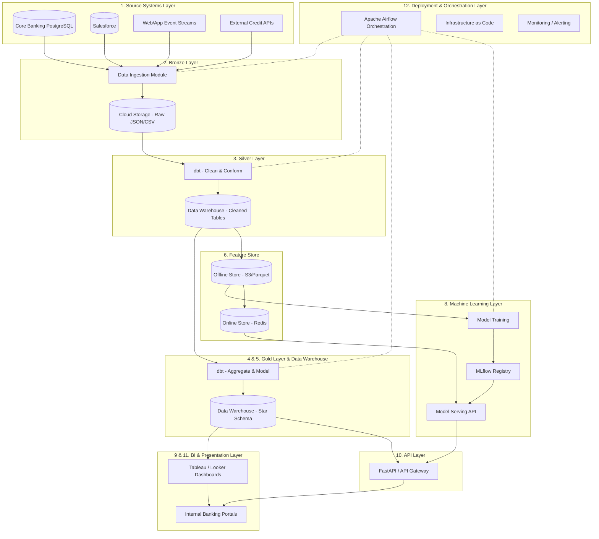

#### Transaction Data Flow Diagram (Mermaid)

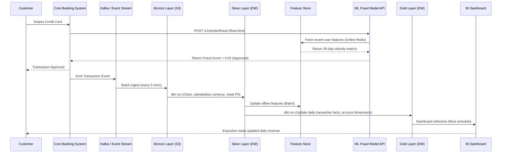

## 7. Repository Structure

The repository structure follows a modular, scalable architecture designed for enterprise data engineering, machine learning, and analytics workflows.

### Repository Layout

```text
enterprise-banking-platform/
├── README.md
├── LICENSE
├── .gitignore
├── .env.example
├── docker-compose.yml
├── Dockerfile
├── Makefile
├── pyproject.toml
├── requirements.txt
├── setup.py
├── .github/
│   └── workflows/
│       ├── ci.yml
│       ├── cd.yml
│       ├── data-quality.yml
│       └── model-training.yml
├── config/
│   ├── __init__.py
│   ├── settings.py
│   ├── database.py
│   ├── logging_config.py
│   └── constants.py
├── data/
│   ├── raw/
│   │   ├── customers.csv
│   │   ├── transactions.csv
│   │   ├── loans.csv
│   │   ├── credit_cards.csv
│   │   ├── accounts.csv
│   │   ├── branches.csv
│   │   ├── revenue.csv
│   │   ├── marketing_campaigns.csv
│   │   ├── support_tickets.csv
│   │   ├── merchants.csv
│   │   ├── fraud_labels.csv
│   │   ├── loan_labels.csv
│   │   ├── calendar.csv
│   │   ├── regions.csv
│   │   └── products.csv
│   ├── bronze/
│   ├── silver/
│   ├── gold/
│   └── feature_store/
├── src/
│   ├── __init__.py
│   ├── data_generation/
│   │   ├── __init__.py
│   │   ├── generator.py
│   │   ├── customers.py
│   │   ├── transactions.py
│   │   ├── loans.py
│   │   ├── credit_cards.py
│   │   ├── accounts.py
│   │   ├── branches.py
│   │   ├── revenue.py
│   │   ├── marketing.py
│   │   ├── support_tickets.py
│   │   ├── merchants.py
│   │   ├── fraud_labels.py
│   │   ├── loan_labels.py
│   │   ├── calendar_dim.py
│   │   ├── regions.py
│   │   └── products.py
│   ├── etl/
│   │   ├── __init__.py
│   │   ├── pipeline.py
│   │   ├── extractors/
│   │   ├── validators/
│   │   ├── transformers/
│   │   ├── loaders/
│   │   └── orchestrator.py
│   ├── database/
│   │   ├── __init__.py
│   │   ├── connection.py
│   │   ├── models.py
│   │   ├── schemas/
│   │   ├── migrations/
│   │   └── seed.py
│   ├── warehouse/
│   │   ├── __init__.py
│   │   ├── dimensions/
│   │   ├── facts/
│   │   ├── views/
│   │   └── procedures/
│   ├── features/
│   │   ├── __init__.py
│   │   ├── feature_engineering.py
│   │   ├── customer_features.py
│   │   ├── transaction_features.py
│   │   ├── loan_features.py
│   │   └── merchant_features.py
│   ├── analytics/
│   │   ├── __init__.py
│   │   ├── customer_analysis.py
│   │   ├── revenue_analysis.py
│   │   ├── fraud_analysis.py
│   │   ├── loan_analysis.py
│   │   ├── branch_analysis.py
│   │   ├── marketing_analysis.py
│   │   ├── risk_analysis.py
│   │   └── executive_analysis.py
│   ├── ml/
│   │   ├── __init__.py
│   │   ├── fraud_detection/
│   │   ├── loan_default/
│   │   ├── customer_segmentation/
│   │   ├── forecasting/
│   │   ├── model_registry.py
│   │   ├── training_pipeline.py
│   │   ├── evaluation.py
│   │   └── explainability.py
│   ├── api/
│   │   ├── __init__.py
│   │   ├── main.py
│   │   ├── routes/
│   │   ├── schemas/
│   │   ├── middleware/
│   │   └── dependencies.py
│   └── dashboards/
│       ├── __init__.py
│       ├── executive_dashboard.py
│       ├── fraud_dashboard.py
│       ├── customer_dashboard.py
│       ├── loan_dashboard.py
│       ├── revenue_dashboard.py
│       ├── marketing_dashboard.py
│       ├── operational_dashboard.py
│       └── risk_dashboard.py
├── sql/
│   ├── ddl/
│   ├── dml/
│   ├── views/
│   ├── procedures/
│   ├── functions/
│   ├── indexes/
│   └── triggers/
├── tests/
│   ├── __init__.py
│   ├── unit/
│   ├── integration/
│   ├── e2e/
│   └── data_quality/
├── notebooks/
│   ├── exploration/
│   ├── analysis/
│   └── modeling/
├── docs/
│   ├── architecture.md
│   ├── data_dictionary.md
│   ├── er_diagram.md
│   ├── user_guide.md
│   ├── developer_guide.md
│   └── business_guide.md
├── monitoring/
│   ├── alerts.py
│   ├── health_checks.py
│   └── metrics.py
└── scripts/
    ├── setup_db.sh
    ├── run_etl.sh
    ├── train_models.sh
    └── deploy.sh
```

### Component Details

#### Root Directory
- **`README.md`**: Project overview, setup instructions, and quickstart guide. Dependencies: None. Owner: Lead Architect.
- **`LICENSE`**: Legal terms of use for the repository. Dependencies: None. Owner: Legal/Compliance.
- **`.gitignore`**: Defines files/folders excluded from version control (e.g., virtual environments, local `.env` files, compiled artifacts). Dependencies: None. Owner: DevOps.
- **`.env.example`**: Template for environment variables (database credentials, API keys) required to run the platform locally. Dependencies: None. Owner: DevOps.
- **`docker-compose.yml`**: Defines multi-container Docker applications for local development (PostgreSQL, Redis, API, workers). Dependencies: Dockerfile. Owner: DevOps.
- **`Dockerfile`**: Defines the base image and build steps for the application containers. Dependencies: requirements.txt. Owner: DevOps.
- **`Makefile`**: Automation macros for common tasks like `make install`, `make test`, `make run`. Dependencies: system shell. Owner: DevOps / Backend Engineering.
- **`pyproject.toml`**: Modern Python build system requirements and metadata (PEP 518). Specifies tools like Black, Flake8, and Pytest. Dependencies: None. Owner: Lead Engineer.
- **`requirements.txt`**: Pinned Python dependencies for production deployments. Dependencies: None. Owner: Lead Engineer.
- **`setup.py`**: Legacy/fallback packaging script for the `src` module. Dependencies: pyproject.toml. Owner: Lead Engineer.

#### `.github/workflows/`
- **`ci.yml`**: Continuous Integration pipeline. Runs linting and unit tests on every pull request. Dependencies: tests/unit/, pyproject.toml. Owner: DevOps.
- **`cd.yml`**: Continuous Deployment pipeline. Builds Docker images and pushes to registry upon merge to main. Dependencies: Dockerfile. Owner: DevOps.
- **`data-quality.yml`**: Scheduled pipeline to run Great Expectations tests against incoming raw data. Dependencies: tests/data_quality/. Owner: Data Engineering.
- **`model-training.yml`**: Trigger-based or scheduled pipeline for retraining ML models. Dependencies: src/ml/training_pipeline.py. Owner: MLOps.

#### `config/`
- **`__init__.py`**: Makes the config directory a Python package. Dependencies: None. Owner: Backend Engineering.
- **`settings.py`**: Core configuration loader utilizing Pydantic BaseSettings to read environment variables. Dependencies: .env. Owner: Backend Engineering.
- **`database.py`**: Database connection pool and ORM configuration parameters. Dependencies: settings.py. Owner: Database Administration (DBA).
- **`logging_config.py`**: Standardized logging format, log levels, and handlers (stdout, file, syslog). Dependencies: None. Owner: DevOps.
- **`constants.py`**: Project-wide static variables (e.g., categorical mappings, fixed thresholds). Dependencies: None. Owner: Backend Engineering.

#### `data/`
- **`raw/`**: Contains immutable source files (15 CSVs). Dependencies: Source systems. Owner: Data Engineering.
  - `customers.csv`, `transactions.csv`, `loans.csv`, `credit_cards.csv`, `accounts.csv`, `branches.csv`, `revenue.csv`, `marketing_campaigns.csv`, `support_tickets.csv`, `merchants.csv`, `fraud_labels.csv`, `loan_labels.csv`, `calendar.csv`, `regions.csv`, `products.csv`.
- **`bronze/`**: Parquet files representing the direct landing zone for raw data (appends only). Dependencies: raw/. Owner: Data Engineering.
- **`silver/`**: Cleansed, deduplicated, and typed data in Parquet/Delta format. Dependencies: bronze/. Owner: Data Engineering.
- **`gold/`**: Business-level aggregations and dimensional models ready for consumption. Dependencies: silver/. Owner: Analytics Engineering.
- **`feature_store/`**: Pre-computed features for machine learning, versioned and indexed. Dependencies: gold/. Owner: Data Science.

#### `src/data_generation/`
- **`__init__.py`**: Package initialization. Dependencies: None. Owner: Data Engineering.
- **`generator.py`**: Core orchestration script to execute individual entity generators. Dependencies: individual module scripts. Owner: Data Engineering.
- **`customers.py`** to **`products.py`**: Scripts to procedurally generate synthetic data matching production schemas and statistical distributions for each respective entity. Dependencies: Faker, Pandas. Owner: Data Engineering / Data Science.

#### `src/etl/`
- **`__init__.py`**: Package initialization. Dependencies: None. Owner: Data Engineering.
- **`pipeline.py`**: Main entry point defining the DAGs for data ingestion. Dependencies: extractors/, validators/, transformers/, loaders/. Owner: Data Engineering.
- **`extractors/`**: Modules for reading data from external APIs, raw CSVs, or source DBs. Dependencies: config. Owner: Data Engineering.
- **`validators/`**: Modules enforcing schema constraints and data quality rules. Dependencies: config, extractors. Owner: Data Quality Team.
- **`transformers/`**: Business logic to clean, join, and aggregate data (Bronze to Silver to Gold). Dependencies: validators. Owner: Analytics Engineering.
- **`loaders/`**: Modules for efficiently bulk-inserting data into the warehouse. Dependencies: transformers. Owner: Data Engineering.
- **`orchestrator.py`**: Task runner (Airflow or Prefect integration) scheduling. Dependencies: pipeline.py. Owner: Data Engineering.

#### `src/database/`
- **`__init__.py`**: Package initialization. Dependencies: None. Owner: Backend Engineering.
- **`connection.py`**: SQLAlchemy engine and session management. Dependencies: config/database.py. Owner: DBA.
- **`models.py`**: SQLAlchemy ORM definitions mapping to relational tables. Dependencies: connection.py. Owner: Backend Engineering.
- **`schemas/`**: Pydantic models for data validation and serialization. Dependencies: None. Owner: Backend Engineering.
- **`migrations/`**: Alembic version control scripts for schema evolution. Dependencies: models.py. Owner: DBA.
- **`seed.py`**: Script to initialize the database with reference data (e.g., regions, branches). Dependencies: models.py. Owner: Backend Engineering.

#### `src/warehouse/`
- **`__init__.py`**: Package initialization. Dependencies: None. Owner: Analytics Engineering.
- **`dimensions/`**: Code to build and update SCD Type 1, 2, and 3 dimension tables. Dependencies: src/etl/gold. Owner: Analytics Engineering.
- **`facts/`**: Code to build fact tables and handle late-arriving data. Dependencies: src/etl/gold, dimensions/. Owner: Analytics Engineering.
- **`views/`**: SQL-based virtual tables simplifying complex joins for BI. Dependencies: facts/, dimensions/. Owner: Analytics Engineering.
- **`procedures/`**: Stored procedure wrappers for batch updates directly in the DB. Dependencies: None. Owner: DBA.

#### `src/features/`
- **`__init__.py`**: Package initialization. Dependencies: None. Owner: Data Science.
- **`feature_engineering.py`**: Core utilities for scaling, encoding, and imputing. Dependencies: config. Owner: Data Science.
- **`customer_features.py`, `transaction_features.py`, `loan_features.py`, `merchant_features.py`**: Domain-specific scripts defining time-windowed aggregations, ratios, and risk scores. Dependencies: src/warehouse/. Owner: Data Science.

#### `src/analytics/`
- **`__init__.py`**: Package initialization. Dependencies: None. Owner: Data Analysts.
- **`customer_analysis.py`** to **`executive_analysis.py`**: Python modules executing descriptive and diagnostic analytics workloads. Dependencies: src/warehouse/. Owner: Data Analysts.

#### `src/ml/`
- **`__init__.py`**: Package initialization. Dependencies: None. Owner: Data Science.
- **`fraud_detection/`, `loan_default/`, `customer_segmentation/`, `forecasting/`**: Directories containing specific model architectures, hyperparameters, and localized pipelines. Dependencies: src/features/. Owner: Data Science.
- **`model_registry.py`**: Interfaces with MLflow to log, version, and load models. Dependencies: None. Owner: MLOps.
- **`training_pipeline.py`**: Script to execute end-to-end training (data split, train, tune, register). Dependencies: model_registry.py, domain modules. Owner: MLOps.
- **`evaluation.py`**: Metrics calculation (ROC-AUC, F1, Precision-Recall) and drift detection. Dependencies: domain modules. Owner: Data Science.
- **`explainability.py`**: SHAP and LIME integrations for model interpretability. Dependencies: evaluation.py. Owner: Data Science.

#### `src/api/`
- **`__init__.py`**: Package initialization. Dependencies: None. Owner: Backend Engineering.
- **`main.py`**: FastAPI application factory and server entry point. Dependencies: routes/, middleware/. Owner: Backend Engineering.
- **`routes/`**: Endpoint definitions (e.g., POST `/predict/fraud`, GET `/customer/{id}`). Dependencies: src/ml/, src/database/. Owner: Backend Engineering.
- **`schemas/`**: Request and response Pydantic models. Dependencies: None. Owner: Backend Engineering.
- **`middleware/`**: Authentication, rate limiting, and CORS handling. Dependencies: config. Owner: Backend Engineering.
- **`dependencies.py`**: Dependency injection providers (e.g., DB sessions, authenticated user context). Dependencies: src/database/. Owner: Backend Engineering.

#### `src/dashboards/`
- **`__init__.py`**: Package initialization. Dependencies: None. Owner: BI Team.
- **`executive_dashboard.py`** to **`risk_dashboard.py`**: Streamlit or Dash applications serving interactive UI components for specific business units. Dependencies: src/analytics/. Owner: BI Team.

#### `sql/`
- **`ddl/`**: Raw SQL files for Data Definition (CREATE TABLE). Dependencies: None. Owner: DBA.
- **`dml/`**: Raw SQL for Data Manipulation (INSERT/UPDATE logic for initial states). Dependencies: ddl/. Owner: DBA.
- **`views/`**: Standard SQL view definitions. Dependencies: ddl/. Owner: DBA.
- **`procedures/`**: Complex SQL transactions encapsulated in procedures. Dependencies: ddl/. Owner: DBA.
- **`functions/`**: User-defined functions (UDFs) for database-level computation. Dependencies: None. Owner: DBA.
- **`indexes/`**: SQL scripts for B-Tree, Hash, and partial indexes. Dependencies: ddl/. Owner: DBA.
- **`triggers/`**: DB triggers for audit logging or automatic updates. Dependencies: ddl/. Owner: DBA.

#### `tests/`
- **`__init__.py`**: Package initialization. Dependencies: None. Owner: QA.
- **`unit/`**: Isolated tests for individual functions and classes. Dependencies: src/. Owner: QA / Developers.
- **`integration/`**: Tests verifying interaction between modules (e.g., API to Database). Dependencies: src/. Owner: QA.
- **`e2e/`**: End-to-end user journey tests. Dependencies: running infrastructure. Owner: QA.
- **`data_quality/`**: Great Expectations test suites validating data constraints. Dependencies: data/raw/. Owner: Data Quality Team.

#### `notebooks/`
- **`exploration/`**: Scratchpads for initial EDA. Dependencies: data/. Owner: Data Science.
- **`analysis/`**: Deep dive analytical investigations. Dependencies: src/warehouse/. Owner: Data Analysts.
- **`modeling/`**: Prototype ML models before porting to `src/ml/`. Dependencies: src/features/. Owner: Data Science.

#### `docs/`
- **`architecture.md`**: System design documentation (this file). Dependencies: None. Owner: Lead Architect.
- **`data_dictionary.md`**: Exhaustive listing of all fields and definitions. Dependencies: None. Owner: Data Governance.
- **`er_diagram.md`**: Entity-relationship models. Dependencies: None. Owner: Data Architecture.
- **`user_guide.md`, `developer_guide.md`, `business_guide.md`**: Manuals for different stakeholders. Dependencies: None. Owner: Tech Writer.

#### `monitoring/`
- **`alerts.py`**: Logic for pushing notifications to Slack/Email on failure or anomaly. Dependencies: config. Owner: SRE.
- **`health_checks.py`**: Endpoints and scripts verifying system component availability. Dependencies: None. Owner: SRE.
- **`metrics.py`**: Prometheus custom metrics collectors. Dependencies: None. Owner: SRE.

#### `scripts/`
- **`setup_db.sh`**: Shell script to drop, recreate, and seed the local database. Dependencies: sql/. Owner: DevOps.
- **`run_etl.sh`**: Shell script to trigger the data ingestion pipeline manually. Dependencies: src/etl/. Owner: Data Engineering.
- **`train_models.sh`**: Shell script to trigger a model training run. Dependencies: src/ml/. Owner: MLOps.
- **`deploy.sh`**: Shell script wrapping Docker/Helm deployment logic. Dependencies: Dockerfile. Owner: DevOps.

---

## 8. Technology Stack

The technology stack is carefully selected to ensure high throughput, enterprise-grade security, and robust machine learning capabilities.

### Programming Language
| Technology | Selected | Alternatives | Why Selected | Tradeoffs |
| :--- | :--- | :--- | :--- | :--- |
| **Python 3.11+** | Yes | Java, Scala, Go | Industry standard for Data Science/ML; massive ecosystem (Pandas, Scikit-Learn, FastAPI); high developer velocity. | Slower execution speed compared to compiled languages (Go/C++); Global Interpreter Lock (GIL) limits multi-threading. |
| **SQL (PostgreSQL)** | Yes | Cypher, MDX | Universal language for relational data manipulation; unparalleled compatibility with BI and Warehouse tools. | Declarative nature can make complex procedural logic difficult to express efficiently. |

**Analysis (Python):**
1. **Version:** 3.11+
2. **Why chosen:** 3.11 provides massive performance improvements (10-60%) over 3.10 and full support for modern type hinting.
3. **Alternatives:** Java (too verbose for rapid ML), Scala (high learning curve, mostly for Spark), Go (poor ML ecosystem).
4. **Tradeoffs:** GIL limits true multi-threading, requiring multi-processing for CPU-bound tasks.
5. **When NOT right:** Low-latency high-frequency trading engines where microsecond latency is required.
6. **Integration:** Used across the entire backend, ETL pipelines, API, and ML training.

### Database
| Technology | Selected | Alternatives | Why Selected | Tradeoffs |
| :--- | :--- | :--- | :--- | :--- |
| **PostgreSQL 15+** | Yes | MySQL, MongoDB, Snowflake | ACID compliant, advanced JSONB support, powerful window functions, robust indexing, open-source with massive enterprise support. | Operational overhead compared to managed cloud DWs; vertical scaling limits. |

**Analysis (PostgreSQL):**
1. **Version:** 15+
2. **Why chosen:** Exceptional support for complex analytical queries, ACID transactions for financial data, and JSONB for semi-structured data. Standard for transactional and operational analytical processing (HTAP).
3. **Alternatives:** MySQL (less robust analytical functions), MongoDB (lacks native relational integrity needed for finance), Snowflake (better for pure OLAP, but too expensive for operational low-latency reads).
4. **Tradeoffs:** Write amplification due to MVCC; requires careful vacuum tuning.
5. **When NOT right:** When data size exceeds ~10TB and requires massive parallel processing (MPP) native to Snowflake/Redshift.
6. **Integration:** Core persistence layer, accessed via SQLAlchemy, populated via ETL orchestrators.

### API Framework
| Technology | Selected | Alternatives | Why Selected | Tradeoffs |
| :--- | :--- | :--- | :--- | :--- |
| **FastAPI** | Yes | Flask, Django REST, Express.js | Asynchronous by default, automatic Swagger/OpenAPI documentation, extreme high performance, utilizes Pydantic for validation. | Smaller ecosystem than Django; requires understanding of async/await paradigms. |

**Analysis (FastAPI):**
1. **Version:** Latest (0.100+)
2. **Why chosen:** Unmatched performance in Python for API serving, strict type checking reduces runtime bugs, and automatic documentation is crucial for enterprise teams.
3. **Alternatives:** Flask (no built-in async or validation), Django REST (too heavy for a microservice architecture).
4. **Tradeoffs:** Strict enforcement of typing can slow down initial prototyping.
5. **When NOT right:** Monolithic applications requiring built-in admin panels and full-stack templating out of the box (Django is better here).
6. **Integration:** Serves ML models and data endpoints; connects to PostgreSQL via SQLAlchemy.

### Business Intelligence
| Technology | Selected | Alternatives | Why Selected | Tradeoffs |
| :--- | :--- | :--- | :--- | :--- |
| **Power BI** | Yes | Tableau, Looker, Superset | Deep integration with Microsoft ecosystem, exceptional row-level security, cost-effective for large enterprises. | Windows-centric desktop client; DAX language can be complex. |

**Analysis (Power BI):**
1. **Version:** Enterprise Cloud / Desktop
2. **Why chosen:** Unrivaled enterprise security features, semantic modeling capabilities, and strong adoption in the banking sector.
3. **Alternatives:** Tableau (better visual aesthetics, but higher cost), Looker (requires centralized semantic layer setup), Superset (open-source but lacks enterprise governance features out-of-the-box).
4. **Tradeoffs:** Desktop development requires Windows; DAX learning curve.
5. **When NOT right:** Startups needing embedded lightweight dashboards (Metabase is better) or Mac-only development teams.
6. **Integration:** Connects directly to PostgreSQL Warehouse views and Gold layer tables.

### Containerization
| Technology | Selected | Alternatives | Why Selected | Tradeoffs |
| :--- | :--- | :--- | :--- | :--- |
| **Docker** | Yes | Podman, VMs, Kubernetes (directly) | Ubiquitous standard for containerization, guarantees environment consistency from local to production. | Requires daemon (security concern in some strict environments). |

**Analysis (Docker):**
1. **Version:** 24+
2. **Why chosen:** Solves "works on my machine"; ensures ML models and APIs run identically in testing and production.
3. **Alternatives:** Podman (daemonless, more secure but slightly different CLI behavior), VMs (too heavy, slow boot times).
4. **Tradeoffs:** Storage overhead for images; networking configuration can be complex.
5. **When NOT right:** Legacy monolithic applications that require deep OS kernel hooks.
6. **Integration:** Wraps FastAPI, ETL jobs, and ML pipelines for deployment via CI/CD.

### CI/CD
| Technology | Selected | Alternatives | Why Selected | Tradeoffs |
| :--- | :--- | :--- | :--- | :--- |
| **GitHub Actions** | Yes | Jenkins, GitLab CI, CircleCI | Native to GitHub, vast marketplace of pre-built actions, highly scalable runner infrastructure. | Vendor lock-in to GitHub ecosystem. |

**Analysis (GitHub Actions):**
1. **Version:** v2/v3 actions
2. **Why chosen:** Seamless integration with repository, YAML-based configuration, eliminates need to manage CI infrastructure (unlike Jenkins).
3. **Alternatives:** Jenkins (highly customizable but high maintenance overhead), GitLab CI (excellent, but requires GitLab repo).
4. **Tradeoffs:** Debugging failed pipelines can be tedious; secrets management requires discipline.
5. **When NOT right:** Highly secure on-premise air-gapped deployments where Jenkins on local servers is mandated.
6. **Integration:** Automates Pytest execution, Docker image builds, and deployments to staging/production.

### ML Experiment Tracking
| Technology | Selected | Alternatives | Why Selected | Tradeoffs |
| :--- | :--- | :--- | :--- | :--- |
| **MLflow** | Yes | Weights & Biases, Neptune, ClearML | Open-source standard, comprehensive model registry, deployment agnostic. | UI is functional but less polished than commercial alternatives. |

**Analysis (MLflow):**
1. **Version:** 2.0+
2. **Why chosen:** Open-source, easily self-hosted, robust tracking of parameters, metrics, and model artifacts, and standardizes model packaging.
3. **Alternatives:** Weights & Biases (excellent visualization but SaaS/expensive), ClearML.
4. **Tradeoffs:** Self-hosting requires managing the backend database and artifact store (S3).
5. **When NOT right:** When managed cloud services (Vertex AI, SageMaker) are fully utilized, making external tracking redundant.
6. **Integration:** Embedded in `src/ml/training_pipeline.py`; artifacts stored in cloud storage, metadata in PostgreSQL.

### Visualization (Python)
| Technology | Selected | Alternatives | Why Selected | Tradeoffs |
| :--- | :--- | :--- | :--- | :--- |
| **Plotly** | Yes | Matplotlib, Seaborn, Altair, Bokeh | Interactive HTML visualizations, integrates perfectly with Streamlit/Dash, aesthetically modern. | Larger bundle size, slightly slower rendering for massive datasets. |

**Analysis (Plotly):**
1. **Version:** 5.0+
2. **Why chosen:** Provides interactivity (hover, zoom) essential for analytical deep dives, which static plots (Matplotlib) lack.
3. **Alternatives:** Matplotlib (foundational but static/ugly), Seaborn (great for static statistical plots), Altair (declarative but steep learning curve).
4. **Tradeoffs:** Heavier memory footprint in notebooks; complex custom layouts.
5. **When NOT right:** Generating static PDF reports where Matplotlib is faster and more reliable.
6. **Integration:** Used in `src/dashboards/` and EDA notebooks.

### ML Frameworks
| Technology | Selected | Alternatives | Why Selected | Tradeoffs |
| :--- | :--- | :--- | :--- | :--- |
| **Scikit-learn, XGBoost, CatBoost, LightGBM** | Yes | TensorFlow, PyTorch | Unbeatable performance for tabular enterprise data (which makes up 99% of banking use cases). | Lacks native deep learning / unstructured data capabilities. |

**Analysis (ML Frameworks):**
1. **Versions:** Latest stable for all.
2. **Why chosen:**
   - **Scikit-learn:** Foundational for preprocessing, baseline models (Logistic Regression for explainability in credit scoring).
   - **XGBoost:** The gold standard for gradient boosting; highly robust.
   - **LightGBM:** Optimized for massive datasets, trains faster than XGBoost with comparable accuracy. Used for transaction-level fraud detection.
   - **CatBoost:** Superior handling of categorical variables without extensive pre-processing. Used for customer segmentation with heavy categorical features.
3. **Alternatives:** PyTorch/TensorFlow (overkill for tabular data, harder to explain for regulatory compliance).
4. **Tradeoffs:** Maintaining multiple GBDT frameworks increases dependency footprint.
5. **When NOT right:** Processing image, audio, or text data (requires Deep Learning).
6. **Integration:** All models are wrapped into MLflow python_function flavor for uniform API deployment.

### Data Manipulation
| Technology | Selected | Alternatives | Why Selected | Tradeoffs |
| :--- | :--- | :--- | :--- | :--- |
| **Pandas & NumPy** | Yes | Polars, Dask, PySpark | Industry standard, massive community, integrates with every ML framework. | High memory footprint; single-threaded. |

**Analysis (Data Manipulation):**
1. **Versions:** Pandas 2.0+, NumPy 1.24+
2. **Why chosen:** Pandas 2.0 utilizing PyArrow backend significantly reduces memory overhead. NumPy provides the underlying C-optimized array structures.
3. **Alternatives:** Polars (faster, but less community adoption), PySpark (required for distributed computing, but overkill for single-node ETL).
4. **Tradeoffs:** Memory bound (data must fit in RAM).
5. **When NOT right:** Datasets exceeding 50GB where distributed computing (Spark) is mandatory.
6. **Integration:** Core backbone of `src/features/` and `src/etl/transformers/`.

### Testing
| Technology | Selected | Alternatives | Why Selected | Tradeoffs |
| :--- | :--- | :--- | :--- | :--- |
| **Pytest** | Yes | unittest, nose2 | Fixture system is incredibly powerful, concise syntax, rich plugin ecosystem. | Magic behavior in fixtures can confuse beginners. |

**Analysis (Pytest):**
1. **Version:** 7.0+
2. **Why chosen:** Less boilerplate than standard library `unittest`. Fixtures allow elegant mocking of database connections and API clients.
3. **Alternatives:** `unittest` (too verbose).
4. **Tradeoffs:** Requires understanding of scoping and fixture resolution.
5. **When NOT right:** Rarely. It is the de facto standard.
6. **Integration:** Runs via GitHub Actions CI pipelines.

### Data Quality
| Technology | Selected | Alternatives | Why Selected | Tradeoffs |
| :--- | :--- | :--- | :--- | :--- |
| **Great Expectations** | Yes | Deequ, Custom scripts | Declarative data quality definitions, automated data profiling, integrates with CI/CD. | Heavy dependency stack, complex configuration syntax. |

**Analysis (Great Expectations):**
1. **Version:** 0.15+
2. **Why chosen:** Translates business rules into executable tests. Prevents silent data corruption in ML pipelines.
3. **Alternatives:** Deequ (Scala/Spark focused), Custom assertions (hard to maintain scale).
4. **Tradeoffs:** Setup and maintenance of expectation suites is time-consuming.
5. **When NOT right:** Simple, highly structured transactional databases where DB constraints are sufficient.
6. **Integration:** Runs in `src/etl/validators/` before loading to Silver/Gold layers.

---

## 9. Data Sources

The platform processes 15 core datasets. Synthetic generation strategies employ localized distributions to mimic real banking data.

### 1. Customers
- **Business Purpose:** Master record of individuals interacting with the bank.
- **Row Count:** ~500,000
- **Relationships:** 1:N to Accounts, Transactions, Loans, Credit Cards, Support Tickets.
- **Generation Strategy:** Faker for PII. Segment-based logic for income/credit score (e.g., 'Wealth' segment guarantees higher income).
- **Columns:**
  - `customer_id` (UUID, PK, Not Null): Unique identifier. (e.g., `cust-1234`)
  - `first_name` (Varchar, Not Null): Given name. (e.g., `Jane`)
  - `last_name` (Varchar, Not Null): Surname. (e.g., `Doe`)
  - `email` (Varchar, Not Null): Contact email. Rule: Must be valid format.
  - `phone` (Varchar, Nullable): E.164 format.
  - `date_of_birth` (Date, Not Null): Rule: Must be > 18 years ago.
  - `gender` (Varchar, Nullable): Categorical (M, F, Other, Prefer not to say).
  - `address_line1` (Varchar, Not Null): Primary residence.
  - `address_line2` (Varchar, Nullable): Apartment/Suite.
  - `city` (Varchar, Not Null): Residence city.
  - `state` (Varchar, Not Null): Residence state/province.
  - `zip_code` (Varchar, Not Null): Postal code.
  - `country` (Varchar, Not Null): ISO 3166-1 alpha-2.
  - `customer_since` (Date, Not Null): Onboarding date.
  - `customer_segment` (Varchar, Not Null): Standard, Premium, Wealth.
  - `credit_score` (Integer, Not Null): Range 300-850.
  - `annual_income` (Numeric, Not Null): Expressed in base currency.
  - `employment_status` (Varchar, Not Null): Employed, Self-Employed, Unemployed, Retired.
  - `employer_name` (Varchar, Nullable): Company name if employed.
  - `risk_rating` (Varchar, Not Null): Low, Medium, High.
  - `is_active` (Boolean, Not Null): True if account is not closed.
  - `created_at` (Timestamp, Not Null): Record creation.
  - `updated_at` (Timestamp, Not Null): Last modification.

### 2. Transactions
- **Business Purpose:** Ledger of all financial movements. Crucial for fraud detection and revenue analysis.
- **Row Count:** ~5,000,000
- **Relationships:** N:1 to Accounts, Customers, Merchants. 1:1 to Fraud Labels.
- **Generation Strategy:** Time-series generation with cyclical patterns (paydays, weekends). Fraud anomalies injected as outliers.
- **Columns:**
  - `transaction_id` (UUID, PK, Not Null): Unique identifier.
  - `account_id` (UUID, FK, Not Null): Link to Accounts.
  - `customer_id` (UUID, FK, Not Null): Link to Customers.
  - `merchant_id` (UUID, FK, Nullable): Link to Merchants (null for transfers).
  - `transaction_date` (Date, Not Null): Partition key.
  - `transaction_time` (Time, Not Null): Exact execution time.
  - `amount` (Numeric(15,2), Not Null): Value. Rule: Can be negative for debits.
  - `currency` (Varchar(3), Not Null): ISO 4217 code.
  - `transaction_type` (Varchar, Not Null): POS, ATM, Wire, ACH, Fee.
  - `channel` (Varchar, Not Null): Mobile, Web, Branch, ATM.
  - `status` (Varchar, Not Null): Pending, Completed, Failed, Reversed.
  - `description` (Varchar, Nullable): Raw statement text.
  - `category` (Varchar, Not Null): Groceries, Travel, Dining, Utilities, etc.
  - `is_international` (Boolean, Not Null): True if merchant country != customer country.
  - `device_type` (Varchar, Nullable): iOS, Android, Desktop.
  - `ip_address` (Varchar, Nullable): IPv4/IPv6 address of initiator.
  - `location_lat` (Numeric(9,6), Nullable): Geo-latitude.
  - `location_lon` (Numeric(9,6), Nullable): Geo-longitude.
  - `created_at` (Timestamp, Not Null): System ingest time.

### 3. Loans
- **Business Purpose:** Details of credit products, used for risk modeling and default prediction.
- **Row Count:** ~200,000
- **Relationships:** N:1 to Customers, Branches. 1:1 to Loan Labels.
- **Generation Strategy:** Parametric generation based on credit_score (low score = higher interest, higher default probability).
- **Columns:**
  - `loan_id` (UUID, PK, Not Null): Unique identifier.
  - `customer_id` (UUID, FK, Not Null): Link to Customers.
  - `loan_type` (Varchar, Not Null): Mortgage, Auto, Personal, Student.
  - `principal_amount` (Numeric(15,2), Not Null): Initial loan amount.
  - `interest_rate` (Numeric(5,4), Not Null): APR (e.g., 0.0525 for 5.25%).
  - `term_months` (Integer, Not Null): Duration (e.g., 360 for 30yr mortgage).
  - `monthly_payment` (Numeric(15,2), Not Null): Calculated EMI.
  - `origination_date` (Date, Not Null): Start date.
  - `maturity_date` (Date, Not Null): Expected end date.
  - `outstanding_balance` (Numeric(15,2), Not Null): Current amount owed.
  - `loan_status` (Varchar, Not Null): Current, Delinquent, Default, Paid Off.
  - `collateral_type` (Varchar, Nullable): Real Estate, Vehicle, None.
  - `collateral_value` (Numeric(15,2), Nullable): Estimated value of collateral.
  - `ltv_ratio` (Numeric(5,4), Nullable): Loan-to-Value ratio.
  - `dti_ratio` (Numeric(5,4), Not Null): Debt-to-Income ratio at origination.
  - `branch_id` (UUID, FK, Not Null): Originating branch.
  - `loan_officer_id` (UUID, Not Null): Employee ID.
  - `created_at` (Timestamp, Not Null)
  - `updated_at` (Timestamp, Not Null)

### 4. Credit Cards
- **Business Purpose:** Revolving credit management and utilization tracking.
- **Row Count:** ~300,000
- **Relationships:** N:1 to Customers.
- **Generation Strategy:** Limit linked to annual_income; balance tied to transaction aggregation patterns.
- **Columns:**
  - `card_id` (UUID, PK, Not Null): Unique identifier.
  - `customer_id` (UUID, FK, Not Null): Link to Customers.
  - `card_number_hash` (Varchar, Not Null): SHA-256 hash of PAN for security.
  - `card_type` (Varchar, Not Null): Visa, Mastercard, Amex.
  - `credit_limit` (Numeric(15,2), Not Null): Maximum borrowing limit.
  - `current_balance` (Numeric(15,2), Not Null): Current utilization.
  - `available_credit` (Numeric(15,2), Not Null): Limit minus balance.
  - `apr` (Numeric(5,4), Not Null): Annual Percentage Rate.
  - `annual_fee` (Numeric(15,2), Not Null): Yearly cost.
  - `reward_program` (Varchar, Not Null): Cash Back, Travel, None.
  - `issue_date` (Date, Not Null): Date generated.
  - `expiry_date` (Date, Not Null): MM/YY equivalent.
  - `status` (Varchar, Not Null): Active, Blocked, Cancelled.
  - `last_payment_date` (Date, Nullable): Most recent payment.
  - `last_payment_amount` (Numeric(15,2), Nullable): Amount paid.
  - `minimum_payment_due` (Numeric(15,2), Not Null): Required payment.
  - `payment_due_date` (Date, Not Null): Deadline for payment.
  - `created_at` (Timestamp, Not Null)
  - `updated_at` (Timestamp, Not Null)

### 5. Accounts
- **Business Purpose:** Deposit product management (Checking, Savings).
- **Row Count:** ~600,000
- **Relationships:** N:1 to Customers, Branches. 1:N to Transactions.
- **Generation Strategy:** 1-3 accounts per customer. Checking accounts have higher transaction velocity.
- **Columns:**
  - `account_id` (UUID, PK, Not Null): Unique identifier.
  - `customer_id` (UUID, FK, Not Null): Link to Customers.
  - `account_type` (Varchar, Not Null): Checking, Savings, CD, Money Market.
  - `account_number_hash` (Varchar, Not Null): Hashed representation.
  - `branch_id` (UUID, FK, Not Null): Domicile branch.
  - `balance` (Numeric(15,2), Not Null): Current funds.
  - `currency` (Varchar(3), Not Null): Default USD.
  - `interest_rate` (Numeric(5,4), Not Null): Yield.
  - `opened_date` (Date, Not Null): Inception.
  - `status` (Varchar, Not Null): Active, Dormant, Closed.
  - `overdraft_limit` (Numeric(15,2), Not Null): Allowable negative balance.
  - `overdraft_protection` (Boolean, Not Null): Linkage to savings.
  - `last_transaction_date` (Date, Nullable): Time of last activity.
  - `created_at` (Timestamp, Not Null)
  - `updated_at` (Timestamp, Not Null)

### 6. Branches
- **Business Purpose:** Physical location management and operational attribution.
- **Row Count:** ~500
- **Relationships:** N:1 to Regions. 1:N to Accounts, Loans, Revenue.
- **Generation Strategy:** Geographically distributed matching Region population density.
- **Columns:**
  - `branch_id` (UUID, PK, Not Null): Unique identifier.
  - `branch_name` (Varchar, Not Null): (e.g., 'Downtown Main').
  - `branch_code` (Varchar, Not Null): Alphanumeric code.
  - `region_id` (UUID, FK, Not Null): Link to Regions.
  - `address`, `city`, `state`, `zip_code` (Varchar, Not Null): Physical location.
  - `phone` (Varchar, Not Null): Contact number.
  - `manager_name` (Varchar, Not Null): Branch head.
  - `employee_count` (Integer, Not Null): Staff size.
  - `opened_date` (Date, Not Null): Establishment date.
  - `branch_type` (Varchar, Not Null): Full Service, ATM Only, Kiosk.
  - `total_deposits` (Numeric(15,2), Not Null): Aggregated metric.
  - `total_loans` (Numeric(15,2), Not Null): Aggregated metric.
  - `is_active` (Boolean, Not Null): Operational status.
  - `created_at` (Timestamp, Not Null)
  - `updated_at` (Timestamp, Not Null)

### 7. Revenue
- **Business Purpose:** Granular profitability tracking by product and channel.
- **Row Count:** ~50,000
- **Relationships:** N:1 to Branches, Products.
- **Generation Strategy:** Synthesized from transaction fees, loan interest, and account maintenance costs.
- **Columns:**
  - `revenue_id` (UUID, PK, Not Null): Unique identifier.
  - `branch_id` (UUID, FK, Not Null): Attributed branch.
  - `product_id` (UUID, FK, Not Null): Attributed product.
  - `revenue_date` (Date, Not Null): Date of recognition.
  - `revenue_type` (Varchar, Not Null): Interest, Fee, Interchange, Penalty.
  - `amount` (Numeric(15,2), Not Null): Gross revenue.
  - `cost` (Numeric(15,2), Not Null): Direct cost.
  - `profit` (Numeric(15,2), Not Null): Amount - Cost.
  - `channel` (Varchar, Not Null): Digital, Branch, Partner.
  - `customer_segment` (Varchar, Not Null): Attributed demographic.
  - `created_at` (Timestamp, Not Null)

### 8. Marketing Campaigns
- **Business Purpose:** ROI tracking for acquisition and up-sell efforts.
- **Row Count:** ~10,000
- **Relationships:** N:1 to Products.
- **Generation Strategy:** Defined timelines with conversion rates varying by target segment.
- **Columns:**
  - `campaign_id` (UUID, PK, Not Null)
  - `campaign_name` (Varchar, Not Null)
  - `campaign_type` (Varchar, Not Null): Email, Social, Search, TV.
  - `channel` (Varchar, Not Null)
  - `start_date`, `end_date` (Date, Not Null)
  - `budget` (Numeric(15,2), Not Null)
  - `spend` (Numeric(15,2), Not Null)
  - `target_segment` (Varchar, Not Null)
  - `target_product_id` (UUID, FK, Not Null): Focus product.
  - `impressions`, `clicks`, `conversions` (Integer, Not Null): Funnel metrics.
  - `revenue_generated` (Numeric(15,2), Not Null): Attributed revenue.
  - `roi` (Numeric(10,4), Not Null): (Revenue - Spend) / Spend.
  - `status` (Varchar, Not Null): Planned, Active, Completed.
  - `created_at`, `updated_at` (Timestamp, Not Null)

### 9. Support Tickets
- **Business Purpose:** Customer service operational metrics and satisfaction tracking.
- **Row Count:** ~100,000
- **Relationships:** N:1 to Customers.
- **Generation Strategy:** Volumes inversely correlated with customer satisfaction. Spikes during simulated outages.
- **Columns:**
  - `ticket_id` (UUID, PK, Not Null)
  - `customer_id` (UUID, FK, Not Null)
  - `ticket_date` (Timestamp, Not Null)
  - `category` (Varchar, Not Null): Fraud Dispute, Account Access, Tech Support.
  - `subcategory` (Varchar, Not Null)
  - `priority` (Varchar, Not Null): Low, Medium, High, Critical.
  - `status` (Varchar, Not Null): Open, In Progress, Resolved, Closed.
  - `channel` (Varchar, Not Null): Phone, Chat, Email.
  - `assigned_to` (Varchar, Not Null): Agent ID.
  - `resolution_date` (Timestamp, Nullable)
  - `resolution_time_hours` (Numeric(8,2), Nullable)
  - `satisfaction_score` (Integer, Nullable): 1-5 scale.
  - `first_response_time_minutes` (Integer, Nullable)
  - `escalated` (Boolean, Not Null)
  - `created_at`, `updated_at` (Timestamp, Not Null)

### 10. Merchants
- **Business Purpose:** Counterparty entities for POS and online transactions.
- **Row Count:** ~50,000
- **Relationships:** 1:N to Transactions.
- **Generation Strategy:** Categorized by MCC codes. Some flagged with high risk scores to simulate fraud hubs.
- **Columns:**
  - `merchant_id` (UUID, PK, Not Null)
  - `merchant_name` (Varchar, Not Null)
  - `merchant_category_code` (Integer, Not Null): Standard ISO MCC.
  - `category_description` (Varchar, Not Null)
  - `city`, `state`, `country` (Varchar, Not Null)
  - `risk_score` (Integer, Not Null): 1-100 scale.
  - `is_online` (Boolean, Not Null): E-commerce vs physical.
  - `avg_transaction_amount` (Numeric(15,2), Not Null)
  - `total_transactions` (Integer, Not Null)
  - `first_transaction_date` (Date, Not Null)
  - `is_active` (Boolean, Not Null)
  - `created_at`, `updated_at` (Timestamp, Not Null)

### 11. Fraud Labels
- **Business Purpose:** Ground truth for training the fraud detection ML model.
- **Row Count:** ~50,000
- **Relationships:** 1:1 to Transactions.
- **Generation Strategy:** 1-2% of transactions labeled true, tied to high-risk merchants, international spikes, or sudden volume changes.
- **Columns:**
  - `fraud_id` (UUID, PK, Not Null)
  - `transaction_id` (UUID, FK, Not Null): 1:1 link to transaction.
  - `is_fraud` (Boolean, Not Null): Target variable (1/0).
  - `fraud_type` (Varchar, Not Null): Identity Theft, Card Skimming, ATO (Account Takeover).
  - `detection_method` (Varchar, Not Null): ML Model, Customer Report, Rule Engine.
  - `detection_date` (Timestamp, Not Null)
  - `investigation_status` (Varchar, Not Null): Pending, Confirmed, False Positive.
  - `loss_amount` (Numeric(15,2), Not Null): Actual bank loss.
  - `recovered_amount` (Numeric(15,2), Not Null): Funds clawed back.
  - `reported_by` (Varchar, Not Null)
  - `notes` (Text, Nullable)
  - `created_at` (Timestamp, Not Null)

### 12. Loan Labels
- **Business Purpose:** Ground truth for training loan default prediction models.
- **Row Count:** ~200,000 (One per loan)
- **Relationships:** 1:1 to Loans.
- **Generation Strategy:** Defaults driven by low credit scores, high DTI, and macroeconomic simulation drops.
- **Columns:**
  - `label_id` (UUID, PK, Not Null)
  - `loan_id` (UUID, FK, Not Null)
  - `is_default` (Boolean, Not Null): Target variable (1/0).
  - `default_date` (Date, Nullable)
  - `days_past_due` (Integer, Not Null): Current delinquency.
  - `delinquency_status` (Varchar, Not Null): 30D, 60D, 90D, Charge-off.
  - `recovery_amount` (Numeric(15,2), Not Null)
  - `write_off_amount` (Numeric(15,2), Not Null)
  - `collection_status` (Varchar, Not Null): Internal, External Agency, Legal.
  - `last_payment_date` (Date, Nullable)
  - `created_at` (Timestamp, Not Null)

### 13. Calendar
- **Business Purpose:** Master time dimension for BI aggregation and temporal ML features.
- **Row Count:** ~3,650 (10 years)
- **Relationships:** 1:N to all date fields across all tables (logical).
- **Generation Strategy:** Deterministic generation based on date math.
- **Columns:**
  - `date_key` (Integer, PK, Not Null): Format YYYYMMDD (e.g., 20231025).
  - `full_date` (Date, Not Null)
  - `day_of_week` (Integer, Not Null): 1-7.
  - `day_name` (Varchar, Not Null): Monday-Sunday.
  - `day_of_month` (Integer, Not Null): 1-31.
  - `day_of_year` (Integer, Not Null): 1-366.
  - `week_of_year` (Integer, Not Null): 1-52.
  - `month_number` (Integer, Not Null): 1-12.
  - `month_name` (Varchar, Not Null): January-December.
  - `quarter` (Integer, Not Null): 1-4.
  - `year` (Integer, Not Null): YYYY.
  - `is_weekend` (Boolean, Not Null)
  - `is_holiday` (Boolean, Not Null): True for bank holidays.
  - `holiday_name` (Varchar, Nullable)
  - `fiscal_year` (Integer, Not Null)
  - `fiscal_quarter` (Integer, Not Null)
  - `fiscal_month` (Integer, Not Null)

### 14. Regions
- **Business Purpose:** Macro-economic and geographic analysis grouping.
- **Row Count:** ~50
- **Relationships:** 1:N to Branches.
- **Generation Strategy:** Pre-defined list of US States or Global Regions.
- **Columns:**
  - `region_id` (UUID, PK, Not Null)
  - `region_name` (Varchar, Not Null)
  - `region_code` (Varchar, Not Null): e.g., 'NA-EAST'.
  - `country` (Varchar, Not Null)
  - `timezone` (Varchar, Not Null)
  - `population` (Integer, Not Null)
  - `median_income` (Numeric(15,2), Not Null)
  - `cost_of_living_index` (Numeric(5,2), Not Null)
  - `created_at` (Timestamp, Not Null)

### 15. Products
- **Business Purpose:** Master catalogue of bank offerings.
- **Row Count:** ~30
- **Relationships:** 1:N to Revenue, Marketing Campaigns.
- **Generation Strategy:** Static catalog defined by business logic.
- **Columns:**
  - `product_id` (UUID, PK, Not Null)
  - `product_name` (Varchar, Not Null): e.g., 'Gold Rewards Credit Card'.
  - `product_category` (Varchar, Not Null): Lending, Deposits, Cards, Investment.
  - `product_type` (Varchar, Not Null)
  - `description` (Text, Not Null)
  - `base_rate` (Numeric(5,4), Nullable): Default APR/APY.
  - `fee_structure` (Varchar, Not Null)
  - `risk_weight` (Numeric(5,2), Not Null): Regulatory capital requirement proxy.
  - `is_active` (Boolean, Not Null)
  - `launch_date` (Date, Not Null)
  - `created_at`, `updated_at` (Timestamp, Not Null)

---

## 10. Entity Relationship Design

The database adheres to **Third Normal Form (3NF)** for operational transaction processing (OLTP). This minimizes data redundancy, prevents update anomalies, and ensures data integrity through rigid foreign key constraints. 

*Denormalization Exception:* `address` fields in `Customers` and `Branches` are kept within the entity rather than extracting to an `Addresses` table to optimize read performance since address history is not strictly tracked in this application scope.

### Relationships & Cardinality
1. **Customer → Accounts (1:N)**: A customer can hold multiple accounts.
2. **Customer → Transactions (1:N)**: A customer initiates multiple transactions.
3. **Customer → Loans (1:N)**: A customer can take multiple loans.
4. **Customer → Credit Cards (1:N)**: A customer holds multiple cards.
5. **Customer → Support Tickets (1:N)**: A customer files multiple tickets.
6. **Account → Transactions (1:N)**: An account logs multiple transactions.
7. **Branch → Accounts (1:N)**: Accounts are opened at one specific branch.
8. **Branch → Loans (1:N)**: Loans are originated at one specific branch.
9. **Branch → Revenue (1:N)**: Revenue entries are attributed to a branch.
10. **Region → Branches (1:N)**: A region encompasses multiple branches.
11. **Product → Revenue (1:N)**: A product generates multiple revenue records.
12. **Product → Marketing Campaigns (1:N)**: A campaign focuses on one product.
13. **Merchant → Transactions (1:N)**: A merchant processes multiple transactions.
14. **Transaction → Fraud Labels (1:1)**: A transaction has at most one fraud label.
15. **Loan → Loan Labels (1:1)**: A loan has at most one default label record.
16. **Calendar → All entities (1:N)**: Date fields reference the calendar logically.

### Referential Integrity & Cascade Rules
- **ON DELETE RESTRICT**: Standard application. You cannot delete a Customer if they have active Accounts, Loans, or Transactions. You cannot delete a Branch if it has linked Accounts.
- **ON DELETE CASCADE**: Applied only for 1:1 analytical label tables. Deleting a `Transaction` cascades to delete its `Fraud Label`.
- **ON UPDATE CASCADE**: Applied to all Foreign Keys. If an ID format changes, downstream references update automatically (rare in UUID implementation, but best practice).

### ER Diagram (Mermaid)

```mermaid
erDiagram
    Customers {
        UUID customer_id PK
        varchar first_name
        varchar last_name
        varchar email
        varchar phone
        date date_of_birth
        varchar gender
        varchar address_line1
        varchar address_line2
        varchar city
        varchar state
        varchar zip_code
        varchar country
        date customer_since
        varchar customer_segment
        int credit_score
        numeric annual_income
        varchar employment_status
        varchar employer_name
        varchar risk_rating
        boolean is_active
        timestamp created_at
        timestamp updated_at
    }

    Accounts {
        UUID account_id PK
        UUID customer_id FK
        varchar account_type
        varchar account_number_hash
        UUID branch_id FK
        numeric balance
        varchar currency
        numeric interest_rate
        date opened_date
        varchar status
        numeric overdraft_limit
        boolean overdraft_protection
        date last_transaction_date
        timestamp created_at
        timestamp updated_at
    }

    Transactions {
        UUID transaction_id PK
        UUID account_id FK
        UUID customer_id FK
        UUID merchant_id FK
        date transaction_date
        time transaction_time
        numeric amount
        varchar currency
        varchar transaction_type
        varchar channel
        varchar status
        varchar description
        varchar category
        boolean is_international
        varchar device_type
        varchar ip_address
        numeric location_lat
        numeric location_lon
        timestamp created_at
    }

    Merchants {
        UUID merchant_id PK
        varchar merchant_name
        int merchant_category_code
        varchar category_description
        varchar city
        varchar state
        varchar country
        int risk_score
        boolean is_online
        numeric avg_transaction_amount
        int total_transactions
        date first_transaction_date
        boolean is_active
        timestamp created_at
        timestamp updated_at
    }

    Fraud_Labels {
        UUID fraud_id PK
        UUID transaction_id FK
        boolean is_fraud
        varchar fraud_type
        varchar detection_method
        timestamp detection_date
        varchar investigation_status
        numeric loss_amount
        numeric recovered_amount
        varchar reported_by
        text notes
        timestamp created_at
    }

    Loans {
        UUID loan_id PK
        UUID customer_id FK
        varchar loan_type
        numeric principal_amount
        numeric interest_rate
        int term_months
        numeric monthly_payment
        date origination_date
        date maturity_date
        numeric outstanding_balance
        varchar loan_status
        varchar collateral_type
        numeric collateral_value
        numeric ltv_ratio
        numeric dti_ratio
        UUID branch_id FK
        UUID loan_officer_id
        timestamp created_at
        timestamp updated_at
    }

    Loan_Labels {
        UUID label_id PK
        UUID loan_id FK
        boolean is_default
        date default_date
        int days_past_due
        varchar delinquency_status
        numeric recovery_amount
        numeric write_off_amount
        varchar collection_status
        date last_payment_date
        timestamp created_at
    }

    Credit_Cards {
        UUID card_id PK
        UUID customer_id FK
        varchar card_number_hash
        varchar card_type
        numeric credit_limit
        numeric current_balance
        numeric available_credit
        numeric apr
        numeric annual_fee
        varchar reward_program
        date issue_date
        date expiry_date
        varchar status
        date last_payment_date
        numeric last_payment_amount
        numeric minimum_payment_due
        date payment_due_date
        timestamp created_at
        timestamp updated_at
    }

    Branches {
        UUID branch_id PK
        varchar branch_name
        varchar branch_code
        UUID region_id FK
        varchar address
        varchar city
        varchar state
        varchar zip_code
        varchar phone
        varchar manager_name
        int employee_count
        date opened_date
        varchar branch_type
        numeric total_deposits
        numeric total_loans
        boolean is_active
        timestamp created_at
        timestamp updated_at
    }

    Regions {
        UUID region_id PK
        varchar region_name
        varchar region_code
        varchar country
        varchar timezone
        int population
        numeric median_income
        numeric cost_of_living_index
        timestamp created_at
    }

    Products {
        UUID product_id PK
        varchar product_name
        varchar product_category
        varchar product_type
        text description
        numeric base_rate
        varchar fee_structure
        numeric risk_weight
        boolean is_active
        date launch_date
        timestamp created_at
        timestamp updated_at
    }

    Revenue {
        UUID revenue_id PK
        UUID branch_id FK
        UUID product_id FK
        date revenue_date
        varchar revenue_type
        numeric amount
        numeric cost
        numeric profit
        varchar channel
        varchar customer_segment
        timestamp created_at
    }

    Marketing_Campaigns {
        UUID campaign_id PK
        varchar campaign_name
        varchar campaign_type
        varchar channel
        date start_date
        date end_date
        numeric budget
        numeric spend
        varchar target_segment
        UUID target_product_id FK
        int impressions
        int clicks
        int conversions
        numeric revenue_generated
        numeric roi
        varchar status
        timestamp created_at
        timestamp updated_at
    }

    Support_Tickets {
        UUID ticket_id PK
        UUID customer_id FK
        timestamp ticket_date
        varchar category
        varchar subcategory
        varchar priority
        varchar status
        varchar channel
        varchar assigned_to
        timestamp resolution_date
        numeric resolution_time_hours
        int satisfaction_score
        int first_response_time_minutes
        boolean escalated
        timestamp created_at
        timestamp updated_at
    }

    Calendar {
        int date_key PK
        date full_date
        int day_of_week
        varchar day_name
        int day_of_month
        int day_of_year
        int week_of_year
        int month_number
        varchar month_name
        int quarter
        int year
        boolean is_weekend
        boolean is_holiday
        varchar holiday_name
        int fiscal_year
        int fiscal_quarter
        int fiscal_month
    }

    Customers ||--o{ Accounts : "owns"
    Customers ||--o{ Transactions : "initiates"
    Customers ||--o{ Loans : "holds"
    Customers ||--o{ Credit_Cards : "holds"
    Customers ||--o{ Support_Tickets : "raises"
    Accounts ||--o{ Transactions : "logs"
    Merchants ||--o{ Transactions : "receives"
    Transactions ||--o| Fraud_Labels : "tagged_as"
    Loans ||--o| Loan_Labels : "tagged_as"
    Regions ||--o{ Branches : "contains"
    Branches ||--o{ Accounts : "domiciles"
    Branches ||--o{ Loans : "originates"
    Branches ||--o{ Revenue : "generates"
    Products ||--o{ Revenue : "produces"
    Products ||--o{ Marketing_Campaigns : "promoted_by"

```

---

## 11. Data Warehouse Design

The Analytics environment employs a dimensional **Star Schema** to drastically improve query read performance, simplify BI tool integration, and facilitate historic point-in-time reporting.

### Star Schema Definitions

#### Dimension Tables
1. **`dim_customer`** (SCD Type 2)
   - Tracks historical changes to address, income, and risk_rating to ensure reports reflect the customer's state at the time of the transaction.
   - Surrogate key: `customer_key`
   - Attributes: `customer_id` (NK), `first_name`, `last_name`, `segment`, `credit_score`, `risk_rating`, `valid_from`, `valid_to`, `is_current`.
   - Est. Rows: 750,000 (accounting for history).

2. **`dim_account`** (SCD Type 2)
   - Surrogate key: `account_key`
   - Attributes: `account_id` (NK), `account_type`, `status`, `valid_from`, `valid_to`, `is_current`.

3. **`dim_branch`** (SCD Type 1)
   - Surrogate key: `branch_key`
   - Attributes: `branch_id`, `branch_name`, `branch_type`, `city`, `state`. Overwrites history on change.

4. **`dim_merchant`** (SCD Type 1)
   - Surrogate key: `merchant_key`
   - Attributes: `merchant_id`, `merchant_name`, `mcc`, `category_description`, `risk_score`.

5. **`dim_product`** (SCD Type 1)
   - Surrogate key: `product_key`
   - Attributes: `product_id`, `product_name`, `product_category`, `risk_weight`.

6. **`dim_date`** (Static / Type 0)
   - Directly loaded from Calendar dataset. Primary key: `date_key`.

7. **`dim_channel`** (Static / Type 0)
   - Surrogate key: `channel_key`
   - Attributes: `channel_name` (Web, Mobile, API, Branch).

8. **`dim_region`** (SCD Type 1)
   - Surrogate key: `region_key`
   - Attributes: `region_id`, `region_name`, `timezone`.

9. **`dim_loan_status`** (Static / Type 0)
   - Surrogate key: `loan_status_key`
   - Attributes: `status_name`, `is_delinquent_flag`.

10. **`dim_fraud_type`** (Static / Type 0)
    - Surrogate key: `fraud_type_key`
    - Attributes: `fraud_category`, `severity`.

11. **`dim_campaign`** (SCD Type 1)
    - Surrogate key: `campaign_key`
    - Attributes: `campaign_id`, `campaign_name`, `campaign_type`.

#### Fact Tables
1. **`fact_transactions`** (Transaction Grain)
   - **Keys:** `date_key`, `customer_key`, `account_key`, `merchant_key`, `branch_key`, `product_key`, `channel_key`.
   - **Degenerate:** `transaction_id`.
   - **Measures:** `amount`, `fee_amount`, `net_amount`.
   - **Audit:** `etl_load_date`, `source_system`.

2. **`fact_loans`** (Monthly Periodic Snapshot Grain)
   - **Keys:** `date_key` (Month end), `customer_key`, `branch_key`, `product_key`, `loan_status_key`.
   - **Measures:** `principal_amount`, `interest_paid_mtd`, `outstanding_balance`, `payment_amount_mtd`.

3. **`fact_revenue`** (Daily Line Item Grain)
   - **Keys:** `date_key`, `branch_key`, `product_key`, `channel_key`.
   - **Measures:** `revenue_amount`, `cost_amount`, `profit_amount`.

4. **`fact_customer_daily_snapshot`** (Daily Periodic Snapshot Grain)
   - **Keys:** `date_key`, `customer_key`, `segment_key`.
   - **Measures:** `total_balance`, `credit_utilization`, `transaction_count_mtd`, `avg_transaction_amount_mtd`.

5. **`fact_fraud_events`** (Event Grain)
   - **Keys:** `date_key`, `customer_key`, `merchant_key`, `fraud_type_key`.
   - **Measures:** `loss_amount`, `recovered_amount`.

6. **`fact_support_tickets`** (Event Grain)
   - **Keys:** `date_key`, `customer_key`, `category_key`, `priority_key`.
   - **Measures:** `resolution_time_hours`, `satisfaction_score`.

7. **`fact_marketing_campaigns`** (Daily Snapshot Grain)
   - **Keys:** `date_key`, `campaign_key`, `product_key`, `channel_key`, `segment_key`.
   - **Measures:** `impressions`, `clicks`, `conversions`, `spend`, `revenue_attributed`.

### Data Warehouse Architecture Details

- **Partitioning Strategy:** All fact tables are partitioned by `date_key`. `fact_transactions` uses daily partitions due to high volume. Snapshot tables use monthly partitions. This guarantees rapid partition pruning for time-bound BI queries.
- **Indexing Strategy:** 
  - B-Tree indexes on all surrogate keys in Fact tables.
  - Partial B-Tree indexes on SCD Type 2 dimension tables (`WHERE is_current = TRUE`) to optimize active record lookups.
  - BRIN (Block Range Index) on `transaction_date` in the raw data layer for sequential scan optimization.
- **Materialized View Refresh Strategy:** 
  - Heavy aggregations (e.g., `mv_customer_lifetime_value`, `mv_branch_profitability`) are created as Materialized Views.
  - Refreshed asynchronously via a daily CRON job (`REFRESH MATERIALIZED VIEW CONCURRENTLY`) executed by the Airflow/Orchestrator pipeline after the ETL batch finishes.
- **Data Retention & Archival:** 
  - Active Warehouse: Retains 3 years of atomic transaction data and 7 years of aggregated monthly snapshots.
  - Cold Storage: Transactions older than 3 years are exported to Parquet on AWS S3 / Azure Blob and purged from the PostgreSQL warehouse to maintain index performance.
- **Query Performance Optimization:** 
  - Use of covering indexes to prevent heap fetches on highly queried dimensions.
  - Enforcement of `Work_mem` configuration tuning at the session level for massive GROUP BY/Hash Join operations.

### Star Schema Diagram (Mermaid)

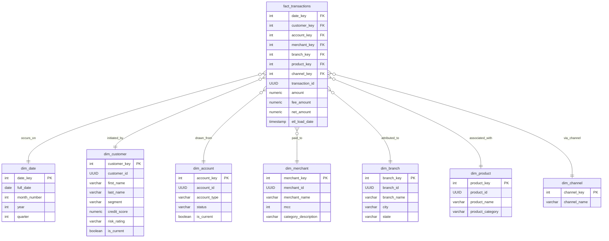

## 12. FEATURE STORE DESIGN

The feature store serves as the central repository for all engineered features used across the platform's analytical models and machine learning pipelines. It ensures consistency, reproducibility, and point-in-time correctness for model training and inference.

### 12.1. Customer Behavioral Features

These features capture the interaction patterns of customers with the bank's digital and physical channels.

| Feature Name | Data Type | Source Tables | Computation Logic | Update Frequency | Storage Format | Used By |
| :--- | :--- | :--- | :--- | :--- | :--- | :--- |
| `login_frequency_7d` | INT | `user_sessions` | `COUNT(session_id) WHERE login_time >= CURRENT_DATE - 7` | Daily | Parquet / Numeric | Fraud, Churn |
| `login_frequency_30d` | INT | `user_sessions` | `COUNT(session_id) WHERE login_time >= CURRENT_DATE - 30` | Daily | Parquet / Numeric | Fraud, Segmentation |
| `avg_session_duration` | FLOAT | `user_sessions` | `AVG(logout_time - login_time) in seconds` | Daily | Parquet / Numeric | Segmentation |
| `channel_preference` | VARCHAR | `user_sessions`, `transactions` | `MODE(channel) OVER (PARTITION BY customer_id)` | Weekly | Parquet / Categorical | Marketing, Segmentation |
| `digital_engagement_score` | FLOAT | `user_sessions`, `transactions` | Weighted sum of logins, digital txns, app interactions normalized to [0,1] | Daily | Parquet / Numeric | Churn, Segmentation |
| `product_adoption_count` | INT | `accounts`, `loans`, `cards` | `COUNT(DISTINCT product_id) WHERE status = 'active'` | Daily | Parquet / Numeric | CLV, Segmentation |
| `days_since_last_login` | INT | `user_sessions` | `CURRENT_DATE - MAX(login_time)` | Daily | Parquet / Numeric | Churn, Fraud |
| `support_ticket_frequency_90d` | INT | `support_tickets` | `COUNT(ticket_id) WHERE created_at >= CURRENT_DATE - 90` | Daily | Parquet / Numeric | Churn |
| `complaint_ratio` | FLOAT | `support_tickets` | `COUNT(ticket_id WHERE type='complaint') / NULLIF(COUNT(ticket_id), 0)` | Weekly | Parquet / Numeric | Churn, Segmentation |
| `avg_response_to_offers` | FLOAT | `marketing_campaigns` | `SUM(clicked) / NULLIF(COUNT(offer_id), 0)` | Weekly | Parquet / Numeric | Marketing |
| `cross_sell_receptivity_score` | FLOAT | `marketing_campaigns`, `accounts` | Logistic function based on historical offer acceptances and tenure | Weekly | Parquet / Numeric | Marketing |
| `transaction_frequency_7d` | INT | `transactions` | `COUNT(txn_id) WHERE txn_date >= CURRENT_DATE - 7` | Real-time | Redis / Parquet | Fraud |
| `transaction_frequency_30d` | INT | `transactions` | `COUNT(txn_id) WHERE txn_date >= CURRENT_DATE - 30` | Daily | Parquet / Numeric | Fraud, Segmentation |
| `transaction_frequency_90d` | INT | `transactions` | `COUNT(txn_id) WHERE txn_date >= CURRENT_DATE - 90` | Weekly | Parquet / Numeric | Segmentation |
| `unique_merchants_30d` | INT | `transactions` | `COUNT(DISTINCT merchant_id) WHERE txn_date >= CURRENT_DATE - 30` | Daily | Parquet / Numeric | Fraud, Segmentation |
| `weekend_transaction_ratio` | FLOAT | `transactions` | `COUNT(txn_id WHERE DAYOFWEEK(txn_date) IN (1,7)) / NULLIF(COUNT(txn_id), 0)` | Weekly | Parquet / Numeric | Fraud |
| `night_transaction_ratio` | FLOAT | `transactions` | `COUNT(txn_id WHERE HOUR(txn_time) BETWEEN 0 AND 5) / NULLIF(COUNT(txn_id), 0)` | Weekly | Parquet / Numeric | Fraud |

### 12.2. Financial Features

These features represent the monetary state and transaction behavior of the customer.

| Feature Name | Data Type | Source Tables | Computation Logic | Update Frequency | Storage Format | Used By |
| :--- | :--- | :--- | :--- | :--- | :--- | :--- |
| `total_balance_all_accounts` | DECIMAL | `accounts` | `SUM(current_balance) WHERE status = 'active'` | Daily | Parquet / Numeric | Default, CLV |
| `avg_monthly_income_deposits` | DECIMAL | `transactions` | `AVG(SUM(amount) WHERE type='credit' AND category='salary' GROUP BY month)` | Monthly | Parquet / Numeric | Default, Marketing |
| `avg_monthly_spending` | DECIMAL | `transactions` | `AVG(SUM(amount) WHERE type='debit' GROUP BY month)` | Monthly | Parquet / Numeric | Segmentation |
| `savings_rate` | FLOAT | `transactions` | `(avg_monthly_income_deposits - avg_monthly_spending) / NULLIF(avg_monthly_income_deposits, 0)` | Monthly | Parquet / Numeric | Default, Segmentation |
| `credit_utilization_ratio` | FLOAT | `cards` | `SUM(current_balance) / NULLIF(SUM(credit_limit), 0)` | Daily | Parquet / Numeric | Default, Risk |
| `debt_to_income_ratio` | FLOAT | `loans`, `cards`, `transactions` | `(Monthly Debt Service) / NULLIF(avg_monthly_income_deposits, 0)` | Monthly | Parquet / Numeric | Default |
| `avg_transaction_amount` | DECIMAL | `transactions` | `AVG(amount)` | Weekly | Parquet / Numeric | Fraud, Segmentation |
| `max_transaction_amount_30d` | DECIMAL | `transactions` | `MAX(amount) WHERE txn_date >= CURRENT_DATE - 30` | Daily | Parquet / Numeric | Fraud |
| `monthly_balance_volatility` | FLOAT | `accounts_history` | `STDDEV(daily_closing_balance) over last 30 days` | Daily | Parquet / Numeric | Default, Risk |
| `overdraft_frequency_90d` | INT | `accounts_history` | `COUNT(days WHERE closing_balance < 0) over last 90 days` | Daily | Parquet / Numeric | Default, Churn |
| `min_balance_30d` | DECIMAL | `accounts_history` | `MIN(daily_closing_balance) over last 30 days` | Daily | Parquet / Numeric | Default |
| `max_balance_30d` | DECIMAL | `accounts_history` | `MAX(daily_closing_balance) over last 30 days` | Daily | Parquet / Numeric | Marketing |
| `balance_trend_slope` | FLOAT | `accounts_history` | Linear regression slope of balance over last 90 days | Weekly | Parquet / Numeric | Default, Churn |
| `income_stability_cv` | FLOAT | `transactions` | `STDDEV(monthly_income) / NULLIF(AVG(monthly_income), 0)` | Monthly | Parquet / Numeric | Default |
| `large_transaction_count_30d` | INT | `transactions` | `COUNT(txn_id) WHERE amount > 1000 AND txn_date >= CURRENT_DATE - 30` | Daily | Parquet / Numeric | Fraud, Segmentation |

### 12.3. Temporal Features

These features capture durations and time-based metrics.

| Feature Name | Data Type | Source Tables | Computation Logic | Update Frequency | Storage Format | Used By |
| :--- | :--- | :--- | :--- | :--- | :--- | :--- |
| `customer_tenure_days` | INT | `customers` | `CURRENT_DATE - created_at` | Daily | Parquet / Numeric | All Models |
| `days_since_last_transaction` | INT | `transactions` | `CURRENT_DATE - MAX(txn_date)` | Daily | Parquet / Numeric | Churn, Fraud |
| `days_since_last_loan_payment` | INT | `loan_payments` | `CURRENT_DATE - MAX(payment_date)` | Daily | Parquet / Numeric | Default |
| `days_to_next_payment_due` | INT | `loans`, `cards` | `MIN(next_due_date) - CURRENT_DATE` | Daily | Parquet / Numeric | Default |
| `account_age_months` | INT | `accounts` | `MONTHS_BETWEEN(CURRENT_DATE, opened_date)` | Monthly | Parquet / Numeric | Segmentation |
| `time_since_credit_limit_increase`| INT | `cards_history` | `CURRENT_DATE - MAX(limit_increase_date)` | Daily | Parquet / Numeric | Risk |
| `recency_of_last_fraud_flag` | INT | `fraud_alerts` | `CURRENT_DATE - MAX(alert_date)` | Daily | Parquet / Numeric | Fraud, Risk |
| `days_since_last_support_ticket` | INT | `support_tickets` | `CURRENT_DATE - MAX(created_at)` | Daily | Parquet / Numeric | Churn |
| `months_since_product_change` | INT | `accounts`, `loans` | `MONTHS_BETWEEN(CURRENT_DATE, MAX(last_product_change_date))` | Monthly | Parquet / Numeric | Marketing |
| `time_to_first_transaction_after_signup`| INT | `customers`, `transactions` | `MIN(txn_date) - created_at` | Batch | Parquet / Numeric | CLV |

### 12.4. Aggregated Features

Rollups of historical data over the lifetime of the relationship.

| Feature Name | Data Type | Source Tables | Computation Logic | Update Frequency | Storage Format | Used By |
| :--- | :--- | :--- | :--- | :--- | :--- | :--- |
| `total_products_held` | INT | `accounts`, `loans`, `cards` | `COUNT(DISTINCT product_id) across all product tables` | Daily | Parquet / Numeric | CLV, Segmentation |
| `total_active_loans` | INT | `loans` | `COUNT(loan_id) WHERE status = 'active'` | Daily | Parquet / Numeric | Default, Risk |
| `total_credit_cards` | INT | `cards` | `COUNT(card_id) WHERE status = 'active'` | Daily | Parquet / Numeric | Default |
| `total_accounts` | INT | `accounts` | `COUNT(account_id) WHERE status = 'active'` | Daily | Parquet / Numeric | Segmentation |
| `lifetime_transaction_count` | INT | `transactions` | `COUNT(txn_id)` | Weekly | Parquet / Numeric | CLV |
| `lifetime_transaction_value` | DECIMAL | `transactions` | `SUM(amount)` | Weekly | Parquet / Numeric | CLV |
| `avg_monthly_transactions_lifetime`| FLOAT | `transactions`, `customers` | `lifetime_transaction_count / (customer_tenure_days / 30.0)` | Monthly | Parquet / Numeric | Segmentation |
| `total_fraud_flags_ever` | INT | `fraud_alerts` | `COUNT(alert_id)` | Daily | Parquet / Numeric | Fraud, Risk |
| `total_support_tickets_ever` | INT | `support_tickets` | `COUNT(ticket_id)` | Weekly | Parquet / Numeric | Churn |
| `total_marketing_responses_ever`| INT | `marketing_campaigns` | `COUNT(response_id WHERE clicked=true)` | Weekly | Parquet / Numeric | Marketing |

### 12.5. Risk Features

Composite metrics quantifying exposure and risk levels.

| Feature Name | Data Type | Source Tables | Computation Logic | Update Frequency | Storage Format | Used By |
| :--- | :--- | :--- | :--- | :--- | :--- | :--- |
| `fraud_score` | FLOAT | Model Output | Output from Fraud Detection Model | Real-time | Redis / Parquet | Risk Dashboard |
| `default_probability` | FLOAT | Model Output | Output from Default Prediction Model | Daily | Parquet / Numeric | Risk Dashboard |
| `credit_score_change_6m` | INT | `customer_credit` | `current_credit_score - credit_score_6m_ago` | Monthly | Parquet / Numeric | Default |
| `consecutive_missed_payments` | INT | `loan_payments`, `card_payments`| Count of continuous missed payment cycles | Daily | Parquet / Numeric | Default |
| `max_days_past_due_12m` | INT | `loan_payments`, `card_payments`| `MAX(days_past_due) over last 12 months` | Daily | Parquet / Numeric | Default, Risk |
| `debt_service_coverage_ratio` | FLOAT | `loans`, `transactions` | `(Net Operating Income) / Total Debt Service` | Monthly | Parquet / Numeric | Default |
| `concentration_risk_score` | FLOAT | `accounts`, `loans` | `MAX(balance in single product) / SUM(all balances)` | Weekly | Parquet / Numeric | Risk |
| `velocity_anomaly_score` | FLOAT | `transactions` | Z-score of transaction volume over last 24 hours vs 30-day baseline | Real-time | Redis / Parquet | Fraud |
| `geographic_risk_score` | FLOAT | `transactions`, `locations` | Look up based on IP geolocation and transaction physical location | Real-time | Redis / Parquet | Fraud |
| `merchant_risk_exposure` | DECIMAL | `transactions`, `merchants`| `SUM(amount * merchant_risk_score) over last 30 days` | Daily | Parquet / Numeric | Fraud |
| `late_payment_frequency_12m` | INT | `loan_payments` | `COUNT(payment_id WHERE status='late') over last 12 months` | Daily | Parquet / Numeric | Default |
| `credit_utilization_trend` | FLOAT | `cards_history` | Slope of credit utilization over last 6 months | Monthly | Parquet / Numeric | Default |

### 12.6. Rolling Window Features

Real-time and batch aggregations over specific time horizons.

| Feature Name | Data Type | Source Tables | Computation Logic | Update Frequency | Storage Format | Used By |
| :--- | :--- | :--- | :--- | :--- | :--- | :--- |
| `rolling_avg_transaction_7d` | DECIMAL | `transactions` | `AVG(amount) over last 7 days` | Real-time | Redis / Parquet | Fraud |
| `rolling_avg_transaction_14d` | DECIMAL | `transactions` | `AVG(amount) over last 14 days` | Daily | Parquet / Numeric | Fraud |
| `rolling_avg_transaction_30d` | DECIMAL | `transactions` | `AVG(amount) over last 30 days` | Daily | Parquet / Numeric | Segmentation |
| `rolling_avg_transaction_90d` | DECIMAL | `transactions` | `AVG(amount) over last 90 days` | Daily | Parquet / Numeric | Segmentation |
| `rolling_std_transaction_7d` | FLOAT | `transactions` | `STDDEV(amount) over last 7 days` | Real-time | Redis / Parquet | Fraud |
| `rolling_std_transaction_30d` | FLOAT | `transactions` | `STDDEV(amount) over last 30 days` | Daily | Parquet / Numeric | Fraud |
| `rolling_max_transaction_7d` | DECIMAL | `transactions` | `MAX(amount) over last 7 days` | Real-time | Redis / Parquet | Fraud |
| `rolling_max_transaction_30d` | DECIMAL | `transactions` | `MAX(amount) over last 30 days` | Daily | Parquet / Numeric | Fraud |
| `rolling_count_transactions_7d`| INT | `transactions` | `COUNT(txn_id) over last 7 days` | Real-time | Redis / Parquet | Fraud |
| `rolling_count_transactions_30d`| INT | `transactions` | `COUNT(txn_id) over last 30 days` | Daily | Parquet / Numeric | Fraud |
| `rolling_unique_merchants_7d` | INT | `transactions` | `COUNT(DISTINCT merchant_id) over last 7 days` | Real-time | Redis / Parquet | Fraud |
| `rolling_unique_merchants_30d`| INT | `transactions` | `COUNT(DISTINCT merchant_id) over last 30 days`| Daily | Parquet / Numeric | Fraud |

### 12.7. Merchant Features

Entity-level features for counter-parties in transactions.

| Feature Name | Data Type | Source Tables | Computation Logic | Update Frequency | Storage Format | Used By |
| :--- | :--- | :--- | :--- | :--- | :--- | :--- |
| `merchant_avg_transaction_amount`| DECIMAL | `transactions` | `AVG(amount) GROUP BY merchant_id` | Weekly | Parquet / Numeric | Fraud |
| `merchant_fraud_rate` | FLOAT | `transactions`, `fraud_alerts`| `COUNT(fraud_txns) / NULLIF(COUNT(all_txns), 0)` | Daily | Parquet / Numeric | Fraud |
| `merchant_transaction_volume_30d`| INT | `transactions` | `COUNT(txn_id) WHERE txn_date >= CURRENT_DATE - 30` | Daily | Parquet / Numeric | Fraud |
| `merchant_chargeback_rate` | FLOAT | `transactions` | `COUNT(chargebacks) / NULLIF(COUNT(all_txns), 0)` | Weekly | Parquet / Numeric | Fraud |
| `merchant_category_risk_score`| FLOAT | `merchant_categories` | Assigned risk weight based on MCC code | Monthly | Parquet / Numeric | Fraud |
| `merchant_avg_customer_spend` | DECIMAL | `transactions` | `SUM(amount) / NULLIF(COUNT(DISTINCT customer_id), 0)` | Weekly | Parquet / Numeric | Fraud |
| `merchant_new_customer_ratio` | FLOAT | `transactions` | `COUNT(first_time_customers) / COUNT(unique_customers)` | Weekly | Parquet / Numeric | Fraud |
| `merchant_international_txn_ratio`| FLOAT | `transactions` | `COUNT(international_txns) / COUNT(all_txns)` | Weekly | Parquet / Numeric | Fraud |

### 12.8. Geographic Features

Spatial and macro-economic factors.

| Feature Name | Data Type | Source Tables | Computation Logic | Update Frequency | Storage Format | Used By |
| :--- | :--- | :--- | :--- | :--- | :--- | :--- |
| `customer_region_median_income`| DECIMAL | `demographics` | Lookup from census/bureau data by ZIP/Region | Yearly | Parquet / Numeric | Default, Marketing |
| `branch_performance_quartile` | INT | `branches`, `revenue` | `NTILE(4) OVER (ORDER BY revenue DESC)` | Monthly | Parquet / Numeric | Branch Analytics |
| `regional_fraud_rate` | FLOAT | `transactions`, `fraud_alerts`| Fraud rate aggregated by state/region | Monthly | Parquet / Numeric | Fraud |
| `distance_from_home_branch` | FLOAT | `customers`, `transactions`| Haversine distance between home address and txn location | Real-time | Redis / Parquet | Fraud |
| `regional_default_rate` | FLOAT | `loans` | Default rate aggregated by state/region | Monthly | Parquet / Numeric | Default |
| `cost_of_living_adjusted_balance`| DECIMAL | `accounts`, `demographics` | `total_balance / regional_COL_index` | Yearly | Parquet / Numeric | Segmentation |

### 12.9. Feature Computation Flow Diagram

```mermaid
graph TD
    subgraph Operational Systems
        A[Core Banking CSVs]
        B[Transaction Streams]
        C[CRM Data]
    end

    subgraph Data Lakehouse (Bronze & Silver)
        D[Raw Tables]
        E[Cleaned Tables]
        A --> D
        B --> D
        C --> D
        D --> E
    end

    subgraph Feature Engineering Pipeline
        F[Batch Processing - Spark/dbt]
        G[Streaming Processing - Flink/Kafka]
        
        E --> F
        B --> G
        
        F --> H{Feature Store}
        G --> H
    end

    subgraph Feature Store Layers
        H --> I[Offline Store - Parquet/Delta]
        H --> J[Online Store - Redis/DynamoDB]
    end

    subgraph Consumption
        I --> K[Model Training]
        I --> L[Batch Inference]
        J --> M[Real-time Inference]
    end
```

---

## 13. ETL ARCHITECTURE

The platform implements an ELT (Extract, Load, Transform) paradigm utilizing modern data stack principles to process data from flat files into analytical schemas.

### 13.1. Extraction Layer
- **Source Identification**: 15 distinct datasets encompassing customers, accounts, loans, cards, transactions, and demographics.
- **Connection Strategy**: Automated ingestion of file-based CSVs from a secure landing zone (S3/ADLS simulation).
- **Schema Detection**: Automated inference of headers, delimiters, and data types via pyarrow/pandas during ingestion.
- **Data Profiling**: High-level statistical summaries generated upon extraction to baseline expectations.
- **Source Freshness**: File timestamp checks to ensure data SLA compliance before ingestion begins.

### 13.2. Validation Layer
- **Schema Validation**: Explicit Great Expectations suites enforcing column presence and order.
- **Data Type Checking**: Enforcement of strong typing (e.g., preventing string insertion into `DECIMAL` fields).
- **Null Value Policies**: Primary keys (`customer_id`, `txn_id`), foreign keys, and critical timestamps reject nulls.
- **Range Validation**: Constraints such as `amount > 0`, `credit_limit >= 0`, `dob < CURRENT_DATE - 18 YEARS`.
- **Referential Integrity**: Validation that foreign keys in child files (e.g., `transactions.customer_id`) exist in parent files (`customers.customer_id`).
- **Uniqueness Validation**: Checking constraint violations for fields like `ssn`, `email`, `txn_id`.
- **Validation Reporting**: Generation of HTML data quality reports via Great Expectations, alerting data engineers via Slack on threshold breaches.

### 13.3. Cleaning Layer
- **Duplicate Detection**: Identifying exact row matches and temporal duplicates (e.g., double-swipe transactions within seconds).
- **Missing Value Imputation**:
  - *Numerical*: Median imputation for skewed financial data (e.g., income); model-based imputation for credit scores.
  - *Categorical*: Assignment of 'Unknown' or mode imputation (e.g., employment status).
  - *Date*: Business rules (e.g., if `close_date` is null, account is active).
- **Outlier Handling**: 
  - *IQR Method*: Identifying statistical anomalies in transaction amounts.
  - *Z-Score*: Flagging extreme counts in transaction frequency.
- **Standardization**:
  - String: Trimming whitespace, upper-casing categorical codes.
  - Date: Standardizing all dates to `YYYY-MM-DD` and timestamps to UTC.
  - Currency: Normalizing amounts to a base currency (USD).

### 13.4. Transformation Layer
- **Bronze → Silver**: Application of cleaning rules, deduplication, and enforcement of standard data types. Stored as optimized Parquet/Delta.
- **Silver → Gold**: Complex joins resolving relationships (Customer -> Account -> Transactions), aggregations, and application of business logic (e.g., determining default status based on DPD).
- **Gold → Warehouse**: Structuring into Star Schemas (Fact and Dimension tables) optimized for BI consumption.
- **Feature Engineering**: Execution of complex SQL/Python logic to generate the features defined in Section 12.
- **Slowly Changing Dimensions (SCD)**: Implementation of Type 2 SCDs for entities like `Customers` and `Accounts` to track historical changes (using `valid_from`, `valid_to`, `is_current` flags).
- **Surrogate Keys**: Hashing natural keys to generate immutable surrogate keys for dimension tables.

### 13.5. Loading Layer
- **Full Load**: Used for dimension initialization and metadata tables. Includes truncation and recreation.
- **Incremental Load**: Utilizing high-water mark tracking (based on `updated_at` or `txn_date`) to process only new or changed records.
- **Upsert Logic**: SQL `MERGE` statements used for Dimension tables to insert new records and update existing ones (SCD Type 1/2 logic).
- **Fact Table Append**: Immutable insert-only operations for high-volume event data like transactions and logs.
- **Load Verification**: Post-load automated checks comparing source row counts against target row counts, and validating checksums.

### 13.6. Orchestration
- **DAG Design**: Managed via Apache Airflow or Dagster. Dependencies explicitly defined to ensure dimensions load before facts.
- **Parallel Execution**: Independent dimension loads execute concurrently; fact tables partition processing by date.
- **Scheduling**: 
  - Daily Batch: Triggered at 02:00 UTC for full analytical refresh.
  - Hourly Micro-batch: For critical transaction and fraud alert feeds.
- **Retry Policy**: 3 automatic retries with exponential backoff for transient failures (network timeouts, locks).
- **Alerting**: Integration with Slack/Email webhooks for pipeline failures, SLA misses, or severe data quality degradation.

### 13.7. Monitoring & Logging
- **Metrics**: Capturing task duration, rows extracted, rows loaded, and error counts stored in an `etl_audit` table.
- **Data Quality Scores**: Percentage of rows passing validation rules tracked over time.
- **Log Levels**: Standardized logging utilizing Python's `logging` module (INFO for progress, WARNING for data anomalies, ERROR for task failures).
- **Dashboard**: A Grafana/Metabase dashboard visualizing pipeline health, execution times, and data volume trends.

### 13.8. Error Handling
- **Classification**: Distinguishing between transient (connection reset) and permanent (schema mismatch) errors.
- **Quarantine Tables**: Malformed records (e.g., failing foreign key constraints) are redirected to `quarantine_*` tables rather than halting the pipeline.
- **Recovery**: Playbooks for re-running specific DAG sub-trees without causing data duplication.

### 13.9. ETL Pipeline DAG

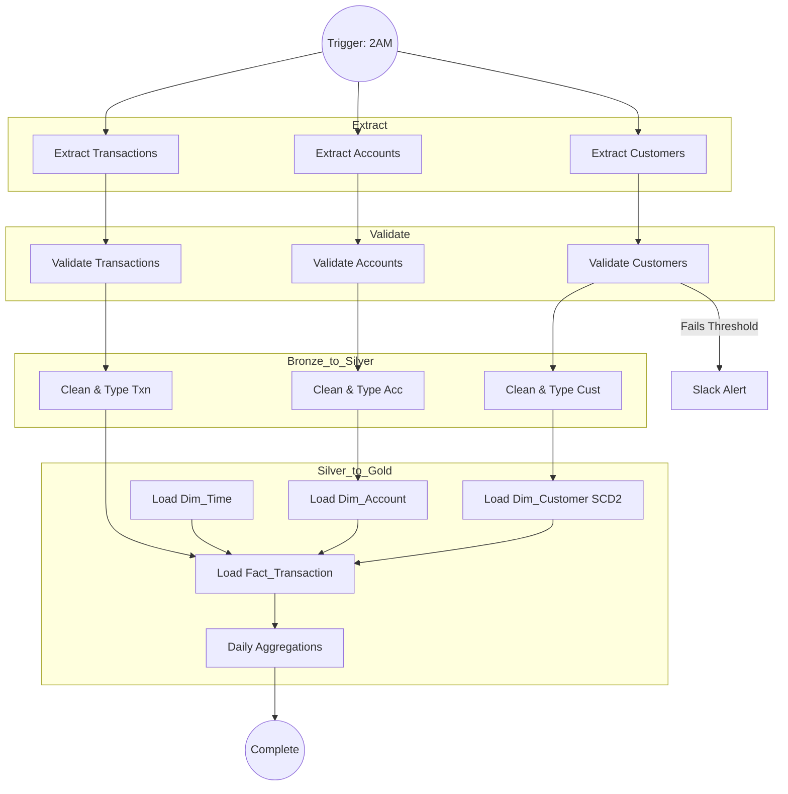

---

## 14. SQL LAYER

The analytical foundation relying on a robust relational database (PostgreSQL/Redshift/Snowflake paradigm).

### 14.1. Views

Logical abstractions simplifying complex queries for BI tools and ad-hoc analysis.

1. **`v_customer_360`**: 
   - *Columns*: `customer_id`, `name`, `age`, `total_balance`, `active_loans`, `credit_score`, `lifetime_value`, `risk_segment`.
   - *Logic*: Joins `customers`, aggregated `accounts`, aggregated `loans`, and `credit_scores`. Left joins ensure customers without loans are retained.
2. **`v_transaction_enriched`**: 
   - *Columns*: `txn_id`, `date`, `amount`, `customer_name`, `merchant_name`, `category`, `is_fraud`, `branch_name`.
   - *Logic*: Joins `transactions` fact table to dimensions: `customers`, `merchants`, `branches`, and `fraud_labels`.
3. **`v_loan_portfolio`**: 
   - *Columns*: `loan_id`, `customer_id`, `principal`, `outstanding_balance`, `interest_rate`, `days_past_due`, `status`.
   - *Logic*: Joins `loans` with recent `loan_payments` to calculate current DPD and outstanding balance.
4. **`v_branch_performance`**:
   - *Columns*: `branch_id`, `branch_name`, `region`, `total_deposits`, `total_loans`, `new_accounts_mtd`, `revenue_ytd`.
   - *Logic*: Aggregates account balances and transaction fees grouped by branch.
5. **`v_fraud_analysis`**:
   - *Columns*: `alert_id`, `txn_id`, `customer_id`, `amount`, `merchant_risk`, `geo_distance`, `resolution_status`.
   - *Logic*: Filters `transactions` where `is_fraud = true` or `fraud_score > 0.85`, joining contextual metadata.
6. **`v_revenue_summary`**:
   - *Columns*: `month`, `product_line`, `region`, `fee_income`, `interest_income`, `total_revenue`.
   - *Logic*: Unions and aggregates fee data from transactions and interest data from loans/accounts.
7. **`v_customer_segments`**:
   - *Columns*: `customer_id`, `segment_name`, `rfm_score`, `primary_channel`, `next_best_offer`.
   - *Logic*: Materialization view output from the ML clustering pipeline joined with CRM details.
8. **`v_marketing_effectiveness`**:
   - *Columns*: `campaign_id`, `channel`, `spend`, `impressions`, `clicks`, `conversions`, `cac`, `roi`.
   - *Logic*: Joins `marketing_campaigns` with `new_accounts` attributed within 30 days of campaign interaction.
9. **`v_risk_dashboard`**:
   - *Columns*: `date`, `portfolio_value`, `var_95`, `expected_loss`, `non_performing_loans_ratio`.
   - *Logic*: High-level aggregations applying risk formulas to portfolio balances.
10. **`v_executive_kpi`**:
    - *Columns*: `metric_name`, `current_value`, `previous_period_value`, `yoy_growth`, `target`, `status`.
    - *Logic*: Complex unpivot of various aggregations to produce a standardized key-value format for dashboards.

### 14.2. Materialized Views

Pre-computed views for performance-critical dashboards.

1. **`mv_daily_transaction_summary`**: Aggregates txns by day, branch, and category. Refresh: Scheduled daily at 03:00. Index on `(date, branch_id)`. ~10k rows.
2. **`mv_customer_risk_scores`**: Composite risk profiles per customer. Refresh: Scheduled daily. Index on `customer_id`. ~1M rows.
3. **`mv_branch_monthly_performance`**: Snapshot of branch KPIs. Refresh: 1st of month. Index on `(month, branch_id)`. ~5k rows.
4. **`mv_product_profitability`**: Revenue vs cost per product type. Refresh: Weekly. Index on `product_id`. ~100 rows.
5. **`mv_fraud_metrics_daily`**: Fraud rates, false positives, total losses. Refresh: Scheduled hourly. Index on `date`. ~2k rows.

### 14.3. Stored Procedures

Encapsulating complex, multi-step transactional logic.

1. **`sp_load_dimension_scd2`**:
   - *Params*: `target_table`, `source_table`, `business_key`.
   - *Logic*: Implements Type 2 SCD. Closes old records (`valid_to = CURRENT_DATE`), inserts new active records. Rolls back on error.
2. **`sp_load_fact_incremental`**:
   - *Params*: `fact_table`, `source_view`, `watermark_column`.
   - *Logic*: Fetches `MAX(watermark)` from target, loads rows from source where watermark is greater.
3. **`sp_refresh_materialized_views`**:
   - *Logic*: Sequentially executes `REFRESH MATERIALIZED VIEW CONCURRENTLY` in dependency order.
4. **`sp_calculate_customer_risk_score`**:
   - *Params*: `customer_id` (optional for single calculation vs batch).
   - *Logic*: Applies weighted formula aggregating credit, behavioral, and demographic risk factors.
5. **`sp_generate_executive_report`**:
   - *Params*: `report_date`.
   - *Logic*: Compiles data into static report tables used for compliance/executive distribution, locking historical numbers.

### 14.4. Functions (UDFs)

Reusable scalar and table-valued calculations.

1. **`fn_calculate_credit_utilization(credit_limit, current_balance)`**: Returns float. Handles div-by-zero if limit is 0.
2. **`fn_calculate_dti_ratio(monthly_debt, monthly_income)`**: Returns float. Cap at 1.0 or handled specifically for extreme values.
3. **`fn_risk_category(risk_score)`**: Returns `VARCHAR`. Implements logic: >80 'Critical', 60-80 'High', 40-60 'Medium', <40 'Low'.
4. **`fn_customer_lifetime_value(customer_id)`**: Calculates NPV of historical revenue + projected 3-year revenue.
5. **`fn_days_past_due(due_date, last_payment_date)`**: Returns integer days. Handles logic for weekends/holidays if applicable.

### 14.5. Indexes Strategy

1. `idx_pk_customer` on `customers(customer_id)` (Automatic).
2. `idx_fk_txn_customer` on `transactions(customer_id)`.
3. `idx_fk_txn_merchant` on `transactions(merchant_id)`.
4. `idx_fk_account_cust` on `accounts(customer_id)`.
5. `idx_fk_loan_cust` on `loans(customer_id)`.
6. `idx_composite_txn_date_cust` on `transactions(txn_date, customer_id)` - Optimize historical lookup.
7. `idx_composite_login_session` on `user_sessions(customer_id, login_time)` - Optimize behavioral features.
8. `idx_partial_active_loans` on `loans(status)` WHERE `status = 'active'` - Fast lookup of current exposure.
9. `idx_partial_unresolved_fraud` on `fraud_alerts(resolution)` WHERE `resolution = 'pending'`.
10. `idx_expr_txn_month` on `transactions(DATE_TRUNC('month', txn_date))` - Optimize monthly aggregations.
11. `idx_expr_lower_email` on `customers(LOWER(email))` - Case insensitive search.
12. `idx_gin_customer_search` on `customers USING GIN(to_tsvector('english', name || ' ' || address))` - Full text search in CRM.
13. `idx_fk_loan_payment` on `loan_payments(loan_id)`.
14. `idx_fk_card_payment` on `card_payments(card_id)`.
15. `idx_txn_amount` on `transactions(amount)` - Useful for outlier detection queries.

### 14.6. Triggers

1. **`trg_audit_customer_changes`**: ON UPDATE `customers`. Inserts old/new values into `customer_audit_log` with user_id and timestamp.
2. **`trg_update_timestamp`**: ON UPDATE any table. Automatically sets `updated_at = CURRENT_TIMESTAMP`.
3. **`trg_fraud_alert`**: ON INSERT `transactions`. If `amount > 50000`, inserts record into `manual_review_queue`.

### 14.7. Window Functions

1. **Customer Ranking**: `DENSE_RANK() OVER (ORDER BY total_balance DESC)` for VIP identification.
2. **Running Total**: `SUM(amount) OVER (PARTITION BY account_id ORDER BY txn_date ROWS UNBOUNDED PRECEDING)` to reconstruct balances.
3. **Moving Average**: `AVG(amount) OVER (PARTITION BY merchant_id ORDER BY txn_date ROWS BETWEEN 29 PRECEDING AND CURRENT ROW)` for 30-day merchant volume.
4. **YoY Comparison**: `LAG(revenue, 12) OVER (PARTITION BY branch_id ORDER BY month)` to calculate YoY growth.
5. **Percentile Ranking**: `PERCENT_RANK() OVER (ORDER BY profitability_score)` to define top 10% customers.
6. **First Transaction**: `FIRST_VALUE(txn_date) OVER (PARTITION BY customer_id ORDER BY txn_date)` for cohort analysis.
7. **MoM Growth**: `(revenue - LAG(revenue, 1) OVER (ORDER BY month)) / LAG(revenue, 1) OVER (ORDER BY month)`.
8. **Cumulative Distribution**: `CUME_DIST() OVER (ORDER BY credit_score)` for risk portfolio distribution.

### 14.8. CTE Query Patterns

1. **Multi-level Aggregation**: Aggregating transactions to monthly, then joining with customer demographics in a single query.
2. **Recursive Hierarchy**: Traversing employee reporting lines or branch hierarchy (Region -> District -> Branch).
3. **Running Calculations**: Using CTE to filter base population before applying complex window functions to improve performance.
4. **Deduplication**: `WITH ranked AS (SELECT *, ROW_NUMBER() OVER(PARTITION BY id ORDER BY timestamp DESC) as rn FROM raw) SELECT * FROM ranked WHERE rn=1`.
5. **Subquery Replacement**: Refactoring deeply nested correlated subqueries into readable CTE blocks for maintainability and execution plan optimization.

### 14.9. Optimization Strategy
- Utilize `EXPLAIN ANALYZE` to identify seq scans and nested loops on large tables.
- **Connection Pooling**: Implement PgBouncer to manage database connections efficiently.
- **Maintenance**: Schedule `VACUUM ANALYZE` off-hours to prevent bloat and update statistics for the query planner.
- **Partitioning**: Implement declarative partitioning on `transactions` table by `RANGE (txn_date)` (monthly partitions) to enable partition pruning and rapid archival.

---

## 15. ANALYTICS LAYER

### 15.1. Customer Analysis
- **Business Questions**: Who are the most valuable customers? Which customers are at risk of churning? What is the demographic breakdown of our high-net-worth segment? What products do customers typically buy after a mortgage? What is the average customer acquisition cost?
- **Sources**: `customers`, `accounts`, `transactions`, `demographics`, `user_sessions`.
- **Metrics**: CLV, Churn Probability Score, RFM Score, NPS, CAC.
- **Methods**: K-Means clustering, Survival analysis for churn, Cohort analysis.
- **Visualizations**: Scatter plots (CLV vs CAC), Sankey diagrams (Journey mapping), Radar charts (Segment profiles).
- **Output**: Interactive BI Dashboards, targeted lists for marketing.
- **Audience**: Marketing Team, Product Managers.

### 15.2. Revenue Analysis
- **Business Questions**: Which product line is most profitable? How is fee income trending YoY? Which branches generate the most interest income? Are we over-reliant on a specific revenue stream? What is the projected revenue for Q4?
- **Sources**: `transactions`, `loans`, `accounts`, `branch_performance`.
- **Metrics**: Net Interest Margin (NIM), Non-Interest Income, Cost-to-Income Ratio, YoY Growth %.
- **Methods**: Time series decomposition, ARIMA forecasting, Variance analysis.
- **Visualizations**: Stacked bar charts (Revenue mix), Line charts with confidence intervals (Forecasts), Waterfall charts (MoM Variance).
- **Output**: Financial reports, Executive dashboards.
- **Audience**: CFO, Finance Team, Executives.

### 15.3. Fraud Analysis
- **Business Questions**: What is the current fraud rate by channel? Which merchant categories are highest risk? Are we seeing an increase in account takeover attempts? What is the false positive rate of the new ML model? How much potential loss was prevented?
- **Sources**: `transactions`, `fraud_alerts`, `merchants`, `user_sessions`.
- **Metrics**: Fraud Rate (bps), False Positive Ratio, Total Prevented Loss, Detection Time.
- **Methods**: Anomaly detection, Network analysis (graph), Geospatial clustering.
- **Visualizations**: Heatmaps (Geographic fraud), Network graphs (Collusion rings), Funnel charts (Investigation process).
- **Output**: Real-time monitoring screens, investigation queues.
- **Audience**: Fraud Operations, Risk Managers.

### 15.4. Loan Analysis
- **Business Questions**: What is the overall delinquency rate? How are recent loan cohorts performing compared to older ones? What is the exposure to commercial real estate? Who are the top performing loan officers? What is the expected loss given default?
- **Sources**: `loans`, `loan_payments`, `customer_credit`, `collateral`.
- **Metrics**: 30/60/90 DPD Rates, NPL Ratio, LGD, PD, Vintage cumulative default rate.
- **Methods**: Vintage analysis, Logistic regression (PD), Survival analysis.
- **Visualizations**: Vintage curves (Line charts), Treemaps (Portfolio concentration), Distribution plots (Credit scores).
- **Output**: Portfolio risk reports, Regulatory filings.
- **Audience**: Chief Risk Officer, Credit Analysts.

### 15.5. Branch Analysis
- **Business Questions**: Which branches have the highest capacity utilization? How does branch A's demographic differ from branch B? Which branch acquires the most net-new customers? What is the profitability of the downtown branch?
- **Sources**: `branches`, `customers`, `transactions`, `accounts`.
- **Metrics**: Transactions per FTE, Deposit Growth, Loan Origination Volume, Operating Efficiency.
- **Methods**: DEA (Data Envelopment Analysis) for efficiency, Spatial analysis.
- **Visualizations**: Bubble maps (Branch locations by size/profit), Bar charts (Ranking), Scatter plots (Efficiency vs Growth).
- **Output**: Branch Manager Scorecards.
- **Audience**: Retail Banking Head, Branch Managers.

### 15.6. Marketing Analysis
- **Business Questions**: Which campaign had the highest ROI? Is email or SMS more effective for loan offers? What is the conversion rate of the summer promo? How should we allocate the Q3 marketing budget?
- **Sources**: `marketing_campaigns`, `web_analytics`, `accounts`.
- **Metrics**: CTR, Conversion Rate, CPA (Cost Per Acquisition), ROI, Incremental Lift.
- **Methods**: A/B Testing (t-tests, chi-square), Multi-touch attribution modeling, Media mix modeling.
- **Visualizations**: Funnels, Bar charts (Channel comparison), Lift charts.
- **Output**: Campaign post-mortem reports.
- **Audience**: CMO, Marketing Analysts.

### 15.7. Risk Analysis
- **Business Questions**: What is our total exposure to the retail sector? Does our capital meet Basel III requirements? What happens to the portfolio under a 20% housing market crash scenario? Are we within our defined risk appetite?
- **Sources**: `loans`, `cards`, `market_data`, `macro_indicators`.
- **Metrics**: VaR (Value at Risk), Expected Shortfall, RWA (Risk-Weighted Assets), Concentration Ratios.
- **Methods**: Monte Carlo simulations (Stress testing), Copulas for dependence modeling.
- **Visualizations**: Distribution plots, Scenario comparison tables, Gauge charts (Risk limits).
- **Output**: Board-level risk reports, Stress test results.
- **Audience**: Risk Committee, Regulators, CRO.

### 15.8. Executive Analysis
- **Business Questions**: Are we hitting our strategic growth targets? How do we compare to peer banks? What are the top 3 risks to the enterprise?
- **Sources**: All aggregated data marts.
- **Metrics**: ROE, ROA, Efficiency Ratio, Total Assets, Tier 1 Capital Ratio.
- **Methods**: Indexing, Trend analysis.
- **Visualizations**: KPI Scorecards with sparklines, Bullet charts (Actual vs Target).
- **Output**: Executive briefing decks, Mobile dashboard.
- **Audience**: CEO, Board of Directors.

---

## 16. STATISTICS LAYER

### 16.1. Descriptive Statistics
- **Mean, Median, Mode**: $\mu = \frac{1}{N}\sum x_i$. Required for central tendency of balances, income, age. Used in ETL imputation and Segmentation.
- **Standard Deviation, Variance**: $\sigma^2 = \frac{\sum (x_i - \mu)^2}{N}$. Required for measuring volatility in transaction patterns. Used in Feature Engineering (Risk).
- **Skewness, Kurtosis**: Assessing distribution asymmetry and tails (heavy-tailed financial data). Used in Exploratory Data Analysis.
- **Percentiles**: Understanding wealth distribution (e.g., top 1% hold X% of deposits). Used in Executive Reporting.
- **Coefficient of Variation**: $CV = \frac{\sigma}{\mu}$. Standardized measure of dispersion, useful for income stability features.

### 16.2. Inferential Statistics
- **Confidence Intervals**: Estimating population parameters (e.g., true average default rate) from samples. Used in Risk Reporting.
- **Hypothesis Testing**: t-tests (continuous), Chi-square (categorical). Required for A/B testing campaign effectiveness. Used in Marketing Analysis.
- **Z-test for Proportions**: Comparing conversion rates between two distinct groups.
- **Mann-Whitney U Test**: Non-parametric test for comparing distributions (e.g., balances of fraud vs non-fraud accounts) without assuming normality.

### 16.3. Correlation & Association
- **Pearson Correlation**: $r = \frac{\sum(x_i-\bar{x})(y_i-\bar{y})}{\sqrt{\sum(x_i-\bar{x})^2 \sum(y_i-\bar{y})^2}}$. Linear relationship between variables (e.g., Income vs Credit Limit). Used in Feature Selection.
- **Spearman Rank Correlation**: Monotonic relationships, robust to outliers (common in finance).
- **Chi-Square Test of Independence**: $\chi^2 = \sum \frac{(O_i - E_i)^2}{E_i}$. Relationship between categorical variables (e.g., Region and Default Status).
- **Cramér's V**: Effect size for Chi-square, scaling the association from 0 to 1.

### 16.4. Regression
- **Linear Regression**: $Y = \beta_0 + \beta_1X_1 + \epsilon$. Baseline for continuous prediction (e.g., predicting CLV).
- **Logistic Regression**: $P(Y=1) = \frac{1}{1 + e^{-(\beta_0 + \beta_1X)}}$. Baseline for binary classification and credit scorecard development (produces interpretable coefficients).

### 16.5. Time Series
- **Moving Averages (SMA, EMA)**: Smoothing noisy daily transaction data to identify trends. Used in Feature Engineering.
- **Trend Decomposition**: Separating time series into Trend, Seasonality, and Residual components. Used in Revenue Forecasting.
- **Autocorrelation (ACF, PACF)**: Detecting lags in time series data. Used in ARIMA modeling for forecasts.
- **Stationarity Tests (ADF Test)**: Ensuring time series properties don't change over time before applying regression.

### 16.6. Classification Metrics
- **Accuracy, Precision, Recall, F1-Score**: $F1 = 2 \cdot \frac{Precision \cdot Recall}{Precision + Recall}$. Standard evaluation. Recall is critical for Fraud (catch all fraud); Precision is critical for Marketing (don't spam).
- **AUC-ROC**: Area under the Receiver Operating Characteristic curve. Threshold-invariant measure of model separability. Used in ML Evaluation.
- **Confusion Matrix**: Tabular representation of True Positives, False Positives, etc.
- **Log Loss**: Measuring the uncertainty of probabilities. Used in ML training objective functions.

### 16.7. Clustering Metrics
- **Silhouette Score**: $\frac{b - a}{\max(a, b)}$. Measures how similar an object is to its own cluster compared to others. Used in K-Means evaluation.
- **Elbow Method (WCSS)**: Plotting within-cluster sum of squares to determine optimal $K$.

### 16.8. Distribution Analysis
- **Kolmogorov-Smirnov Test**: Comparing a sample with a reference probability distribution. Used in Data Drift monitoring in ML Ops.
- **QQ Plots**: Visual check for normality of residuals in regression.

### 16.9. Dimensionality Reduction
- **PCA**: Orthogonal transformation to convert correlated variables into linearly uncorrelated principal components. Used to reduce feature space for clustering.
- **t-SNE / UMAP**: Non-linear dimensionality reduction for visualizing high-dimensional customer segments in 2D space.

### 16.10. Sampling
- **Stratified Sampling**: Ensuring train/test splits maintain the exact ratio of classes (e.g., maintaining 2% fraud rate in both sets).
- **SMOTE (Synthetic Minority Over-sampling Technique)**: Generating synthetic examples for the minority class to handle severe imbalances in Fraud and Default datasets.

---

## 17. MACHINE LEARNING ARCHITECTURE

### 17.1. Fraud Detection Model
- **Problem Type**: Binary classification (`is_fraud`: 0/1).
- **Target Variable**: `is_fraud` from the `fraud_labels` table.
- **Class Imbalance**: ~2% fraud rate. Handled via SMOTE during training and using `scale_pos_weight` in tree models.
- **Features (25+)**: 
  - *Txn*: amount, type, time_of_day, currency, is_international.
  - *Velocity*: `rolling_count_transactions_7d`, `velocity_anomaly_score`, `large_transaction_count_30d`.
  - *Merchant*: `merchant_risk_score`, `merchant_fraud_rate`, `merchant_category_code`.
  - *Customer*: `account_age_months`, `days_since_last_login`, `total_fraud_flags_ever`.
  - *Geo*: `distance_from_home_branch`, `ip_country_match`.
- **Algorithms**: XGBoost (Primary for performance), LightGBM (Benchmark), Random Forest (Interpretable baseline).
- **Evaluation**: AUC-ROC (Primary metric), AUC-PR (Crucial for imbalanced data), Precision@K, Recall@K.
- **Target Performance**: AUC-ROC > 0.95, Precision > 0.85 at Recall > 0.80.
- **Explainability**: SHAP (Shapley Additive exPlanations) values for global feature importance; LIME for generating human-readable reasons for investigators.
- **Serving**: Containerized FastAPI REST endpoint deployed on Kubernetes for real-time inference (SLA < 100ms).
- **Retraining**: Triggered monthly or when Data Drift metrics (PSI) exceed thresholds.

### 17.2. Loan Default Prediction
- **Problem Type**: Binary classification (`is_default`: 0/1).
- **Target Variable**: `is_default` from `loan_labels` (typically defined as >90 Days Past Due).
- **Class Imbalance**: ~8% default rate.
- **Features (20+)**: 
  - *Credit*: `credit_score`, `credit_score_change_6m`, `credit_utilization_ratio`.
  - *Financials*: `debt_to_income_ratio`, `avg_monthly_income_deposits`, `savings_rate`.
  - *Loan characteristics*: `ltv_ratio`, `interest_rate`, `loan_term_months`.
  - *Behavioral*: `consecutive_missed_payments`, `late_payment_frequency_12m`, `overdraft_frequency_90d`.
- **Algorithms**: CatBoost (Primary, natively handles high-cardinality categorical features like zip codes or job titles), XGBoost.
- **Evaluation**: AUC-ROC, Gini Coefficient (standard in credit risk), KS (Kolmogorov-Smirnov) Statistic.
- **Target Performance**: AUC-ROC > 0.90, Gini > 0.75.
- **Explainability**: Partial Dependence Plots (PDP) for regulatory compliance to prove non-discriminatory lending. SHAP summary plots.
- **Serving**: Nightly batch scoring pipeline using PySpark, writing `default_probability` to the `customer_risk_scores` table.
- **Retraining**: Quarterly, validated against new loan vintages.

### 17.3. Customer Segmentation
- **Problem Type**: Unsupervised clustering.
- **Method**: K-Means clustering (Primary). DBSCAN used periodically to identify density-based outliers.
- **Feature Space (15+)**: 
  - `lifetime_transaction_value`, `avg_monthly_transactions`, `total_products_held`.
  - `digital_engagement_score`, `channel_preference_encoded`, `support_ticket_frequency_90d`.
  - `total_balance_all_accounts`, `savings_rate`.
- **Preprocessing**: RobustScaler (resistant to financial outliers), PCA (reduce to ~5 components representing 90% variance).
- **K Selection**: Automated Elbow method combined with Silhouette scoring visualization.
- **Expected Segments**: 5-8 distinct segments (e.g., "Digital-first High Net Worth", "Traditional Branch Users", "Credit-dependent").
- **Evaluation**: Silhouette score > 0.6. Final evaluation is *business interpretability* reviewed by marketing.
- **Serving**: Batch job generating mapping tables loaded into the SQL layer `v_customer_segments`.
- **Update Frequency**: Monthly refresh to allow customers to migrate between segments.

### 17.4. Revenue Forecasting
- **Problem Type**: Time series regression.
- **Target Variable**: Monthly total revenue, segmented by branch and product line.
- **Methods**: Prophet (Facebook's additive regression model, handles holidays well), ARIMA (Statistical baseline), XGBoost with lagged features.
- **Features**: Historical monthly revenue (lags 1, 2, 3, 12), seasonality flags (month, quarter), external economic indicators (Fed interest rate, inflation).
- **Horizon**: Predicting $t+3$, $t+6$, $t+12$ months.
- **Evaluation**: MAPE (Mean Absolute Percentage Error), RMSE.
- **Target Performance**: MAPE < 5% for 3-month horizon, < 8% for 12-month horizon.

### 17.5. ML System Pipelines

#### ML Training Pipeline Flow
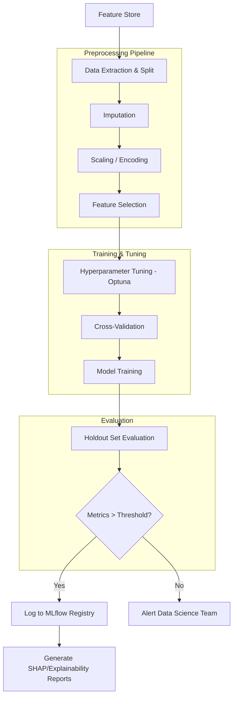

#### Model Serving Architecture
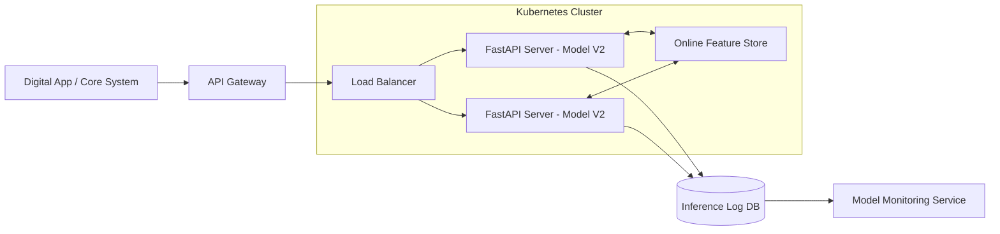

#### Model Monitoring and Retraining Loop
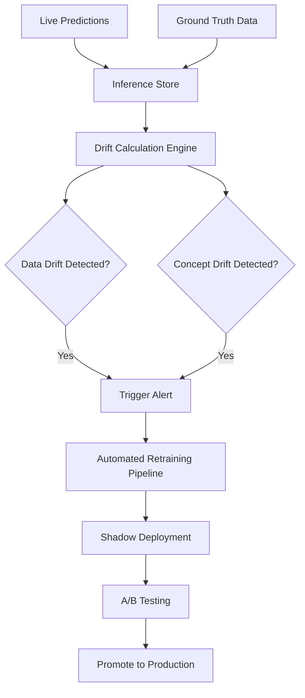

### 17.6. Model Registry & MLOps
- **Tooling**: MLflow for experiment tracking and model registry.
- **Versioning**: Semantic versioning tracking dataset hash, code commit, and hyperparameters.
- **Stages**: `Development` (experiments) -> `Staging` (shadow mode testing) -> `Production` (live serving) -> `Archived`.
- **Promotion Criteria**: New model must out-perform current production model by >1% AUC on holdout, pass fairness checks, and have inference latency < SLA.
- **Monitoring**: EvidentlyAI or custom Python scripts computing Population Stability Index (PSI) on incoming feature distributions. Alerts trigger Slack notifications if PSI > 0.2.

## SECTION 18: DASHBOARD ARCHITECTURE

The dashboard layer serves as the primary consumption interface for business stakeholders, presenting insights derived from the data warehouse, feature store, and machine learning models. 

### 1. Executive Dashboard

**Target Users:** CEO, CFO, CRO, CMO, Board Members

**KPIs (10):**
1. **Total Revenue (MTD, QTD, YTD):** Aggregate income across all banking products and services.
2. **Net Interest Margin (NIM):** Difference between interest income and interest paid out.
3. **Cost-to-Income Ratio (CIR):** Operating expenses divided by operating income.
4. **Total Assets Under Management (AUM):** Total market value of the investments managed.
5. **Customer Growth Rate:** Percentage change in the active customer base.
6. **Net Promoter Score (NPS):** Measure of customer loyalty and satisfaction.
7. **Non-Performing Loan (NPL) Ratio:** Percentage of total loans that are in default or close to being in default.
8. **Return on Assets (ROA):** Net income divided by total assets.
9. **Return on Equity (ROE):** Net income divided by shareholders' equity.
10. **Fraud Loss Rate:** Total fraud losses divided by total transaction volume.

**Charts:**
- **Revenue Trend Line:** 12-month historical actuals overlaid with 3-month predictive forecasting.
- **KPI Gauge Cards:** Current values compared to target with red/yellow/green trend indicators.
- **Customer Growth Bar Chart:** Month-over-month net new customer additions segmented by product.
- **Product Revenue Breakdown Donut Chart:** Revenue contribution by Retail, Commercial, Wealth Management, etc.
- **Risk Heat Map:** Geographic or product-based visualization of aggregate credit and operational risk.
- **Branch Performance Map:** Geospatial scatter plot showing branch profitability metrics.

**Filters:** Date Range, Geographic Region, Product Category, Customer Segment.

**Drilldowns:** Clicking on any KPI gauge card redirects the user to the respective detailed dashboard (e.g., clicking Fraud Loss Rate opens the Fraud Dashboard).

**Business Decisions:** Strategic resource allocation, risk appetite recalibration, corporate planning, executive compensation tracking.

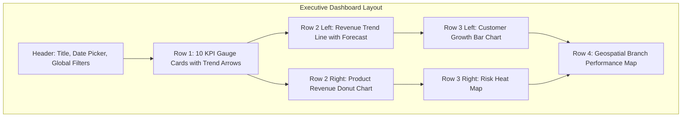

### 2. Fraud Dashboard

**Target Users:** Fraud Investigation Team, Risk Managers, Compliance Analysts

**KPIs (8):**
1. **Total Fraud Cases (Period):** Count of confirmed fraud incidents.
2. **Fraud Loss Amount:** Monetary value lost to confirmed fraudulent activities.
3. **Detection Rate:** Percentage of total fraud successfully identified by the system.
4. **False Positive Rate:** Percentage of legitimate transactions incorrectly flagged as fraud.
5. **Average Investigation Time:** Mean time taken to resolve a flagged case.
6. **Recovery Rate:** Percentage of lost funds successfully recovered.
7. **Fraud Rate by Channel:** Incident volume segmented by Mobile, Web, ATM, POS.
8. **Model Confidence Score Distribution:** Average certainty of the ML model for flagged cases.

**Charts:**
- **Fraud Trend Line:** Daily/weekly volume of flagged vs. confirmed fraud cases.
- **Fraud by Type Sunburst Chart:** Breakdown by Account Takeover, Identity Theft, Card Not Present, etc.
- **Geographic Fraud Heat Map:** Density map of fraudulent transaction origins.
- **Merchant Fraud Scatter Plot:** Transaction volume vs. fraud rate per merchant.
- **Channel Comparison Bar Chart:** Normalized fraud rates across banking channels.
- **Investigation Status Funnel:** Total alerts → Assigned → Investigating → Confirmed/Dismissed.
- **Transaction Amount Distribution:** Overlaid histograms comparing fraudulent vs. normal transaction amounts.
- **Real-Time Fraud Alert Feed:** Scrolling list of high-risk transactions requiring immediate review.

**Filters:** Date Range, Fraud Type, Channel, Transaction Amount Range, Case Status, Risk Score.

**Drilldowns:** Clicking a specific transaction on the feed opens the detailed transaction view with SHAP feature importance explaining the model's decision.

**Business Decisions:** Manual investigation prioritization, fraud detection rule tuning, merchant blacklisting, threshold adjustments.

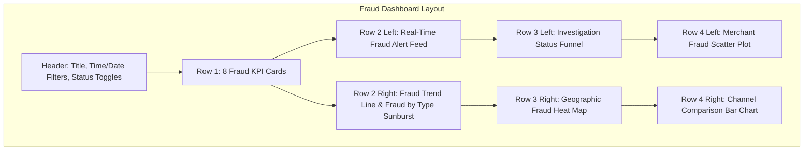

### 3. Customer Dashboard

**Target Users:** Marketing Team, Relationship Managers, Analysts

**KPIs (8):**
1. **Total Active Customers:** Count of users who performed a transaction in the last 30 days.
2. **Customer Acquisition Rate:** Ratio of new customers gained over a period.
3. **Churn Rate:** Percentage of customers who closed accounts or went dormant.
4. **Average Customer Lifetime Value (CLV):** Projected net profit attributed to the future relationship.
5. **Customer Satisfaction Score (CSAT):** Average rating from post-interaction surveys.
6. **Products per Customer:** Cross-sell index measuring product penetration.
7. **Digital Adoption Rate:** Percentage of customers exclusively using mobile/web platforms.
8. **High-Value Customer Count:** Number of users in the top 10% CLV tier.

**Charts:**
- **Customer Segment Treemap:** Proportion of customers in generated ML segments (e.g., Young Professionals, Retirees).
- **CLV Distribution Histogram:** Distribution curve of lifetime value across the user base.
- **Churn Risk Scatter Plot:** CLV on X-axis, Churn Probability on Y-axis (highlights high-value/high-risk users).
- **Customer Journey Sankey Diagram:** Flow of users moving between product states (e.g., Checking → Savings → Mortgage).
- **Segment Migration Flow:** How users transition between demographic or behavioral segments over time.
- **Demographic Breakdown Charts:** Age, income, occupation distributions.
- **Product Adoption Heatmap:** Cross-tabulation showing affinity between different banking products.
- **Customer Satisfaction Trend:** CSAT rolling average over 12 months.

**Filters:** Customer Segment, Geographic Region, Product Ownership, Date Range, ML Risk/Churn Level.

**Drilldowns:** Clicking on a segment block in the treemap reveals a paginated customer list; clicking a customer reveals an exhaustive 360-degree profile.

**Business Decisions:** Targeted retention campaigns, bespoke cross-selling strategies, VIP relationship management, UX/service level improvements.

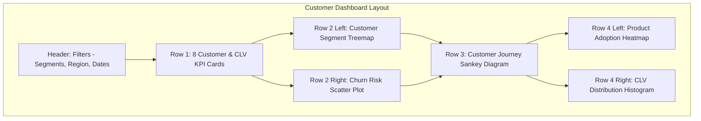

### 4. Loan Dashboard

**Target Users:** Loan Officers, Credit Risk Managers, Underwriters

**KPIs (8):**
1. **Total Loan Portfolio Value:** Outstanding principal balance across all lending products.
2. **Non-Performing Loan (NPL) Ratio:** Percentage of balance 90+ days past due.
3. **Average Loan Size:** Mean principal amount approved.
4. **Approval Rate:** Percentage of total applications that transition to funded loans.
5. **Default Rate:** Percentage of originated loans that have defaulted.
6. **Delinquency Rate (30/60/90 DPD):** Proportion of portfolio grouped by days past due.
7. **Loss Given Default (LGD):** Estimated percentage of exposure that will not be recovered upon default.
8. **Coverage Ratio:** Loan loss provisions relative to non-performing loans.

**Charts:**
- **Portfolio Composition Pie Chart:** Split by Mortgage, Auto, Personal, Commercial.
- **Vintage Analysis Line Chart:** Default trajectories organized by origination quarter/year.
- **DPD Bucket Waterfall Chart:** Migration of balances from Current → 30 DPD → 60 DPD → Default.
- **Default Probability Distribution:** Output of the ML default prediction model across active loans.
- **LTV vs DTI Scatter Plot:** Loan-to-Value against Debt-to-Income, color-coded by performance status.
- **Loan Officer Performance Comparison:** Approval rates and default rates by underwriter.
- **Geographic Default Heat Map:** Default concentration by state/zip code.
- **Payment Status Flow Diagram:** State transitions of loan payments month-over-month.

**Filters:** Loan Type, Delinquency Status, Branch/Region, Origination Date Range, Risk Rating Tier.

**Drilldowns:** Clicking a specific delinquency bucket exposes the constituent loan accounts; clicking an account shows full credit history and ML default probability score.

**Business Decisions:** Credit underwriting policy adjustments, collections prioritization, setting capital reserves, modifying risk appetite.

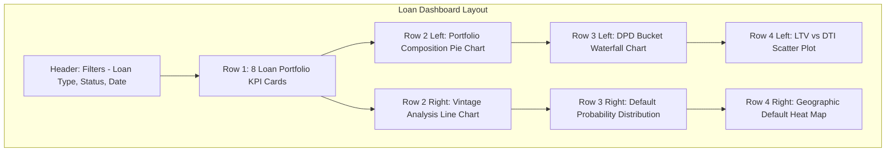

### 5. Revenue Dashboard

**Target Users:** CFO, Branch Managers, Product Managers

**KPIs (8):**
1. **Total Revenue:** Gross top-line income.
2. **Net Interest Income (NII):** Core banking income from spread.
3. **Non-Interest Income:** Fees, commissions, trading income.
4. **Cost-to-Income Ratio:** Efficiency metric for the enterprise.
5. **Revenue per Customer:** Yield per active user.
6. **Revenue per Branch:** Average yield across physical locations.
7. **Product Revenue Mix:** Entropy or concentration of income streams.
8. **Revenue Growth Rate:** Period-over-period percentage expansion.

**Charts:**
- **Revenue Waterfall Chart:** Start-of-year revenue + additions - reductions = Current Revenue.
- **Branch Revenue Comparison Bar Chart:** Ranked list of branches by profitability.
- **Product Revenue Trend Lines:** Stacked area chart showing growth of specific product lines.
- **Revenue vs Cost Scatter Plot:** Branch or product level visualization identifying inefficient units.
- **Monthly Revenue Heatmap:** Calendar view highlighting high/low revenue days.
- **Revenue Concentration Lorenz Curve:** Identifying dependency on top-tier customers.
- **Forecast vs Actual Comparison:** ML forecast model plotted against realized numbers.
- **Top/Bottom Performing Branches Table:** Detailed tabular view with conditional formatting.

**Filters:** Date Range, Branch/Region, Product Hierarchy, Revenue Category.

**Drilldowns:** Selecting a branch opens a P&L breakdown for that specific location.

**Business Decisions:** Retail footprint expansion/closure, fee pricing strategies, marketing budget allocation per product.

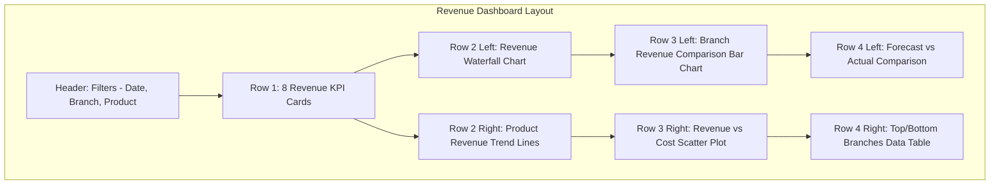

### 6. Marketing Dashboard

**Target Users:** CMO, Marketing Team, Campaign Managers

**KPIs (8):**
1. **Total Marketing Spend:** Overall budget utilized.
2. **Customer Acquisition Cost (CAC):** Average cost to acquire a net new customer.
3. **Campaign ROI:** Generated revenue divided by campaign cost.
4. **Conversion Rate:** Percentage of prospects who took the desired action.
5. **Response Rate:** Engagement volume divided by total outreach.
6. **Revenue per Campaign Dollar:** Efficiency of marketing spend.
7. **Active Campaigns Count:** Currently running marketing initiatives.
8. **Lead-to-Customer Ratio:** Sales funnel conversion efficiency.

**Charts:**
- **Campaign Performance Comparison Bar Chart:** ROI and conversion rates side-by-side.
- **Channel Effectiveness Radar Chart:** Comparing Social, Email, Direct Mail, Search.
- **Spend vs ROI Scatter Plot:** Bubble chart (size = revenue) identifying sweet spots.
- **Conversion Funnel:** Impression → Click → Application → Funded/Opened.
- **Campaign Timeline Gantt Chart:** Visual schedule of marketing activities.
- **Segment Response Heatmap:** Which customer segments respond best to which campaigns.
- **A/B Test Results Comparison:** Statistical confidence intervals for split tests.
- **Attribution Model Visualization:** Multi-touch attribution mapping.

**Filters:** Campaign Type, Channel, Date Range, Target Demographic, Product Type.

**Drilldowns:** Clicking a campaign yields the customer-level response list and individual journey paths.

**Business Decisions:** Budget reallocation across channels, messaging optimization, segment targeting adjustments.

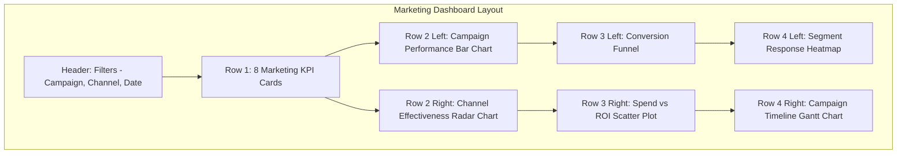

### 7. Operational Dashboard

**Target Users:** Operations Team, Branch Managers, Support Managers

**KPIs (8):**
1. **Total Support Tickets:** Gross volume of customer service requests.
2. **Average Resolution Time:** Mean time from ticket creation to closure.
3. **First Response Time:** How quickly support acknowledges a request.
4. **Customer Satisfaction Score (CSAT):** Transactional satisfaction per ticket.
5. **Escalation Rate:** Percentage of L1 tickets pushed to L2/L3.
6. **SLA Compliance Rate:** Percentage of tickets resolved within service level agreements.
7. **Agent Utilization:** Percentage of time staff spend actively handling cases.
8. **Channel Distribution:** Ratio of Call Center vs. Chatbot vs. Email vs. In-Branch.

**Charts:**
- **Ticket Volume Trend Line:** Intra-day and daily rolling volumes.
- **Category Breakdown Donut Chart:** Disputes, Password Resets, App Issues, etc.
- **Resolution Time Distribution Box Plot:** Outlier detection for slow-to-resolve cases.
- **SLA Compliance Gauge:** Real-time health indicator of operational queues.
- **Agent Performance Comparison:** Leaderboards based on throughput and CSAT.
- **Priority Distribution Stacked Bar:** Backlog categorized by Critical, High, Medium, Low.
- **Satisfaction Trend Line:** Moving average of post-interaction feedback.
- **Escalation Path Sankey Diagram:** Visualizing bottlenecks in the routing tree.

**Filters:** Date/Time Range, Issue Category, Priority Level, Channel, Current Status.

**Drilldowns:** Clicking a specific category shows the raw queue of tickets with timeline details for manual triage.

**Business Decisions:** Shift scheduling, identifying training gaps, UX fixes to reduce ticket generation, vendor SLA enforcement.

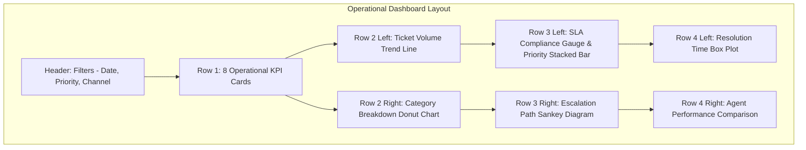

### 8. Risk Dashboard

**Target Users:** CRO, Risk Managers, Compliance Officers

**KPIs (8):**
1. **Total Credit Exposure:** Maximum potential loss across the entire portfolio.
2. **Risk-Weighted Assets (RWA):** Assets adjusted for their associated risk profile.
3. **Expected Credit Loss (ECL):** IFRS 9 / CECL provision estimate.
4. **Credit Risk Score Distribution:** Mean and variance of portfolio credit ratings.
5. **Concentration Risk Index:** Herfindahl-Hirschman Index for geographic/industry clustering.
6. **Non-Performing Asset (NPA) Ratio:** Sum of defaulted loans and foreclosed properties.
7. **Provision Coverage Ratio:** Available buffers against potential bad debts.
8. **Capital Adequacy Ratio (CAR):** Bank's capital mapped against risk-weighted assets.

**Charts:**
- **Risk Score Distribution Histogram:** Bell curve of customer credit grades.
- **Exposure by Product Stacked Area Chart:** Time-series view of capital allocation.
- **Risk Heat Map (Region × Product):** 2D matrix highlighting toxic intersections.
- **Stress Test Scenario Comparison:** Baseline vs. Adverse vs. Severely Adverse economic shock simulations.
- **Risk Trend Line:** Aggregate VaR (Value at Risk) over time.
- **Top Risk Exposure Table:** The largest counterparty risks sorted by magnitude.
- **Risk Appetite vs Actual Gauge Chart:** Defined threshold limits vs current operational reality.
- **Correlation Matrix Heatmap:** Cross-asset dependency to identify systemic portfolio vulnerabilities.

**Filters:** Risk Category, Asset Class, Geographic Region, Date Range, Stress Scenario.

**Drilldowns:** Selecting a high-risk matrix cell displays individual counterparties/loans making up the exposure.

**Business Decisions:** Setting concentration limits, increasing capital buffers, divesting toxic assets, complying with regulatory reporting.

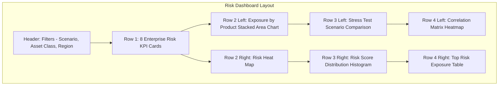

---

## SECTION 19: API ARCHITECTURE

The application exposes a robust REST API designed using FastAPI, adhering to OpenAPI specifications, ensuring structured payloads and uniform error handling.

### General Design Principles

- **Base URL:** `https://api.domain.com/api/v1`
- **Authentication:** JWT (Access token via `Authorization: Bearer <token>`). Machine-to-machine utilizes `X-API-Key`.
- **Versioning:** URI-based (`/v1/`). Major breaking changes necessitate `/v2/`.
- **Rate Limiting:** Redis-backed sliding window algorithm. Default: 100 req/min/user.

### Standard Response Format

**Success Schema:**
```json
{
  "status": "success",
  "data": { ... },
  "meta": {
    "page": 1,
    "per_page": 50,
    "total": 1250,
    "next_url": "/api/v1/resource?page=2"
  },
  "timestamp": "2024-03-15T12:00:00Z"
}
```

**Error Schema:**
```json
{
  "status": "error",
  "errors": [
    {
      "code": "VALIDATION_FAILED",
      "message": "The 'amount' field must be greater than zero.",
      "field": "amount"
    }
  ],
  "timestamp": "2024-03-15T12:00:05Z"
}
```

### 1. Health & System Endpoints

| Endpoint | Method | Path | Auth Req | Rate Limit | Description |
|---|---|---|---|---|---|
| Basic Health | GET | `/health` | No | 1000/min | Lightweight liveness probe for Kubernetes/Docker. Returns `{"status": "ok"}`. |
| Detailed Health | GET | `/health/detailed` | Admin | 100/min | Readiness probe validating DB, Redis, and MLflow connections. |
| Metrics | GET | `/metrics` | Admin | 60/min | Prometheus formatted metrics scrape endpoint. |

### 2. Customer Endpoints

**GET `/api/v1/customers`**
- **Description:** Retrieve a paginated list of customers.
- **Query Params:** `page` (int, default 1), `per_page` (int, default 50), `segment` (str, opt), `region` (str, opt).
- **Response:** 200 OK. Standard paginated response. Array of customer summary objects.
- **Auth:** Yes (Role: Analyst, Business User)

**GET `/api/v1/customers/{id}`**
- **Description:** Retrieve comprehensive 360-degree profile for a single customer.
- **Path Params:** `id` (UUID).
- **Response:** 200 OK. Returns full demographic and product relationship data.
- **Auth:** Yes

**GET `/api/v1/customers/{id}/risk-profile`**
- **Description:** Retrieve ML-generated risk scores (churn probability, default probability).
- **Response:** 200 OK. Contains latest ML inference scores and risk tier.
- **Auth:** Yes (Role: Risk Manager, Analyst)

**GET `/api/v1/customers/{id}/transactions`**
- **Description:** Retrieve transaction history for a customer.
- **Query Params:** `start_date` (ISO8601), `end_date` (ISO8601), `type` (str).
- **Response:** 200 OK. Array of transaction entities.

**GET `/api/v1/customers/segments`**
- **Description:** Retrieve aggregate summaries of all ML-defined customer segments.
- **Response:** 200 OK. Array containing segment name, size, avg CLV, and key defining traits.

### 3. Fraud Endpoints

**POST `/api/v1/fraud/score`**
- **Description:** Synchronous, real-time ML inference for a newly initiated transaction.
- **Body Schema:** `{"transaction_id": "...", "amount": 500.0, "merchant_id": "...", "channel": "WEB", ...}`
- **Response:** 200 OK. `{"fraud_probability": 0.92, "is_flagged": true, "reason_codes": [...]}`
- **Auth:** Yes (API Key for internal services)

**GET `/api/v1/fraud/alerts`**
- **Description:** Retrieve active fraud alerts requiring manual review.
- **Query Params:** `status` (PENDING, RESOLVED), `min_score` (float).
- **Response:** 200 OK. List of flagged transactions sorted by risk score descending.

**GET `/api/v1/fraud/statistics`**
- **Description:** Retrieve aggregated KPIs for the Fraud Dashboard.
- **Response:** 200 OK. Returns total cases, loss amount, detection rate.

**GET `/api/v1/fraud/transactions/{id}/explanation`**
- **Description:** Retrieve SHAP values explaining why the ML model flagged a transaction.
- **Response:** 200 OK. Contains feature importance vector (e.g., `"distance_from_home": +0.45`).

### 4. Loan Endpoints

**GET `/api/v1/loans/portfolio`**
- **Description:** Retrieve aggregate portfolio composition metrics.
- **Response:** 200 OK. Total value, breakdown by product class, average loan size.

**GET `/api/v1/loans/{id}/default-probability`**
- **Description:** Retrieve the ML-generated probability of default for a specific loan.
- **Response:** 200 OK. `{"probability": 0.15, "risk_tier": "LOW", "last_calculated": "..."}`

**GET `/api/v1/loans/delinquency`**
- **Description:** Retrieve list of loans currently in delinquency buckets.
- **Query Params:** `bucket` (30, 60, 90+).
- **Response:** 200 OK.

**GET `/api/v1/loans/analytics`**
- **Description:** Retrieve vintage analysis and LGD metrics for visualization.
- **Response:** 200 OK.

### 5. Revenue Endpoints

**GET `/api/v1/revenue/summary`**
- **Description:** Retrieve top-level corporate revenue KPIs.
- **Query Params:** `period` (MTD, QTD, YTD).
- **Response:** 200 OK. Total Revenue, NII, Non-Interest Income.

**GET `/api/v1/revenue/by-branch`**
- **Description:** Breakdown of revenue metrics grouped by branch ID.
- **Response:** 200 OK.

**GET `/api/v1/revenue/forecast`**
- **Description:** Retrieve the ML time-series forecast for upcoming revenue periods.
- **Response:** 200 OK. Array of projected monthly revenues with 95% confidence intervals.

### 6. Analytics Endpoints

**GET `/api/v1/analytics/executive-kpi`**
- **Description:** Omnibus endpoint delivering the 10 core KPIs for the Executive Dashboard.
- **Response:** 200 OK.

**GET `/api/v1/analytics/branch-performance`**
- **Description:** Geospatial and financial metrics mapped to branch locations.
- **Response:** 200 OK.

**GET `/api/v1/analytics/marketing/campaigns`**
- **Description:** Retrieve ROI, CAC, and conversion metrics per campaign.
- **Response:** 200 OK.

**GET `/api/v1/analytics/risk-summary`**
- **Description:** Enterprise risk metrics (RWA, ECL, CAR).
- **Response:** 200 OK.

### 7. ML Model Endpoints

**GET `/api/v1/models/registry`**
- **Description:** List all deployed ML models and their active versions from MLflow.
- **Response:** 200 OK. Array of model metadata.

**GET `/api/v1/models/{name}/performance`**
- **Description:** Retrieve drift metrics and evaluation scores (F1, AUC, RMSE) for a model in production.
- **Response:** 200 OK.

**POST `/api/v1/models/{name}/predict`**
- **Description:** Generic batch/single inference endpoint for any registered model.
- **Body Schema:** Dynamic depending on model requirements.
- **Response:** 200 OK.

---

## SECTION 20: SECURITY

The platform enforces Defense-in-Depth, ensuring zero-trust principles at the network, application, and data layers.

**Encryption:**
- **Data at Rest:** The PostgreSQL cluster is encrypted at the volume level. Specific sensitive PII columns (SSN, Account Numbers) utilize `pgcrypto` for transparent column-level AES-256 encryption.
- **Data in Transit:** All traffic (API, Web, DB connections) mandates TLS 1.3. Internal service-to-service communication within the Docker network is also encrypted.
- **Key Management:** Master keys are managed externally via AWS KMS or HashiCorp Vault (simulated via secure environment variables in local deployments).

**Authentication:**
- **Mechanism:** JWT (JSON Web Tokens) encoded via RS256 algorithm.
- **Lifecycle:** Access Tokens expire in 15 minutes. Refresh Tokens (stored as HttpOnly secure cookies) expire in 7 days.
- **Passwords:** Handled using `passlib` with `bcrypt` (work factor/salt rounds = 12).
- **MFA:** Architecture is built to support TOTP (Time-based One-Time Password) via a secondary authentication phase.

**Authorization:**
- **RBAC (Role-Based Access Control):** Granular permissions.
  - *Admin:* Full system access.
  - *Data Engineer:* Access to ETL triggering, pipeline logs.
  - *Data Scientist:* Access to feature store, model registry, raw data.
  - *Analyst:* Access to Analytics API and BI tools.
  - *API Consumer:* Machine identities limited by strict scopes.
- **Row-Level Security (RLS):** PostgreSQL RLS policies ensure Branch Managers can only query data relevant to their specific branch ID.

**Secrets Management:**
- **No Hardcoding:** Absolutely zero credentials in source code.
- **Environment Handling:** Utilizes `.env` files locally (strictly in `.gitignore`).
- **Container Deployment:** Relies on Docker Swarm/Compose Secrets mapped to `/run/secrets/`.

**SQL Injection Prevention:**
- **ORM Strictness:** 100% database interaction via SQLAlchemy ORM or bound parametrized queries for raw SQL views. String concatenation for queries is explicitly forbidden and flagged by CI linters (Bandit).

**Data Privacy:**
- **Data Masking:** PII fields (names, emails, phones) are obfuscated dynamically in non-production environments using Faker during the ETL extraction phase.
- **Compliance:** Support for GDPR/CCPA "Right to Erasure" via a dedicated metadata deletion script that replaces PII with anonymous UUIDs while preserving statistical distribution for ML integrity.
- **Audit Trails:** Database triggers log all `UPDATE` and `DELETE` operations on sensitive tables to an append-only `audit_log` table.

**API Security:**
- **Rate Limiting:** IP and Token-based throttling via Redis middleware.
- **Validation:** Pydantic strictly validates all incoming JSON request bodies against rigid schemas.
- **CORS:** Strictly whitelisted origins; wildcards `*` are prohibited.
- **Error Obfuscation:** Production exceptions return generic HTTP 500s; stack traces are exclusively routed to centralized logging (ELK/Datadog).

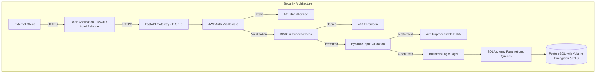

---

## SECTION 21: DEPLOYMENT

The system is designed for containerized deployment, ensuring parity between local development and production environments.

**Docker Strategy:**
- **Base Image:** `python:3.11-slim` for minimal attack surface and reduced image size.
- **Multi-Stage Builds:** Separation of build dependencies (gcc, python-dev) from the final runtime container to strip unnecessary weight.
- **Security:** Containers run as a non-root user (`appuser`).
- **Optimization:** Strategic layering to cache `requirements.txt` dependencies before copying application source code.

**Docker Compose (Development & Production-Simulation):**
- **Services Defined:**
  - `api`: The FastAPI application.
  - `postgres`: Data Warehouse and backend storage.
  - `redis`: Caching and rate-limiting store.
  - `mlflow`: Model registry and experiment tracking.
  - `etl_runner`: Cron-based container executing the pipeline.
- **Networking:** Dedicated bridge network (`banking_net`) ensuring isolation. Database port (5432) is *not* exposed to the host machine in production, only to the internal Docker network.
- **Volumes:** Persistent volumes for Postgres data, MLflow artifacts, and logs.

**GitHub Actions CI/CD Pipeline:**

*Continuous Integration (CI):*
- **Triggers:** Pull Requests and Pushes to the `main` branch.
- **Steps:**
  1. Code Checkout.
  2. Setup Python environment.
  3. **Linting & Formatting:** `black`, `flake8`, `isort`.
  4. **Type Checking:** `mypy`.
  5. **Security Scan:** `bandit` for AST vulnerabilities, `safety` for dependency CVEs.
  6. **Unit Testing:** `pytest` execution.
  7. **Data Quality Check:** `great_expectations` dry-run on synthetic samples.

*Continuous Deployment (CD):*
- **Triggers:** Git tags (e.g., `v1.2.0`).
- **Steps:**
  1. Build Docker images.
  2. Push to Container Registry (e.g., Docker Hub, AWS ECR).
  3. Execute database migrations (`alembic upgrade head`).
  4. Rolling restart of containers via Docker Swarm/Kubernetes.

**Environment Strategy:**
- **Development:** Local Docker Compose with synthetic mocked data. Fast iteration.
- **Staging:** Exact replica of production infrastructure with sanitized/anonymized data sets for pre-release validation.
- **Production:** High-availability cluster.

**Versioning:**
- **Application:** Strict SemVer (Major.Minor.Patch).
- **Database:** Incremental Alembic migration scripts.
- **Models:** Handled explicitly by MLflow (e.g., `fraud_model_v3`).

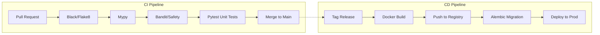

---

## SECTION 22: TESTING STRATEGY

Quality assurance is enforced across the entire data and application stack using a comprehensive testing pyramid.

### 1. Unit Testing (Pytest)
**Target:** >90% coverage for business logic and data transformations.
**Test Cases (20):**
1. `test_calculate_age_valid_date`: Ensures correct age calculation from DOB.
2. `test_calculate_age_future_date`: Verifies exception handling for invalid dates.
3. `test_credit_utilization_ratio`: Validates (balance / limit) calculation.
4. `test_credit_utilization_zero_limit`: Verifies division by zero handling.
5. `test_jwt_token_generation`: Verifies token payload matches user identity.
6. `test_jwt_token_expiry`: Verifies expired tokens are rejected.
7. `test_password_hashing`: Ensures raw passwords do not match hashes directly.
8. `test_fraud_rule_high_amount`: Validates deterministic logic for >$10k flags.
9. `test_fraud_rule_velocity`: Validates rule flagging 5+ transactions in 1 hour.
10. `test_clean_currency_string`: Tests removal of '$' and ',' from raw data.
11. `test_impute_missing_values`: Verifies median imputation logic works on Series.
12. `test_api_pagination_logic`: Verifies limit/offset calculations.
13. `test_rbac_admin_access`: Ensures admin can access protected routes.
14. `test_rbac_user_denied`: Ensures basic users cannot access admin routes.
15. `test_model_inference_format`: Ensures ML wrapper returns consistent schema.
16. `test_extract_domain_from_email`: Verifies regex extraction logic.
17. `test_calculate_days_past_due`: Verifies date arithmetic for loan status.
18. `test_generate_synthetic_ssn`: Verifies faker output format.
19. `test_db_connection_retry_logic`: Tests exponential backoff implementation.
20. `test_feature_scaling`: Verifies Standard Scaler output maintains mean=0, std=1.

### 2. Integration Testing
**Test Cases (10):**
1. `test_api_to_db_customer_creation`: Full HTTP request to DB insert validation.
2. `test_fraud_endpoint_triggers_alert`: API call creates expected DB alert record.
3. `test_etl_bronze_to_silver`: Pipeline executes and outputs expected schema.
4. `test_mlflow_model_registration`: Ensures model saves and loads from registry.
5. `test_redis_rate_limiting`: Verifies 101st request returns 429 Too Many Requests.
6. `test_alembic_up_down`: Ensures migrations can upgrade and downgrade cleanly.
7. `test_transaction_rollback_on_error`: Verifies DB integrity if API crashes mid-request.
8. `test_concurrent_api_requests`: Validates thread safety of DB session pooling.
9. `test_feature_store_write_read`: Writes features, reads them back, validates match.
10. `test_docker_compose_startup`: Verifies all services report healthy within timeout.

### 3. Pipeline Testing
**Test Cases (8):**
1. `test_pipeline_idempotency`: Running ETL twice yields the exact same state, not duplicate rows.
2. `test_row_count_preservation`: Total inputs = Total outputs (minus explicitly filtered bad data).
3. `test_orphan_record_handling`: Ensures transactions without valid customers are shunted to dead-letter queue.
4. `test_scd_type_2_update`: Verifies historical tracking creates new row and expires old row properly.
5. `test_pipeline_recovery`: Simulates crash mid-run, verifies pipeline resumes correctly.
6. `test_incremental_load_logic`: Verifies only new records are processed on subsequent runs.
7. `test_data_type_coercion`: Ensures strings that should be ints cast properly without failure.
8. `test_memory_limits`: Ensures batch processing does not trigger OOM kills on large files.

### 4. Model Testing
**Test Cases (8):**
1. `test_model_reproducibility`: Same random seed yields identical weights/metrics.
2. `test_performance_regression`: Asserts AUC does not drop below baseline (0.85).
3. `test_inference_latency`: Asserts API endpoint returns prediction in < 200ms.
4. `test_feature_input_validation`: Model gracefully rejects categorical data where numeric is expected.
5. `test_serialization_format`: Verifies `.pkl` or `.onnx` outputs correctly.
6. `test_fairness_bias`: Asserts rejection rate disparity across demographic groups is within threshold.
7. `test_concept_drift_detection`: Simulates shifted distribution and triggers alert.
8. `test_shap_explanation_generation`: Verifies feature importance array sums to model margin.

### 5. API Testing
**Test Cases (10):**
1. `test_healthcheck_returns_200`: Basic availability.
2. `test_openapi_schema_generation`: Ensures `/docs` renders without syntax errors.
3. `test_unauthenticated_request_401`: Validates JWT middleware interception.
4. `test_invalid_json_422`: Validates Pydantic rejects malformed syntax.
5. `test_not_found_404`: Validates safe handling of non-existent UUIDs.
6. `test_post_customer_201`: Validates resource creation status code.
7. `test_query_parameter_filtering`: Verifies `?status=ACTIVE` filters DB results.
8. `test_cors_headers`: Ensures `Access-Control-Allow-Origin` is present.
9. `test_response_headers_security`: Verifies `X-Content-Type-Options: nosniff`.
10. `test_pagination_links`: Verifies `next_url` is generated correctly.

### 6. Data Validation (Great Expectations)
**Test Cases (10):**
1. `expect_column_to_exist`: Verifies `transaction_id` is present.
2. `expect_column_values_to_not_be_null`: Validates `customer_id` has no nulls.
3. `expect_column_values_to_be_unique`: Validates `account_number` uniqueness.
4. `expect_column_values_to_be_in_set`: `transaction_type` must be [CREDIT, DEBIT, TRANSFER].
5. `expect_column_values_to_be_between`: `customer_age` must be between 18 and 120.
6. `expect_column_pair_values_A_to_be_greater_than_B`: `loan_amount` > `current_balance`.
7. `expect_table_row_count_to_be_between`: Ensures daily batch is not suspiciously small.
8. `expect_column_mean_to_be_between`: Validates statistical distribution of transaction amounts.
9. `expect_column_values_to_match_regex`: Validates email string format.
10. `expect_column_kl_divergence_to_be_less_than`: Advanced check for data drift against baseline.

---

## SECTION 23: DOCUMENTATION STRATEGY

Comprehensive documentation ensures the platform is maintainable, extensible, and usable across engineering, data, and business units.

**1. README.md:**
The entry point of the repository. Contains a high-level project summary, prerequisites (Docker, Python), immediate "Quick Start" commands (`docker-compose up -d`), environment variable templates, and navigation links to deeper documentation.

**2. Architecture Document (This Document):**
The definitive blueprint detailing structural decisions, rationale, technologies, and component interactions. Acts as the primary onboarding resource for Senior Engineers and Architects.

**3. ER Diagram Document:**
Located in `/docs/database/`. Features Mermaid Entity-Relationship diagrams, normalizing the Star Schema. Describes Fact and Dimension table cardinalities, indexing strategies, and primary/foreign key definitions.

**4. Data Dictionary:**
A living markdown document (generated partially via DB metadata). Lists every table, column name, exact data type, human-readable description, allowable values (enums), and the origin of the data point.

**5. User Guide:**
Aimed at Business Users (Analysts, Managers). Contains screenshots and narrative walkthroughs of the 8 Dashboards. Explains how to interpret charts, use cross-filtering, and export data. Includes a glossary of BI terms.

**6. Developer Guide:**
Instructions for local environment setup, virtual environment management, executing the ETL pipeline manually, database migration steps (`alembic`), testing protocols, and Git branching strategy (Feature Branch Workflow).

**7. Business Guide:**
Defines the mathematical formulations of all KPIs (e.g., `NIM = (Investment Returns - Interest Expenses) / Average Earning Assets`). Details data refresh SLAs (e.g., "Warehouse updates nightly at 02:00 UTC") to manage stakeholder expectations.

---

## SECTION 24: RESUME VALUE

This project is a massive portfolio piece demonstrating end-to-end capabilities across multiple data disciplines. Here is the exact mapping of project components to professional roles.

### Data Analyst Skills
- **Skill:** SQL (Window functions, CTEs, Aggregations)
  - **Module:** SQL Analytics Layer, Materialized Views.
  - **Interview Q:** "How do you handle complex aggregations over time?"
  - **Resume Keyword:** Advanced SQL, Data Transformation, Postgres.
- **Skill:** Data Visualization & Dashboards
  - **Module:** Dashboard Architecture (8 distinct designs).
  - **Interview Q:** "Walk me through a dashboard you designed from scratch."
  - **Resume Keyword:** Dashboard Design, BI, Data Storytelling, KPI Tracking.
- **Skill:** Business Intelligence / Reporting
  - **Module:** Metric definitions, Data Dictionary.
  - **Interview Q:** "How do you define requirements with business stakeholders?"
  - **Resume Keyword:** Requirements Gathering, Cross-functional Communication.

### Data Scientist Skills
- **Skill:** Machine Learning Modeling
  - **Module:** Fraud, Default, Forecasting, Segmentation Models.
  - **Interview Q:** "Explain the trade-off between Precision and Recall in your fraud model."
  - **Resume Keyword:** Classification, Time-Series, XGBoost, Scikit-Learn.
- **Skill:** Feature Engineering
  - **Module:** Feature Store pipeline (100+ computed features).
  - **Interview Q:** "How did you handle categorical variables and date features?"
  - **Resume Keyword:** Feature Engineering, Data Preprocessing, Dimensionality Reduction.
- **Skill:** Model Explainability
  - **Module:** SHAP integration for fraud prediction APIs.
  - **Interview Q:** "How do you explain a black-box model's decision to a business user?"
  - **Resume Keyword:** SHAP, Model Interpretability.

### Analytics Engineer Skills
- **Skill:** Data Modeling (Star Schema)
  - **Module:** Data Warehouse schema (Facts, Dimensions).
  - **Interview Q:** "Explain the difference between a Fact and Dimension table."
  - **Resume Keyword:** Dimensional Modeling, Star Schema, Kimball Methodology.
- **Skill:** ETL/ELT Pipeline Construction
  - **Module:** End-to-end Python ETL scripts.
  - **Interview Q:** "How do you ensure data quality moving between bronze/silver/gold layers?"
  - **Resume Keyword:** ETL pipelines, Data Orchestration.
- **Skill:** Data Quality & Validation
  - **Module:** Great Expectations test suite.
  - **Interview Q:** "How do you detect bad data before it hits the dashboard?"
  - **Resume Keyword:** Data Quality, Automated Testing.

### BI Engineer Skills
- **Skill:** Performance Optimization
  - **Module:** Materialized views, database indexing strategy.
  - **Interview Q:** "How would you speed up a dashboard that takes 30 seconds to load?"
  - **Resume Keyword:** Query Optimization, Materialized Views.
- **Skill:** Self-Service Analytics
  - **Module:** Semantic layer design, documentation guides.
  - **Interview Q:** "How do you empower users to build their own reports?"
  - **Resume Keyword:** Semantic Layer, Self-Service BI, Data Literacy.

### ML Engineer Skills
- **Skill:** MLOps & Model Registry
  - **Module:** MLflow integration.
  - **Interview Q:** "How do you track model versions and experiments?"
  - **Resume Keyword:** MLOps, MLflow, Experiment Tracking.
- **Skill:** API Development & Model Serving
  - **Module:** FastAPI application.
  - **Interview Q:** "How did you deploy your trained model to production?"
  - **Resume Keyword:** FastAPI, REST API, Model Deployment.
- **Skill:** Infrastructure & CI/CD
  - **Module:** Docker Compose, GitHub Actions.
  - **Interview Q:** "Explain your CI/CD pipeline for a data application."
  - **Resume Keyword:** Docker, CI/CD, GitHub Actions.

---

## SECTION 25: INTERVIEW PREPARATION

50 targeted interview questions this project prepares you to answer.

### SQL Questions (10)
1. **"Write a query to find the top 5 customers by transaction volume."** 
   - *Module:* SQL Layer. *Talking Point:* Use `ORDER BY` and `LIMIT`.
2. **"Explain the difference between RANK(), DENSE_RANK(), and ROW_NUMBER()."**
   - *Module:* SQL Layer. *Talking Point:* Discuss handling of ties.
3. **"How do you optimize a slow-running query?"**
   - *Module:* Warehouse Design. *Talking Point:* `EXPLAIN ANALYZE`, adding indexes, materializing views.
4. **"What is a CTE and when would you use it?"**
   - *Module:* SQL Layer. *Talking Point:* Improves readability, replaces complex nested subqueries.
5. **"Explain the difference between LEFT JOIN and INNER JOIN."**
   - *Module:* SQL Layer. *Talking Point:* Inner drops non-matches; Left keeps all left table rows.
6. **"How do you handle duplicate rows in SQL?"**
   - *Module:* ETL Cleaning. *Talking Point:* `DISTINCT`, or CTE with `ROW_NUMBER() = 1`.
7. **"What is a window function?"**
   - *Module:* SQL Layer (Running totals). *Talking Point:* Performs calculations across related rows without collapsing them like `GROUP BY`.
8. **"How do you calculate a rolling 30-day average?"**
   - *Module:* SQL Layer. *Talking Point:* `AVG() OVER (ORDER BY date ROWS BETWEEN 29 PRECEDING AND CURRENT ROW)`.
9. **"Explain an index and how it works under the hood."**
   - *Module:* Database Schema. *Talking Point:* B-Tree structure, speeds up reads, slows down writes.
10. **"What is the difference between WHERE and HAVING?"**
    - *Module:* SQL Layer. *Talking Point:* `WHERE` filters rows before aggregation; `HAVING` filters aggregated groups.

### Data Modeling Questions (8)
11. **"Explain Star Schema vs Snowflake Schema."**
    - *Module:* Data Warehouse. *Talking Point:* Star is denormalized for read-speed; Snowflake is fully normalized for storage efficiency.
12. **"What is a Slowly Changing Dimension (SCD)?"**
    - *Module:* ETL Pipeline. *Talking Point:* Type 1 (Overwrite), Type 2 (Add new row with validity dates).
13. **"How do you handle surrogate keys vs natural keys?"**
    - *Module:* Database Schema. *Talking Point:* Surrogate (UUID/Auto-increment) protects against source system changes to natural keys (like SSN).
14. **"What is a Factless Fact table?"**
    - *Module:* Data Warehouse. *Talking Point:* Records events without numeric measures (e.g., student attendance).
15. **"Explain normalization up to 3NF."**
    - *Module:* Bronze/Silver architecture. *Talking Point:* Eliminate redundancy, ensure columns depend solely on the primary key.
16. **"How do you model many-to-many relationships?"**
    - *Module:* Database Schema. *Talking Point:* Use a junction/bridge table.
17. **"What are degenerate dimensions?"**
    - *Module:* Data Warehouse. *Talking Point:* Transaction IDs that sit in the fact table without a corresponding dimension table.
18. **"How would you model hierarchical data?"**
    - *Module:* Branch structure. *Talking Point:* Parent_ID self-referencing column, or Closure Tables.

### ETL Questions (8)
19. **"What is the difference between ETL and ELT?"**
    - *Module:* Pipeline architecture. *Talking Point:* ELT leverages the target database's compute power for transformations.
20. **"How do you ensure data pipeline idempotency?"**
    - *Module:* Pipeline Testing. *Talking Point:* `INSERT ON CONFLICT DO UPDATE` (Upsert logic).
21. **"How do you handle missing or NULL values in an automated pipeline?"**
    - *Module:* ETL Cleaning Layer. *Talking Point:* Imputation (mean/median/mode) or dropping, depending on the business logic.
22. **"Describe your approach to data validation."**
    - *Module:* Great Expectations. *Talking Point:* Automated schema and statistical checks failing the pipeline before bad data enters the warehouse.
23. **"How do you orchestrate complex dependencies?"**
    - *Module:* Pipeline Scripting. *Talking Point:* DAGs (Directed Acyclic Graphs), utilizing tools like Airflow or custom script sequencing.
24. **"What happens if your pipeline fails halfway through?"**
    - *Module:* Pipeline Recovery. *Talking Point:* Database transactions, rollback mechanisms, restartability from failure points.
25. **"How do you handle massive datasets that don't fit in memory?"**
    - *Module:* Python Pipeline. *Talking Point:* Chunking with Pandas, PySpark, or database-side cursors.
26. **"Explain Change Data Capture (CDC)."**
    - *Module:* Pipeline logic. *Talking Point:* Tracking database transaction logs to only ingest modified records.

### Machine Learning Questions (10)
27. **"Why use XGBoost over Logistic Regression for fraud detection?"**
    - *Module:* Fraud Model. *Talking Point:* Captures non-linear relationships and complex interactions; handles imbalanced data well.
28. **"How do you handle highly imbalanced datasets?"**
    - *Module:* Fraud/Default Models. *Talking Point:* SMOTE, class weights, precision/recall evaluation instead of accuracy.
29. **"Explain the ROC Curve and AUC."**
    - *Module:* Model Evaluation. *Talking Point:* Trade-off between True Positive Rate and False Positive Rate across thresholds.
30. **"What is feature leakage?"**
    - *Module:* Feature Engineering. *Talking Point:* Accidentally including data from the future (target variable) in the training set.
31. **"How do you interpret SHAP values?"**
    - *Module:* Fraud API. *Talking Point:* Local explainability; measures the marginal contribution of a feature to a specific prediction.
32. **"Explain K-Means clustering."**
    - *Module:* Customer Segmentation. *Talking Point:* Unsupervised learning, minimizing within-cluster variance.
33. **"How do you choose 'K' in K-Means?"**
    - *Module:* Segmentation. *Talking Point:* Elbow method (inertia) or Silhouette Score.
34. **"What is cross-validation?"**
    - *Module:* Model Training. *Talking Point:* K-Fold; ensures the model generalizes well and isn't overfitting to a specific train/test split.
35. **"How do you detect model drift in production?"**
    - *Module:* MLflow/Monitoring. *Talking Point:* Tracking statistical distribution changes of input features over time (KL Divergence).
36. **"What is the difference between Bagging and Boosting?"**
    - *Module:* Modeling. *Talking Point:* Bagging (Random Forest) trains in parallel to reduce variance; Boosting (XGBoost) trains sequentially to reduce bias.

### System Design Questions (5)
37. **"How would you scale this architecture to handle 10x traffic?"**
    - *Module:* Architecture overall. *Talking Point:* Horizontal scaling of APIs via load balancers, read-replicas for Postgres, Redis caching.
38. **"How do you secure a REST API?"**
    - *Module:* Security section. *Talking Point:* HTTPS, JWT authentication, Rate Limiting, Input Validation.
39. **"Explain monolithic vs microservices architecture."**
    - *Module:* API layer. *Talking Point:* Monolith is simpler to deploy; Microservices allow independent scaling and deployment of domains (e.g., separating Fraud API from Customer API).
40. **"Why use Docker?"**
    - *Module:* Deployment. *Talking Point:* Environment consistency ("works on my machine"), isolation, dependency management.
41. **"How do you design an API to be backward compatible?"**
    - *Module:* API Architecture. *Talking Point:* URI Versioning (`/v1/`), only appending fields, never deleting or renaming existing response fields.

### Behavioral Questions (5)
42. **"Tell me about a time you had to balance technical debt with delivering a feature."**
    - *Talking Point:* Point to deciding between writing raw SQL vs setting up an ORM for the MVP phase of this project.
43. **"How do you communicate complex technical concepts to non-technical stakeholders?"**
    - *Talking Point:* Discussing model performance (Precision/Recall) in terms of "False Alarms vs Caught Fraudsters" using the dashboard visuals.
44. **"Describe a project you built from scratch."**
    - *Talking Point:* This exact Enterprise Banking Platform.
45. **"How do you handle ambiguous requirements?"**
    - *Talking Point:* Building the initial ER diagram and validating it with synthetic data to force concrete decisions.
46. **"Tell me about a time you found a critical bug in your code."**
    - *Talking Point:* Discovering data leakage during model training and how the Great Expectations pipeline was implemented to catch it.

---

## SECTION 26: DEVELOPMENT ROADMAP

The project execution is broken into 12 linear, dependency-driven milestones.

### Milestones

**Milestone 1: Project Foundation (Week 1)**
- *Deliverables:* Git repo, folder structure, Docker Compose (Postgres, pgAdmin), baseline FastAPI app.
- *Validation Checkpoint:* `docker-compose up` runs successfully; DB accepts connections.
- *Effort:* 1 Week

**Milestone 2: Data Generation & Ingestion (Week 2)**
- *Deliverables:* Faker scripts generating 15 CSV datasets; Great Expectations basic suite.
- *Validation Checkpoint:* Datasets generated (1M+ rows) passing schema validation.
- *Effort:* 1 Week

**Milestone 3: Data Warehouse (Week 3)**
- *Deliverables:* SQLAlchemy ORM models, Alembic migrations, Bronze-to-Gold ETL scripts.
- *Validation Checkpoint:* All Fact and Dimension tables populated with synthetic data.
- *Effort:* 1 Week

**Milestone 4: SQL Layer (Week 4)**
- *Deliverables:* Complex views, materialized views, analytical queries.
- *Validation Checkpoint:* Queries execute efficiently against the Gold layer.
- *Effort:* 1 Week

**Milestone 5: Feature Store (Week 5)**
- *Deliverables:* Feature engineering pipeline, computation of 100+ variables.
- *Validation Checkpoint:* Feature table populated and verified against raw data.
- *Effort:* 1 Week

**Milestone 6: Analytics Layer (Week 6)**
- *Deliverables:* Python analytics modules compiling KPIs.
- *Validation Checkpoint:* Output dataframes match expected dashboard metrics.
- *Effort:* 1 Week

**Milestone 7: Machine Learning (Week 7-8)**
- *Deliverables:* Trained Fraud, Default, Segmentation, and Forecast models; MLflow tracking.
- *Validation Checkpoint:* Models meet accuracy/AUC targets; registered in MLflow.
- *Effort:* 2 Weeks

**Milestone 8: API Layer (Week 9)**
- *Deliverables:* FastAPI endpoints for all domains, JWT Auth.
- *Validation Checkpoint:* Swagger UI functional; endpoints return correct JSON.
- *Effort:* 1 Week

**Milestone 9: Dashboards (Week 10)**
- *Deliverables:* 8 BI Dashboards (Plotly/Dash or Power BI templates).
- *Validation Checkpoint:* Visualizations render interactively with API/DB data.
- *Effort:* 1 Week

**Milestone 10: Testing & Quality (Week 11)**
- *Deliverables:* Comprehensive Pytest suite.
- *Validation Checkpoint:* CI pipeline passes with >90% coverage.
- *Effort:* 1 Week

**Milestone 11: Deployment & Documentation (Week 12)**
- *Deliverables:* Production Dockerfiles, GitHub Actions YAML, full Markdown documentation suite.
- *Validation Checkpoint:* End-to-end automated deployment succeeds.
- *Effort:* 1 Week

**Milestone 12: Polish & Presentation (Week 13)**
- *Deliverables:* Code refactoring, demo scripts, portfolio write-up.
- *Validation Checkpoint:* Project is ready for public showcase.
- *Effort:* 1 Week

### Gantt Chart

```mermaid
gantt
    title Project Implementation Roadmap
    dateFormat  YYYY-MM-DD
    axisFormat  W%W
    
    section Foundation
    M1: Foundation            :active, m1, 2024-01-01, 7d
    M2: Data Generation       :m2, after m1, 7d
    
    section Data Engineering
    M3: Data Warehouse        :m3, after m2, 7d
    M4: SQL Layer             :m4, after m3, 7d
    M5: Feature Store         :m5, after m4, 7d
    
    section Analytics & ML
    M6: Analytics Layer       :m6, after m5, 7d
    M7: Machine Learning      :m7, after m6, 14d
    
    section Application
    M8: API Layer             :m8, after m7, 7d
    M9: Dashboards            :m9, after m8, 7d
    
    section Delivery
    M10: Testing & Quality    :m10, after m9, 7d
    M11: Deploy & Docs        :m11, after m10, 7d
    M12: Polish & Demo        :m12, after m11, 7d
```

### Dependency Graph

```mermaid
graph TD
    M1[M1: Foundation] --> M2[M2: Data Gen]
    M2 --> M3[M3: Data Warehouse]
    
    M3 --> M4[M4: SQL Layer]
    M3 --> M5[M5: Feature Store]
    
    M4 --> M6[M6: Analytics Layer]
    M5 --> M7[M7: Machine Learning]
    
    M6 --> M8[M8: API Layer]
    M7 --> M8
    
    M8 --> M9[M9: Dashboards]
    
    M9 --> M10[M10: Testing & Quality]
    M10 --> M11[M11: Deployment & Docs]
    M11 --> M12[M12: Polish & Presentation]
```
