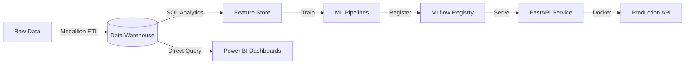

<div align="center">
  <h1>Enterprise Banking Risk & Customer Intelligence Platform</h1>
  <p><strong>A Production-Grade End-to-End Data, Machine Learning, and MLOps Platform</strong></p>
  
  [](https://www.python.org/downloads/)
  [](https://fastapi.tiangolo.com)
  [](https://mlflow.org/)
  [](https://www.docker.com/)
  [](https://powerbi.microsoft.com/)
  [](https://scikit-learn.org/)
  [](https://xgboost.readthedocs.io/)
</div>

---

## 📖 Overview

The **Enterprise Banking Risk & Customer Intelligence Platform** is a full-stack data and machine learning platform simulating a modern retail bank's core intelligence layer. 

It takes 5 million rows of raw relational banking data and transforms it through a Medallion ETL pipeline into a Kimball Star Schema. From there, it engineers 60+ features and trains four specialized Machine Learning systems to detect fraud, predict loan defaults, segment customers, and forecast revenue. The final models are registered in an MLflow Model Registry and served via a highly optimized, Dockerized FastAPI microservice.

This repository serves as a comprehensive portfolio piece demonstrating mastery across **Data Engineering, Data Science, MLOps, and Business Intelligence**.

---

## 🎯 Business Objectives

1. **Risk Mitigation**: Reduce financial loss by predicting loan defaults and detecting fraudulent transactions in real-time.
2. **Customer Intelligence**: Increase customer lifetime value (CLV) by clustering users into behavioral personas for targeted marketing.
3. **Strategic Planning**: Forecast transaction volumes and revenue to optimize branch staffing and liquidity.

---

## 🏗️ Architecture

The platform follows a modern, scalable enterprise data architecture.

### System Flow


### 1. Data Engineering (Medallion ETL & Star Schema)
- **Bronze**: Raw data ingestion with robust schema validation.
- **Silver**: Data cleaning, null imputation, deduplication, and normalization.
- **Gold**: Kimball Star Schema (`Fact_Transactions`, `Dim_Customers`, `Dim_Accounts`, etc.) optimized for analytics.

### 2. Machine Learning & Feature Engineering
- **Feature Store**: Over 60 engineered features (e.g., `rolling_30d_spend`, `debt_to_income_ratio`, `weekend_spending_ratio`).
- **Fraud Detection**: XGBoost classification model identifying anomalous transaction patterns.
- **Loan Default**: XGBoost credit risk model for application approval.
- **Customer Segmentation**: K-Means clustering algorithm mapped to business personas (VIP, Dormant, Emerging).
- **Revenue Forecasting**: ARIMA time-series models for multi-day revenue and transaction forecasting.

### 3. MLOps & API Deployment
- **MLflow**: Centralized experiment tracking and model versioning backed by PostgreSQL.
- **FastAPI**: REST API with lazy-loading Singleton registries (sub-10ms inference latency).
- **Docker**: Multi-container orchestration (`docker-compose`) isolating the API, MLflow, and DB.
- **CI/CD**: GitHub Actions pipeline for linting, testing (`pytest`), and Docker build validation.

---

## 📂 Project Structure

```text
.
├── data/                       # Local file-based storage (Bronze/Silver/Gold)
├── src/                        # Core Application Source
│   ├── etl/                    # Medallion ETL Pipeline logic
│   ├── warehouse/              # SQLite Data Warehouse initialization
│   ├── analytics/              # SQL Aggregations & Business Intelligence
│   ├── features/               # Automated Feature Store generation
│   ├── ml/                     # Machine Learning Pipelines
│   │   ├── fraud_detection/
│   │   ├── loan_default/
│   │   ├── customer_segmentation/
│   │   └── forecasting/
│   ├── api/                    # FastAPI endpoints and Pydantic schemas
│   └── mlops/                  # MLflow tracking scripts
├── docs/                       # Comprehensive Architecture & Business Documentation
├── .github/workflows/          # CI/CD Pipelines
├── docker-compose.yml          # Container Orchestration
├── Dockerfile                  # API Container Build
└── Makefile                    # Developer CLI Commands
```

---

## 🚀 Quick Start (Docker)

To run the full serving platform (FastAPI, MLflow, Postgres) locally:

**1. Clone the repository & set up environment variables**
```bash
git clone https://github.com/yourusername/enterprise-banking-intelligence.git
cd enterprise-banking-intelligence
cp .env.example .env
```

**2. Start the Docker stack**
```bash
make up
```

**3. Register the trained models into MLflow**
```bash
make register-models
```

**4. Access the Platform**
- **FastAPI Swagger UI**: [http://localhost:8000/docs](http://localhost:8000/docs)
- **MLflow UI**: [http://localhost:5000](http://localhost:5000)

*(To stop the platform, run `make down`)*

---

## 📊 Documentation Deep-Dives

Explore the `docs/` folder for detailed technical and business documentation:

- [**Architecture**](docs/architecture/Architecture.md): Full system design and technology choices.
- [**ETL Pipeline**](docs/pipelines/ETL_Pipeline.md): Medallion architecture and data cleaning rules.
- [**Machine Learning**](docs/machine_learning/Fraud_Detection.md): Model selection, hyperparameters, and evaluation metrics for all 4 ML systems.
- [**Resume & Interview Assets**](docs/portfolio/Resume_Assets.md): ATS-friendly bullet points and STAR stories.

## 📸 Platform Gallery (Screenshots)


<details>
<summary><b>System Architecture & Data Flow</b></summary>
<br>
<i>[Insert Image: Overall Architecture Diagram]</i><br>
<i>[Insert Image: Medallion Pipeline Flow]</i><br>
<i>[Insert Image: Star Schema ER Diagram]</i>
</details>

<details>
<summary><b>Power BI Dashboards</b></summary>
<br>
<i>[Insert Image: Executive Dashboard Overview]</i><br>
<i>[Insert Image: Fraud Detection Dashboard]</i><br>
<i>[Insert Image: Customer Segmentation Insights]</i><br>
<i>[Insert Image: Revenue & Loan Analytics]</i>
</details>

<details>
<summary><b>API & MLOps Interfaces</b></summary>
<br>
<i>[Insert Image: FastAPI Swagger UI showing endpoints]</i><br>
<i>[Insert Image: MLflow Registry showing registered models]</i><br>
<i>[Insert Image: Docker Desktop showing running containers]</i><br>
<i>[Insert Image: GitHub Actions CI/CD Pipeline passing]</i>
</details>

---


## 👨‍💻 Author & Contact

Built by **Sowmya Dasari** as a demonstration of production-grade Data Science and Engineering.

---
<div align="center">
  <i>"Bridging the gap between raw data and actionable enterprise intelligence."</i>
</div>
