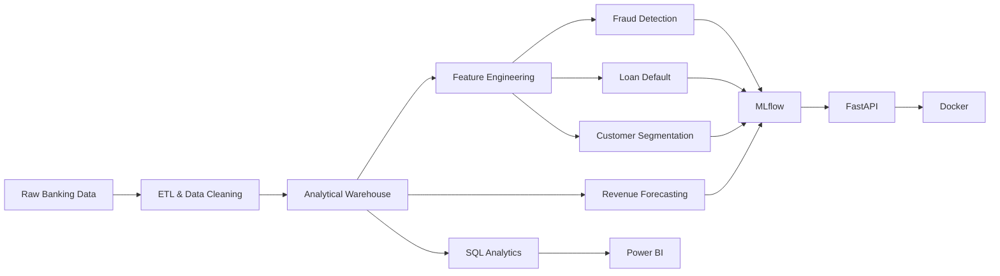
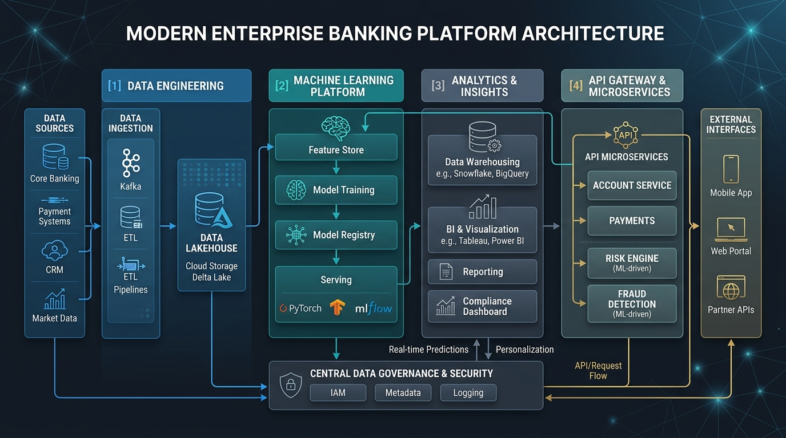
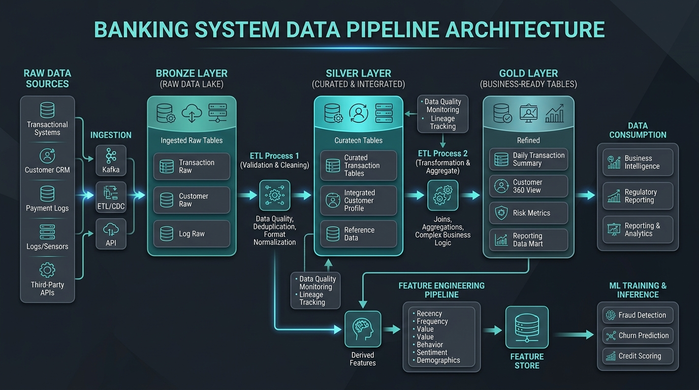
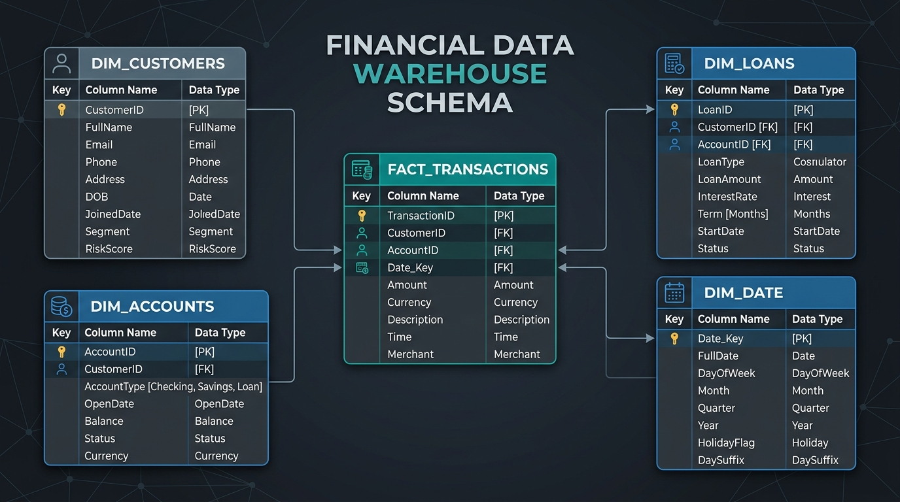
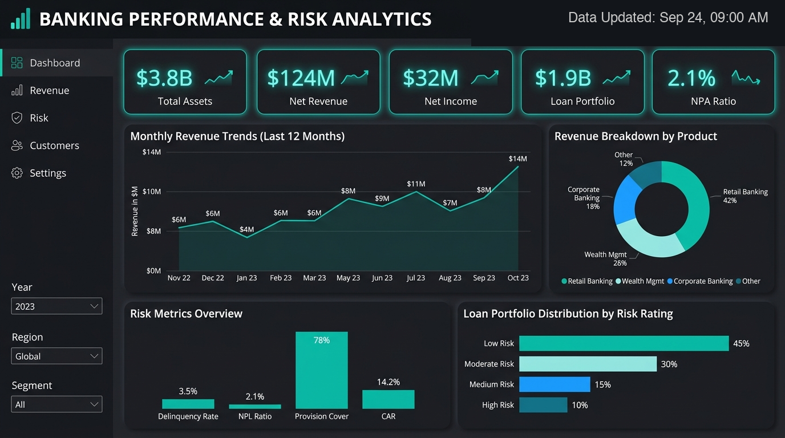
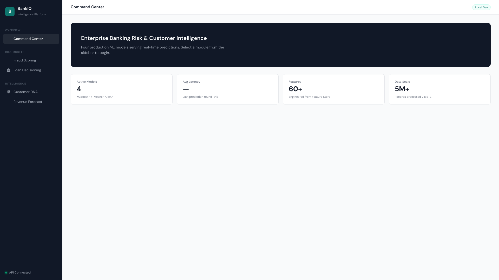
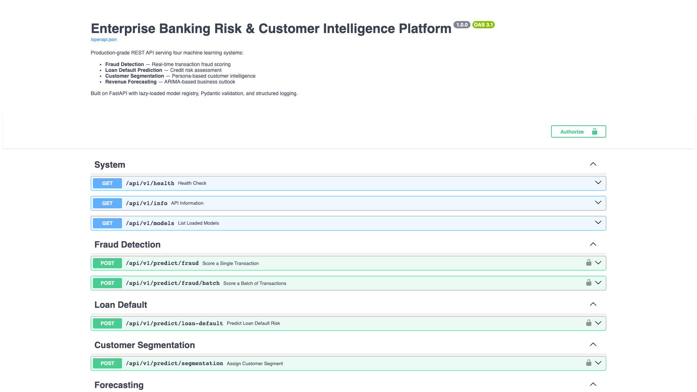
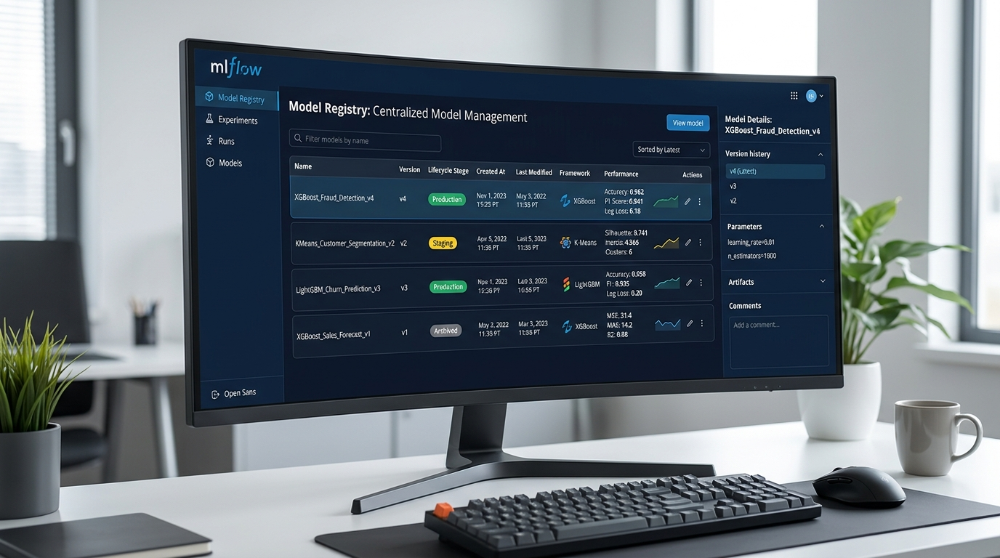

<div align="center">

# Enterprise Banking Risk & Customer Intelligence Platform

### End-to-end banking analytics, machine learning, and model serving

<p>
  
  
  
  
  
  
  
  
</p>

</div>

---

## Overview

The **Enterprise Banking Risk & Customer Intelligence Platform** is an end-to-end project that brings together data engineering, analytics, machine learning, business intelligence, and model serving around a banking use case.

The project works with banking data across customers, accounts, transactions, and loans to explore four main analytical problems:

* **Fraud detection**
* **Loan default prediction**
* **Customer segmentation**
* **Revenue and transaction forecasting**

The workflow takes the data from preparation and SQL-based analysis through feature engineering and machine learning, with the resulting models exposed through a FastAPI service and tracked with MLflow.

The project is designed as a hands-on exploration of how different parts of a data platform fit together rather than treating analytics, machine learning, and deployment as completely separate tasks.

---

## Project Goals

The project focuses on three broad areas:

### Risk

Use transaction and loan information to explore fraud patterns and default risk.

### Customer Intelligence

Use customer and transaction behaviour to identify meaningful customer groups and understand how different segments behave.

### Business Analytics

Use SQL analysis and Power BI dashboards to turn the underlying data into metrics and views that can support business questions.

---

## Architecture

The overall workflow connects the data preparation, analytical, machine learning, BI, and serving layers.



---

## Data Pipeline

The data workflow is organized into separate stages so that raw data can be cleaned and transformed before it is used for analytics and machine learning.

### Data Preparation

The repository includes scripts for generating, processing, and loading the project data.

The pipeline covers tasks such as:

* Data validation
* Cleaning and transformation
* Missing-value handling
* Duplicate handling
* Data type preparation
* Derived analytical features
* Loading data into the analytical layer

The project separates raw data from processed analytical data to make the workflow easier to reproduce and maintain.

---

## Data Warehouse & SQL Analytics

The project includes a dedicated SQL layer for analytical queries and business metrics.

The warehouse layer is used to organize data around entities such as:

* Customers
* Accounts
* Transactions
* Loans

SQL analysis is then used to investigate areas such as transaction behaviour, customer activity, financial performance, and risk-related patterns.

The `sql/` directory contains the project's SQL work, while the warehouse and analytics components live under `src/`.

---

## Feature Engineering

Machine learning models use features derived from the underlying banking data rather than relying only on raw columns.

Examples include behavioural and financial features such as:

```text
rolling_30d_spend
debt_to_income_ratio
weekend_spending_ratio
transaction_frequency
average_transaction_amount
```

The feature engineering code is organized separately from the individual machine learning workflows so that feature creation can be reused across different models.

---

# Machine Learning

The project contains four main machine learning workflows.

---

## Fraud Detection

The fraud detection workflow treats fraudulent transactions as a classification problem.

The model uses transaction and behavioural features to identify patterns associated with potentially fraudulent activity.

The evaluation is designed around the challenges of imbalanced classification, where accuracy alone can give a misleading picture of model performance.

Relevant evaluation measures include:

* Precision
* Recall
* F1-score
* ROC-AUC

The implementation and experiments are contained within the project's ML and notebook structure.

---

## Loan Default Prediction

The loan default workflow uses customer and loan-related information to estimate default risk.

The project focuses on understanding how different financial and behavioural characteristics relate to default outcomes.

Model evaluation considers classification performance and the trade-offs involved in selecting prediction thresholds.

---

## Customer Segmentation

Customer segmentation uses **K-Means clustering** to identify groups of customers with similar behavioural characteristics.

The segmentation is based on customer-level features derived from transaction and account activity.

The resulting clusters can then be examined to understand differences in:

* Spending behaviour
* Transaction activity
* Customer value
* Account usage

The clusters are interpreted from a business perspective rather than being treated as predefined customer categories.

---

## Revenue Forecasting

The forecasting workflow uses historical revenue and transaction information to examine trends over time.

Time-series techniques are used to generate forecasts and compare predicted values with historical observations.

The project includes forecasting code alongside the other machine learning workflows.

---

# Business Intelligence

The analytical outputs are intended to be explored through Power BI dashboards.

The dashboards focus on questions around:

* Overall business performance
* Transaction activity
* Fraud and risk
* Customer behaviour
* Loan performance
* Revenue trends
* Customer segmentation

The BI layer provides a way to move from individual analytical queries to a more visual view of the information.

---

# Model Tracking

The project uses **MLflow** for experiment tracking and model management.

MLflow is integrated into the project to support:

* Experiment tracking
* Model metrics
* Model artifacts
* Model registration
* Version management

The Docker setup also includes an MLflow service backed by PostgreSQL.

---

# API

The project includes a **FastAPI** service for exposing model functionality through REST endpoints.

The API layer includes:

* Pydantic request/response schemas
* API routes
* Model loading
* Prediction handling
* Health checking

FastAPI also provides an automatically generated API documentation interface.

When running locally, the API documentation is available at:

```text
http://localhost:8000/docs
```

---

# Docker

The repository includes Docker configuration for running the main serving components together.

The current Docker Compose setup contains:

| Service    | Purpose                            |
| ---------- | ---------------------------------- |
| `api`      | FastAPI application                |
| `postgres` | PostgreSQL database used by MLflow |
| `mlflow`   | MLflow tracking and model registry |

The services communicate over a dedicated Docker network and use persistent volumes for PostgreSQL and MLflow artifacts.

---

# Project Structure

```text
enterprise-banking-risk-customer-intelligence-platform/
│
├── .github/
│   └── workflows/
│
├── config/
│
├── data/
│   └── raw/
│
├── docs/
│
├── monitoring/
│
├── notebooks/
│   └── eda/
│
├── scripts/
│
├── sql/
│
├── src/
│   ├── api/
│   ├── analytics/
│   ├── etl/
│   ├── features/
│   ├── ml/
│   ├── mlops/
│   └── warehouse/
│
├── tests/
│
├── .dockerignore
├── .env.example
├── .gitignore
├── ARCHITECTURE.md
├── CHANGELOG.md
├── CODE_OF_CONDUCT.md
├── CONTRIBUTING.md
├── Dockerfile
├── LICENSE
├── Makefile
├── README.md
├── SECURITY.md
├── docker-compose.yml
├── pyproject.toml
├── requirements.txt
├── run_etl.py
├── run_generator.py
├── run_warehouse.py
└── setup.py
```

---

# Running the Project

## Requirements

* Python 3.11+
* Docker
* Docker Compose
* Git

---

## Local Python Environment

Clone the repository:

```bash
git clone https://github.com/sowmyadasar1/enterprise-banking-risk-customer-intelligence-platform.git
cd enterprise-banking-risk-customer-intelligence-platform
```

Create a virtual environment:

```bash
python3 -m venv .venv
```

Activate it on macOS/Linux:

```bash
source .venv/bin/activate
```

Install the project dependencies:

```bash
pip install -r requirements.txt
```

---

## Data & Warehouse Scripts

The repository includes dedicated scripts for the project's data workflow:

```bash
python run_generator.py
```

```bash
python run_etl.py
```

```bash
python run_warehouse.py
```

These scripts correspond to data generation, ETL processing, and warehouse initialization.

---

# Docker Setup

Build the Docker services:

```bash
make build
```

Start the platform:

```bash
make up
```

Stop the platform:

```bash
make down
```

Once the services are running:

**FastAPI**

```text
http://localhost:8000/docs
```

**MLflow**

```text
http://localhost:5000
```

---

# Testing & Code Quality

The project includes a test suite under `tests/` and API-specific tests.

Run the API tests with:

```bash
make test
```

Run linting with:

```bash
make lint
```

The Python project configuration also includes pytest, coverage configuration, Black, Flake8, and MyPy settings.

---

# MLflow Model Registration

Trained models can be registered through the project's MLflow tracking script:

```bash
make register-models
```

This connects the model workflows with the MLflow tracking and registry layer.

---

# Documentation

The repository includes additional technical documentation:

* [Architecture](ARCHITECTURE.md)
* [Changelog](CHANGELOG.md)
* [Security Policy](SECURITY.md)
* [Contributing Guide](CONTRIBUTING.md)
* [Code of Conduct](CODE_OF_CONDUCT.md)

---

# Project Gallery

## System Architecture



## Data Pipeline



## Data Warehouse



## Power BI Dashboards



## Fraud Detection


## Customer Segmentation



## FastAPI



## MLflow



---

# Limitations

This project is a portfolio and learning project based on simulated banking data and should not be considered a production banking system.

The models are intended to demonstrate the machine learning workflow and analytical process. Their outputs should not be used for real financial, lending, or fraud decisions.

The architecture also contains components that are designed to demonstrate how a larger system could be organized. The implemented repository should be considered separately from the broader architecture documented in `ARCHITECTURE.md`.

---

# Future Improvements

Some areas that could be extended include:

* More extensive model evaluation and tuning
* Additional data quality checks
* Model explainability and monitoring
* Expanded API test coverage
* More dashboard views
* Improved model monitoring
* Additional forecasting approaches
* More automated pipeline validation

---

# License

This project is licensed under the MIT License. See [LICENSE](LICENSE) for details.

---

<div align="center">

**Enterprise Banking Risk & Customer Intelligence Platform**

Built by [Sowmya Dasari](https://github.com/sowmyadasar1)

</div>
