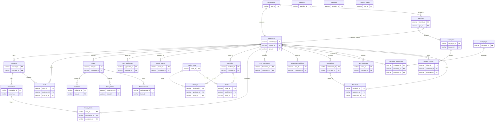

# Entity Relationship Diagram (ERD)

The following Mermaid diagram maps the relationships between all 29 datasets in the platform.

```mermaid
erDiagram

    %% Core Banking
    Geographies ||--o{ Customers : resides_in
    Geographies ||--o{ Branches : located_in
    Branches ||--o{ Employees : employs
    Branches ||--o{ Customers : primary_branch
    Customers ||--o{ Accounts : owns
    Accounts ||--o{ Transactions : has
    Customers ||--o{ Cards : holds
    Accounts ||--o{ Cards : linked_to
    
    %% Credit/Loans
    Customers ||--o{ Loans : borrows
    Customers ||--o{ Loan_Applications : applies_for
    Loans ||--o{ Collateral : secured_by
    Loans ||--o{ Repayments : receives
    Loans ||--o{ Delinquencies : tracks
    Customers ||--o{ Credit_Scores : evaluated_by

    %% Investments
    Customers ||--o{ Portfolios : invests_in
    Portfolios ||--o{ Holdings : contains
    Portfolios ||--o{ Trades : executes
    Market_Data ||--o{ Holdings : prices
    Market_Data ||--o{ Trades : traded_as

    %% Risk/Fraud/Compliance
    Transactions ||--o{ Fraud_Alerts : triggers
    Customers ||--o{ Fraud_Alerts : involved_in
    Customers ||--o{ KYC_Documents : provides
    Customers ||--o{ Suspicious_Activities : subject_of
    
    %% Marketing/Intelligence
    Customers ||--o{ Interactions : performs
    Campaigns ||--o{ Campaign_Responses : generates
    Customers ||--o{ Campaign_Responses : responds_to
    Customers ||--o{ Web_Analytics : browses
    Customers ||--o{ Support_Tickets : raises
    Employees ||--o{ Support_Tickets : resolves
    Customers ||--o{ Feedback : gives
    Interactions ||--o{ Feedback : relates_to

    %% Reference (Isolated logically but part of platform)
    %% Currency_Rates, Watchlists, Sanctions are often lookup tables
    %% joined at runtime in data warehouse.

    Customers {
        varchar customer_id PK
        varchar branch_id FK
        varchar geo_id FK
    }
    Accounts {
        varchar account_id PK
        varchar customer_id FK
    }
    Transactions {
        varchar transaction_id PK
        varchar account_id FK
    }
    Branches {
        varchar branch_id PK
        varchar geo_id FK
    }
    Employees {
        varchar employee_id PK
        varchar branch_id FK
    }
    Cards {
        varchar card_id PK
        varchar customer_id FK
        varchar account_id FK
    }
    Loans {
        varchar loan_id PK
        varchar customer_id FK
    }
    Loan_Applications {
        varchar application_id PK
        varchar customer_id FK
    }
    Collateral {
        varchar collateral_id PK
        varchar loan_id FK
    }
    Repayments {
        varchar repayment_id PK
        varchar loan_id FK
    }
    Delinquencies {
        varchar delinquency_id PK
        varchar loan_id FK
    }
    Credit_Scores {
        varchar score_id PK
        varchar customer_id FK
    }
    Portfolios {
        varchar portfolio_id PK
        varchar customer_id FK
    }
    Holdings {
        varchar holding_id PK
        varchar portfolio_id FK
        varchar asset_id FK
    }
    Trades {
        varchar trade_id PK
        varchar portfolio_id FK
        varchar asset_id FK
    }
    Market_Data {
        varchar asset_id PK
    }
    Fraud_Alerts {
        varchar alert_id PK
        varchar transaction_id FK
        varchar customer_id FK
    }
    KYC_Documents {
        varchar document_id PK
        varchar customer_id FK
    }
    Suspicious_Activities {
        varchar sar_id PK
        varchar customer_id FK
    }
    Watchlists {
        varchar watchlist_id PK
    }
    Sanctions {
        varchar sanction_id PK
    }
    Interactions {
        varchar interaction_id PK
        varchar customer_id FK
    }
    Campaigns {
        varchar campaign_id PK
    }
    Campaign_Responses {
        varchar response_id PK
        varchar campaign_id FK
        varchar customer_id FK
    }
    Web_Analytics {
        varchar event_id PK
        varchar customer_id FK
    }
    Support_Tickets {
        varchar ticket_id PK
        varchar customer_id FK
        varchar assigned_to FK
    }
    Feedback {
        varchar feedback_id PK
        varchar customer_id FK
        varchar interaction_id FK
    }
    Geographies {
        varchar geo_id PK
    }
    Currency_Rates {
        varchar rate_id PK
    }
```
