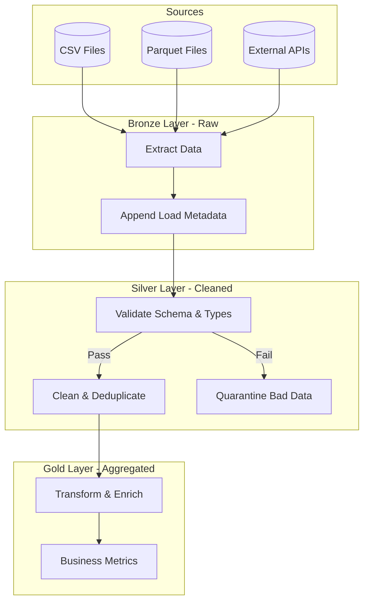

# ETL Pipeline Architecture

## 1. Overview
The Enterprise Banking Risk & Customer Intelligence Platform utilizes a Medallion Architecture to process, validate, and enrich raw data into analytics-ready datasets.



## 2. Folder Structure
The ETL codebase is organized as follows:
- `src/etl/extraction.py`: Contains extractors for various data formats (CSV, Parquet, API). Handles raw ingestion.
- `src/etl/validation.py`: Data quality assertions, schema validation, foreign key checks, and null threshold monitoring.
- `src/etl/cleaning.py`: Normalization, duplicate removal, missing value imputation, and formatting logic.
- `src/etl/transformations.py`: Core business logic, derived features, metrics calculation (e.g., tenure, age groups).
- `src/etl/pipeline.py`: Orchestration module linking all stages (Extract -> Validate -> Clean -> Transform -> Load).

## 3. Execution Flow
1. **Extraction (Sources -> Bronze)**: Read data exactly as-is from source systems. Add `_load_timestamp` and `_source_file` metadata columns.
2. **Validation & Cleaning (Bronze -> Silver)**: 
   - Check schemas, verify PK uniqueness.
   - Deduplicate rows.
   - Standardize strings (title casing names, lowercasing emails) and dates.
   - Fill nulls and handle outliers.
3. **Transformation (Silver -> Gold)**:
   - Compute aggregate metrics.
   - Join dimension tables.
   - Output structured, partitioned parquet files ready for downstream BI tools.

## 4. Transformation Rules
| Table | Column | Formula/Rule |
|-------|--------|--------------|
| Customers | `age` | `(Current Date - dob) / 365` |
| Customers | `age_group` | Binned `age`: `<18`, `18-35`, `36-50`, `51-65`, `65+` |
| Customers | `tenure_days` | `Current Date - join_date` |
| Transactions | `hour` | Extracted from `tx_timestamp` |
| Transactions | `is_weekend` | `True` if `tx_timestamp` day of week >= 5 |
| Transactions | `is_night` | `True` if `hour` >= 22 OR `hour` <= 4 |
| Loans | `loan_age_days` | `Current Date - issue_date` |
| Loans | `loan_utilization` | `balance / limit` (Clipped between 0 and 1) |

## 5. Validation Rules
- **Primary Key Uniqueness**: Essential for all core entities (Customers, Accounts, Loans).
- **Foreign Key Integrity**: All `account_id` in Transactions must exist in the Accounts table.
- **Null Thresholds**: Reject files if critical columns (e.g., `amount`, `customer_id`) have > 5% null rate.
- **Email Validation**: Regex matching for valid formats.
- **Schema Validation**: Enforcement of required columns before processing.

## 6. Quality Checks
Data Quality (DQ) is scored based on:
1. **Completeness**: Percentage of non-null values.
2. **Uniqueness**: Lack of duplicate PKs.
3. **Validity**: Conformance to regex/domain constraints.
4. **Accuracy**: Outlier detection bounds.
Files dropping below a 90% overall DQ score are flagged for manual review.

## 7. Error Handling
- **Quarantine Strategy**: Invalid records (e.g., bad emails, duplicate rows, missing foreign keys) are segregated into a `quarantine/` data lake zone.
- **Logging**: All validation failures emit warnings/errors to `etl.log` with contextual information.
- **Circuit Breaker**: If >20% of a dataset fails validation, the pipeline halts to prevent massive data corruption downstream.

## 8. Running the Pipeline
```bash
# Run the full pipeline for all datasets
python -m src.etl.pipeline --layer all

# Run only the extraction phase for customers
python -m src.etl.pipeline --dataset customers --layer bronze

# Run with custom input/output directories
python -m src.etl.pipeline --bronze-dir /data/bronze --silver-dir /data/silver
```

## 9. Outputs
- **Bronze**: Append-only raw data in Parquet format. Contains full history.
- **Silver**: Cleaned, deduplicated, type-casted snapshot of the current state.
- **Gold**: Highly-optimized, aggregated, denormalized tables (e.g., `Customer_360`, `Monthly_Transaction_Summary`) ready for Machine Learning and BI dashboards.
