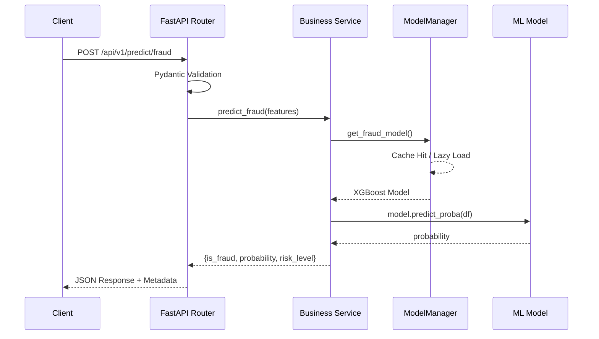

# FastAPI Model Serving Platform

The FastAPI Platform (Phase 9) exposes all four ML models as production-ready REST endpoints.

## Request Lifecycle

## Endpoints

| Method | Path | Description | Auth |
|--------|------|-------------|------|
| `GET` | `/api/v1/health` | Health check & model status | None |
| `GET` | `/api/v1/info` | API capabilities | None |
| `POST` | `/api/v1/predict/fraud` | Single fraud prediction | API Key |
| `POST` | `/api/v1/predict/fraud/batch` | Batch fraud scoring (up to 1000) | API Key |
| `POST` | `/api/v1/predict/loan-default` | Loan default risk assessment | API Key |
| `POST` | `/api/v1/predict/segmentation` | Customer segment assignment | API Key |
| `GET` | `/api/v1/forecast/{metric}` | Time-series forecast | API Key |

## Key Design Decisions

### Lazy-Loading Singleton (`ModelManager`)
Models are NOT loaded at startup. They are loaded into memory on the first API request and cached in a Singleton registry. This reduces cold-start memory usage and ensures sub-10ms latency on subsequent calls.

### Pydantic Validation
Every request is validated against strict Pydantic schemas with type constraints (e.g., `credit_score` must be between 300-900). Invalid payloads return a `422 Unprocessable Entity` before touching any ML code.

### Security
All prediction endpoints require an `X-API-Key` header. Missing keys return `401 Unauthorized`; invalid keys return `403 Forbidden`.

### Error Handling
Custom exception handlers produce consistent JSON error envelopes:
- `400`: Invalid business-rule input
- `422`: Schema validation failure
- `500`: Internal prediction error
- `503`: Model unavailable
