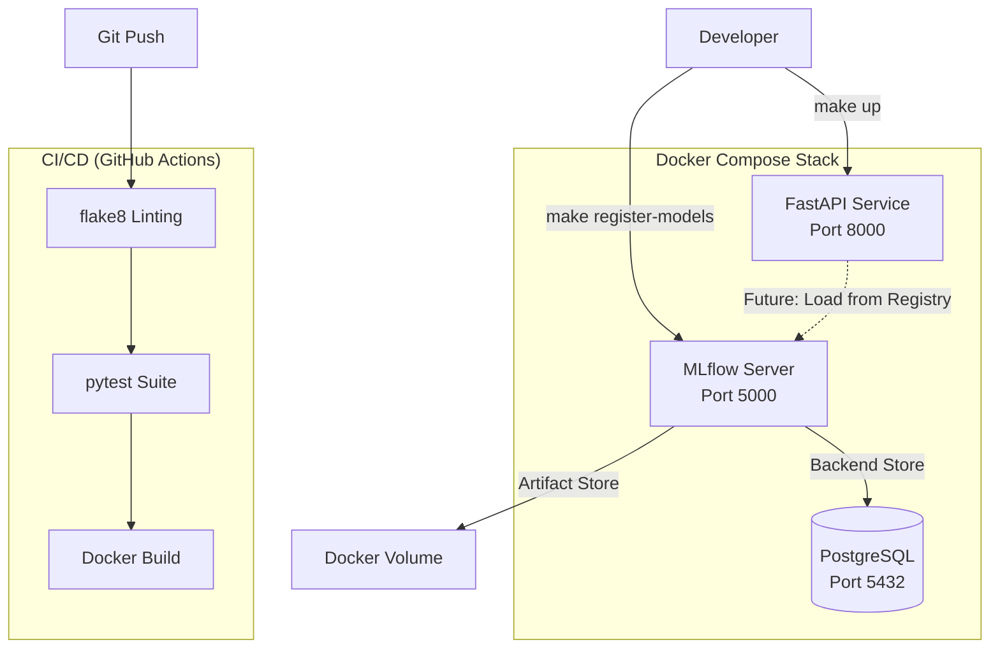

# MLOps Platform

The MLOps Platform (Phase 10) provides reproducible development, containerized deployment, experiment tracking, and continuous integration.

## Deployment Architecture

## Docker Compose Services

| Service | Image | Port | Purpose |
|---------|-------|------|---------|
| `api` | Custom (multi-stage build) | 8000 | FastAPI model serving |
| `mlflow` | python:3.10-slim + mlflow | 5000 | Experiment tracking UI & Model Registry |
| `postgres` | postgres:15-alpine | 5432 | MLflow metadata backend |

## MLflow Model Registry
Three models are formally registered:
1. `fraud_detection_model` — XGBoost (Phase 7A)
2. `loan_default_model` — XGBoost (Phase 7B)
3. `customer_segmentation_model` — K-Means (Phase 7C)

## CI/CD Pipeline (GitHub Actions)
Triggered on `push` / `pull_request` to `main`:
1. **Lint**: `flake8` checks for syntax errors and PEP-8 violations.
2. **Test**: `pytest` runs the full FastAPI test suite (14 tests).
3. **Build**: Compiles the Docker image and validates `docker-compose.yml`.

## Makefile Automation

| Command | Action |
|---------|--------|
| `make build` | Build Docker images |
| `make up` | Start the full stack |
| `make down` | Stop the stack |
| `make test` | Run pytest |
| `make register-models` | Ingest models into MLflow |
