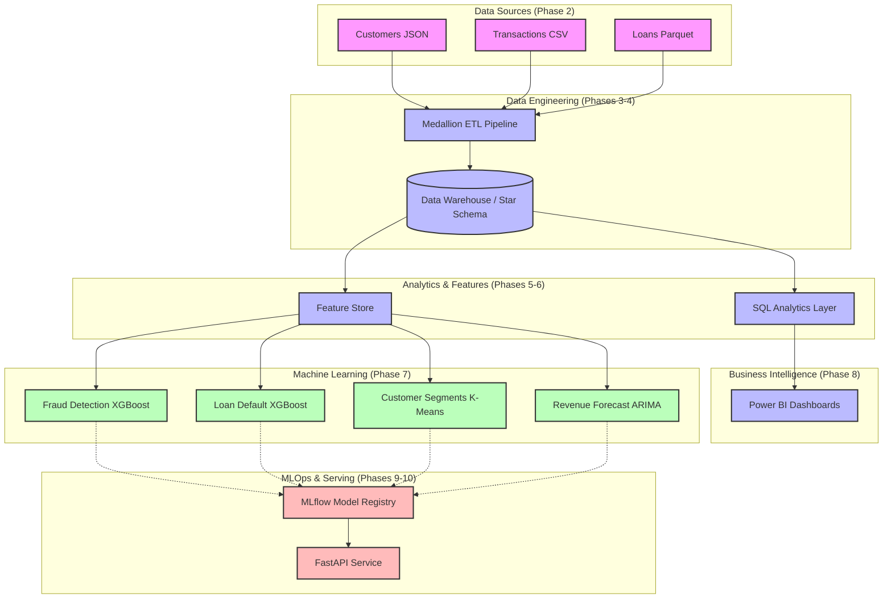

# Enterprise System Architecture

The Enterprise Banking Risk & Customer Intelligence Platform is designed to ingest raw operational data and seamlessly transform it into actionable business intelligence and machine learning predictions. 

## High-Level Architecture Diagram

## Technology Choices & Rationale

| Layer | Technology | Rationale for Portfolio / Production |
|-------|------------|--------------------------------------|
| **Data Processing** | `pandas`, custom ETL framework | Simulates PySpark distributed processing logic (Medallion architecture) in a local environment. |
| **Data Warehouse** | `SQLite` (Star Schema) | Provides a fully relational SQL backend that acts as a stand-in for Snowflake/Redshift without requiring cloud credentials. |
| **Machine Learning** | `scikit-learn`, `xgboost`, `statsmodels` | Industry standard for tabular data. XGBoost consistently outperforms deep learning for structured financial data. |
| **Model Tracking** | `MLflow` | The de facto open-source standard for experiment tracking and model registries. |
| **Model Serving** | `FastAPI`, `Pydantic` | Superior performance, async capabilities, and automatic OpenAPI documentation compared to Flask. |
| **Containerization**| `Docker`, `Docker Compose` | Ensures environment reproducibility and demonstrates deployment capabilities to DevOps teams. |

## Architectural Principles
1. **Separation of Concerns**: ETL, Feature Engineering, Model Training, and API Serving are completely decoupled. 
2. **Immutability**: The Data Warehouse is read-only for the ML and BI layers.
3. **Lazy Loading**: The FastAPI service defers model loading until the first request to minimize startup memory overhead.
