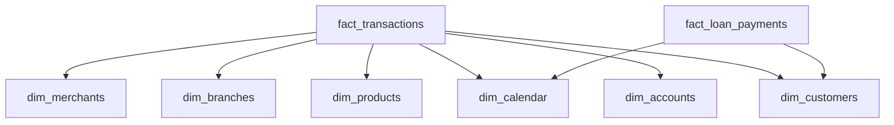

# Data Warehouse Design

The Data Warehouse (Phase 4) is a SQLite-based OLAP store implementing the Kimball Star Schema methodology.

## Technology Choice
**SQLite** was selected as a portable stand-in for cloud data warehouses (Snowflake, BigQuery, Redshift). The Star Schema design is cloud-agnostic — the same `CREATE TABLE` statements and SQL queries would work on any SQL-compliant OLAP system with minimal modification.

## Star Schema

## Fact Tables

### `fact_transactions`
The grain is one row per transaction. Contains foreign keys to all dimension tables plus the transaction amount and type.

### `fact_loan_payments`
The grain is one row per loan payment. Links to the customer dimension and calendar dimension for time-based analysis.

## Dimension Tables

| Table | Description | Key Attributes |
|-------|-------------|----------------|
| `dim_customers` | Customer demographics and profile | name, age, segment, credit_score, tenure |
| `dim_accounts` | Account metadata | account_type, balance, open_date, status |
| `dim_products` | Financial product catalog | product_name, category, interest_rate |
| `dim_branches` | Branch/region hierarchy | branch_name, city, state, region |
| `dim_calendar` | Date dimension for time intelligence | full_date, year, quarter, month, day_name, is_weekend |
| `dim_merchants` | Merchant information | merchant_name, category, location |

## Design Principles
1. **Conformed Dimensions**: `dim_customers` and `dim_calendar` are shared across both fact tables.
2. **Surrogate Keys**: Integer primary keys for join performance.
3. **Denormalization**: Dimensions are intentionally denormalized to reduce JOIN complexity for analysts.
