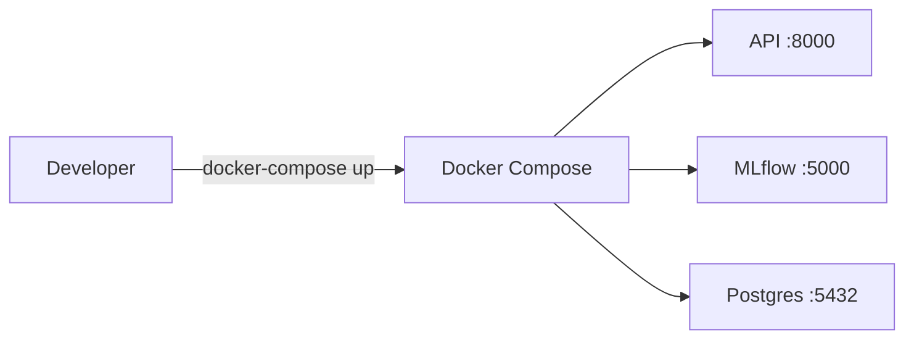

# Deployment Guide

## Local Development (No Docker)

```bash
# 1. Clone & install
git clone <repo-url>
cd enterprise-banking-intelligence
pip install -r requirements.txt

# 2. Run the API
uvicorn src.api.main:app --reload --port 8000

# 3. Access
open http://localhost:8000/docs
```

## Docker Compose Deployment



```bash
# 1. Configure environment
cp .env.example .env
# Edit .env with production credentials

# 2. Build and start
make build
make up

# 3. Register models
make register-models

# 4. Verify
curl http://localhost:8000/api/v1/health
curl http://localhost:5000/api/2.0/mlflow/experiments/list
```

## Production Deployment Recommendations

### Reverse Proxy (NGINX)
Place NGINX in front of the FastAPI service for SSL/TLS termination, rate limiting, and static file serving.

### Container Registry
Push the built image to AWS ECR, Azure ACR, or Google Artifact Registry:
```bash
docker tag enterprise-api:latest <registry>/enterprise-api:1.0.0
docker push <registry>/enterprise-api:1.0.0
```

### Kubernetes (EKS/AKS/GKE)
Deploy the Docker image to a managed Kubernetes cluster for horizontal scaling, self-healing, and rolling updates.

### Monitoring
- **Prometheus + Grafana**: Scrape the `/api/v1/health` endpoint for uptime and latency metrics.
- **ELK Stack**: Aggregate structured JSON logs from the FastAPI middleware.

## Environment Variables

| Variable | Default | Description |
|----------|---------|-------------|
| `API_KEY` | `enterprise-banking-dev-key-2026` | API authentication key |
| `LOG_LEVEL` | `INFO` | Python logging level |
| `PORT` | `8000` | API listening port |
| `POSTGRES_USER` | `mlflow_user` | MLflow DB username |
| `POSTGRES_PASSWORD` | `mlflow_password` | MLflow DB password |
| `POSTGRES_DB` | `mlflow_db` | MLflow DB name |
| `MLFLOW_TRACKING_URI` | `http://localhost:5000` | MLflow server URL |
