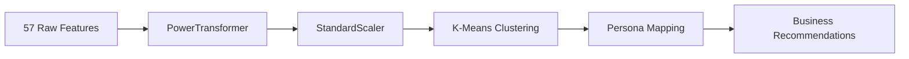

# Customer Segmentation & Intelligence Pipeline

Customer Segmentation (Phase 7C) transforms raw behavioral data into actionable business personas using unsupervised machine learning.

## Business Context
A one-size-fits-all banking strategy leaves money on the table. VIP customers need white-glove retention programs while dormant customers need re-engagement campaigns. Segmentation enables personalized experiences at scale.

## Segmentation Pipeline

## Methodology
1. **Feature Selection**: 57 engineered features covering balance, transaction patterns, loan behavior, risk scores, and temporal activity.
2. **PowerTransformer**: Applies Yeo-Johnson transformation to handle skewed financial distributions (e.g., income, transaction amounts).
3. **StandardScaler**: Centers and normalizes features to unit variance so no single feature dominates the distance metric.
4. **K-Means**: Optimal K=4 determined via the **Elbow Method** and **Silhouette Analysis**.

## Business Personas

| Cluster | Persona | Key Traits | Recommended Action |
|---------|---------|------------|-------------------|
| 0 | **Mass Market** | Average balance, moderate activity | Standard product offerings |
| 1 | **VIP / High-Value** | High balances, frequent transactions, multiple products | Premium services, dedicated relationship manager |
| 2 | **Emerging Growth** | Growing engagement, recent account opening | Upsell credit cards, investment products |
| 3 | **Dormant / At-Risk** | Low activity, declining balances | Re-engagement campaigns, retention offers |

## API Endpoint
`POST /api/v1/predict/segmentation` — Returns `cluster_id`, `persona`, and `persona_description`.
