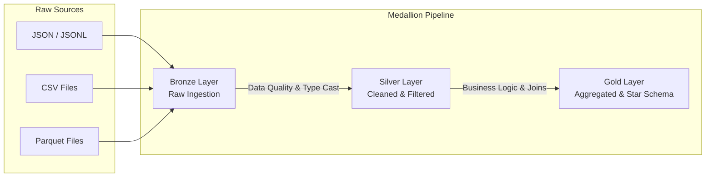

# ETL & Data Pipeline Architecture

The foundation of the Enterprise Platform is a custom-built, Python-based Data Engineering framework that processes 5 million rows of banking data using the Databricks **Medallion Architecture**.

## Medallion Data Flow

### 1. Bronze Layer (Raw Ingestion)
- **Goal**: Ingest data exactly as it arrived.
- **Actions**: Reads JSON, CSV, and Parquet formats. No data is altered.
- **Validation**: Strict schema validation guarantees that files missing critical columns (e.g., `transaction_id`) fail fast before corrupting downstream layers.

### 2. Silver Layer (Cleansed & Conformed)
- **Goal**: Filter, clean, and augment data to a standardized format.
- **Actions**:
  - Impute missing numeric values using the median.
  - Fill missing categorical values with "Unknown".
  - Parse and standardize all date formats to ISO-8601 datetimes.
  - Remove duplicate primary keys.
- **Quarantine**: Any rows that violate referential integrity (e.g., a transaction pointing to a non-existent account) are dynamically routed to a `data/temp/quarantine/` folder for auditor review.

### 3. Gold Layer (Business Aggregations)
- **Goal**: Create highly optimized, query-ready tables for Data Scientists and BI Analysts.
- **Actions**:
  - Convert the 3rd Normal Form (3NF) relational tables into a Kimball Star Schema.
  - Generate core dimensions (`Dim_Customers`, `Dim_Accounts`) and massive fact tables (`Fact_Transactions`).
  - Output to `.parquet` format for fast columnar reads, before ultimately loading into the SQLite Data Warehouse.
