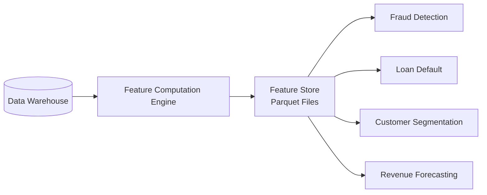

# Feature Store Architecture

The Feature Store (Phase 6B) is a centralized, reusable repository of engineered features that feeds all four Machine Learning pipelines.

## Purpose
Without a Feature Store, each ML model would independently compute features from raw data — leading to inconsistent logic, duplicated code, and training-serving skew. By centralizing feature computation, we guarantee that the features used in training are *identical* to those used in real-time inference.

## Data Flow

## Feature Categories (60+ Features)

### Customer Demographics
`customer_age`, `customer_tenure_days`, `customer_tenure_years`, `is_active`, `account_count`, `products_owned`

### Transaction Behavior
`avg_transaction_amount`, `total_transaction_count`, `total_spend`, `rolling_7d_spend`, `rolling_30d_spend`, `transaction_velocity`, `weekend_spending_ratio`, `night_transaction_ratio`, `large_transaction_ratio`, `merchant_diversity`

### Loan Performance
`total_loan_amount`, `avg_interest_rate`, `avg_repayment_rate`, `avg_loan_utilization`, `total_late_payments`, `total_missed_payments`, `avg_missed_payment_ratio`

### Account & Balance
`avg_balance`, `total_balance`, `max_balance`, `min_balance`, `balance_range`, `customer_lifetime_value`

### Risk & Engagement
`risk_score`, `credit_score`, `fraud_case_count`, `total_fraud_loss`, `support_ticket_count`, `marketing_responses`, `marketing_engagement_score`

### Temporal Patterns
`days_since_last_transaction`, `preferred_day_of_week`, `preferred_month`, `preferred_quarter`, `summer_txn_ratio`, `winter_txn_ratio`

## Storage Format
Features are persisted as compressed Parquet files in `data/gold/feature_store/` for efficient columnar reads by downstream ML pipelines.
