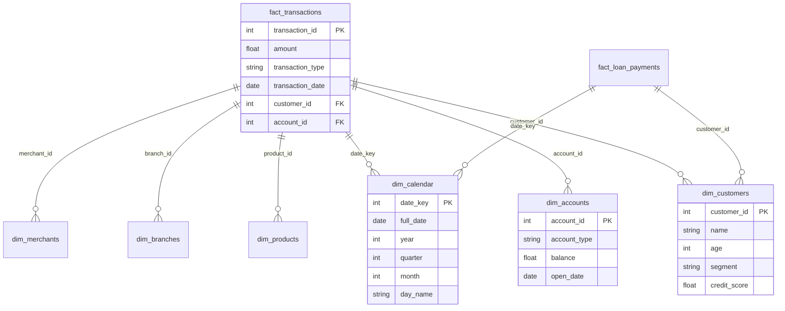

# SQL Analytics Layer

The SQL Analytics Layer (Phase 5) provides pre-computed business intelligence aggregations optimized for Power BI dashboards and ad-hoc analyst queries.

## Star Schema Design

## Key SQL Aggregations

### Revenue Analytics
- Total revenue by branch, product, and time period.
- Month-over-month growth rates.
- Year-to-date cumulative revenue.

### Risk Analytics
- Average credit score distribution by segment.
- Loan default rates by product and branch.
- Fraud incident counts and total loss amounts.

### Customer Analytics
- Customer acquisition trends over time.
- Average customer lifetime value by segment.
- Product penetration rates.

## Design Rationale
The **Kimball Star Schema** was chosen over a Snowflake Schema because:
1. **Query Performance**: Fewer JOINs required for BI queries.
2. **Power BI Compatibility**: Star schemas map directly to Power BI's data model.
3. **Analyst Friendliness**: Business users can self-serve without needing to understand complex normalization.
