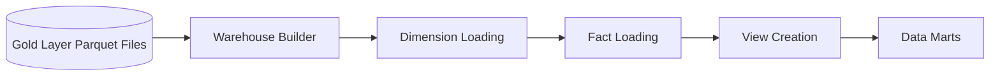

# Enterprise Banking Data Warehouse Architecture

## Section 1: Architecture Overview

The Enterprise Banking Data Warehouse serves as the central analytical data repository, consolidating data from multiple transactional systems to support risk analysis, customer intelligence, and executive reporting.

**Medallion Architecture Integration:**
The warehouse represents the pinnacle of our data pipeline, serving as the final presentation layer:
- **Raw:** Ingested source data from operational banking systems.
- **Bronze:** Append-only, validated datasets with schema enforcement.
- **Silver:** Cleaned, filtered, and augmented datasets.
- **Gold:** Aggregated business-level datasets stored in Parquet.
- **Warehouse:** The final dimensional model loaded from Gold Parquet files, optimized for analytical querying, BI tools, and ad-hoc reporting.

**Technology Stack:**
- **Production:** PostgreSQL (Robust, ACID compliant, extensive analytical functions).
- **Local/Development:** SQLite (Lightweight, zero-configuration for rapid prototyping).

---

## Section 2: Star Schema Diagram

```mermaid
erDiagram
    %% Dimension Tables
    dim_date {
        int date_sk PK
        date full_date
        int year
        int month
    }
    dim_customer {
        int customer_sk PK
        string customer_id
        string name
    }
    dim_branch {
        int branch_sk PK
        string branch_id
        string region_id
    }
    dim_region {
        int region_sk PK
        string region_id
        string name
    }
    dim_product {
        int product_sk PK
        string product_id
        string category
    }
    dim_merchant {
        int merchant_sk PK
        string merchant_id
        string risk_tier
    }
    dim_account {
        int account_sk PK
        string account_id
        string type
    }
    dim_loan {
        int loan_sk PK
        string loan_id
        string status
    }
    dim_risk {
        int risk_sk PK
        string risk_category
    }
    dim_campaign {
        int campaign_sk PK
        string campaign_name
    }
    dim_employee {
        int employee_sk PK
        string employee_id
    }

    %% Fact Tables
    fact_transactions {
        int transaction_id PK
        int account_sk FK
        int date_sk FK
        int merchant_sk FK
        decimal amount
    }
    fact_loans {
        int loan_fact_id PK
        int loan_sk FK
        int customer_sk FK
        int date_sk FK
        int product_sk FK
        decimal loan_amount
    }
    fact_fraud {
        int fraud_id PK
        int transaction_id
        int account_sk FK
        int date_sk FK
        int merchant_sk FK
        decimal fraud_score
    }
    fact_loan_payments {
        int payment_id PK
        int loan_sk FK
        int date_sk FK
        decimal amount_paid
    }
    fact_marketing_responses {
        int response_id PK
        int campaign_sk FK
        int customer_sk FK
        int date_sk FK
        string response_type
    }
    fact_support_tickets {
        int ticket_id PK
        int customer_sk FK
        int employee_sk FK
        int date_sk FK
        string status
    }
    fact_customer_activity {
        int activity_id PK
        int customer_sk FK
        int date_sk FK
        string activity_type
    }

    %% Relationships
    fact_transactions }|--|| dim_account : "has"
    fact_transactions }|--|| dim_date : "occurred on"
    fact_transactions }|--|| dim_merchant : "at"

    fact_loans }|--|| dim_loan : "is"
    fact_loans }|--|| dim_customer : "owned by"
    fact_loans }|--|| dim_date : "originated on"
    fact_loans }|--|| dim_product : "type of"

    fact_fraud }|--|| dim_account : "involves"
    fact_fraud }|--|| dim_date : "detected on"
    fact_fraud }|--|| dim_merchant : "at"

    fact_loan_payments }|--|| dim_loan : "pays"
    fact_loan_payments }|--|| dim_date : "paid on"

    fact_marketing_responses }|--|| dim_campaign : "part of"
    fact_marketing_responses }|--|| dim_customer : "by"
    fact_marketing_responses }|--|| dim_date : "responded on"

    fact_support_tickets }|--|| dim_customer : "raised by"
    fact_support_tickets }|--|| dim_employee : "handled by"
    fact_support_tickets }|--|| dim_date : "raised on"

    fact_customer_activity }|--|| dim_customer : "performed by"
    fact_customer_activity }|--|| dim_date : "occurred on"
```



---

## Section 3: Data Flow Diagram



---

## Section 4: Schema Documentation

- **dim**: Dimensional schema containing slowly changing dimension (SCD) tables representing the master data entities (customers, branches, dates).
- **fact**: Fact schema containing the transactional and event-driven data tables (transactions, payments, events).
- **mart**: Data Mart schema, consisting of aggregated, domain-specific views and tables tailored for specific business units (e.g., Marketing, Risk).
- **rpt**: Reporting schema designed for direct consumption by BI tools like Tableau or PowerBI. Highly denormalized.
- **staging**: Temporary schema used during the ETL/ELT process to hold raw records before they are merged into the final dimensional models.
- **sec**: Security and administration schema storing user roles, row-level security (RLS) policies, and audit logs.

---

## Section 5: Dimension Table Documentation

### 1. dim_date
| Column Name | Data Type | Nullable | Description |
|---|---|---|---|
| date_sk | integer | No | Primary key, surrogate key (YYYYMMDD) |
| full_date | date | No | The actual date |
| day_of_week | integer | No | Day of the week (1-7) |
| day_name | varchar | No | Name of the day (e.g., Monday) |
| day_of_month | integer | No | Day of the month (1-31) |
| day_of_year | integer | No | Day of the year (1-366) |
| week_of_year | integer | No | ISO week number |
| month_name | varchar | No | Name of the month |
| month_of_year | integer | No | Month number (1-12) |
| quarter | integer | No | Quarter (1-4) |
| year | integer | No | Year |
| is_weekend | boolean | No | True if Saturday/Sunday |
| is_holiday | boolean | No | True if banking holiday |

### 2. dim_customer
| Column Name | Data Type | Nullable | Description |
|---|---|---|---|
| customer_sk | integer | No | Surrogate key |
| customer_id | varchar | No | Operational CRM customer ID |
| first_name | varchar | Yes | Customer's first name |
| last_name | varchar | Yes | Customer's last name |
| dob | date | Yes | Date of birth |
| gender | varchar | Yes | Gender |
| email | varchar | Yes | Email address |
| phone | varchar | Yes | Phone number |
| address | varchar | Yes | Street address |
| city | varchar | Yes | City |
| state | varchar | Yes | State/Province |
| zip_code | varchar | Yes | Postal code |
| country | varchar | Yes | Country |
| occupation | varchar | Yes | Job title/occupation |
| income_bracket | varchar | Yes | Estimated income bracket |
| credit_score | integer | Yes | Current credit score |
| customer_segment | varchar | Yes | Retail, HNW, Business, etc. |
| join_date | date | Yes | Date customer joined the bank |

### 3. dim_branch
| Column Name | Data Type | Nullable | Description |
|---|---|---|---|
| branch_sk | integer | No | Surrogate key |
| branch_id | varchar | No | Operational branch ID |
| branch_name | varchar | No | Name of the branch |
| branch_type | varchar | No | Physical, Digital, ATM-only |
| address | varchar | Yes | Street address |
| city | varchar | Yes | City |
| state | varchar | Yes | State/Province |
| zip_code | varchar | Yes | Postal code |
| region_id | varchar | Yes | Reference to region |
| manager_id | varchar | Yes | Branch manager ID |
| open_date | date | Yes | Date opened |
| close_date | date | Yes | Date closed (if applicable) |

### 4. dim_region
| Column Name | Data Type | Nullable | Description |
|---|---|---|---|
| region_sk | integer | No | Surrogate key |
| region_id | varchar | No | Operational region ID |
| region_name | varchar | No | Region name (e.g., North America, EMEA) |
| country | varchar | No | Country of region |
| region_manager | varchar | Yes | Manager responsible |

### 5. dim_product
| Column Name | Data Type | Nullable | Description |
|---|---|---|---|
| product_sk | integer | No | Surrogate key |
| product_id | varchar | No | Operational product ID |
| product_name | varchar | No | Product name |
| product_category | varchar | No | Checking, Savings, Loan, Credit |
| product_type | varchar | Yes | Sub-type of product |
| interest_rate | decimal | Yes | Base interest rate |
| min_balance | decimal | Yes | Minimum balance required |
| fee_structure | varchar | Yes | JSON string of fees |
| launch_date | date | Yes | Date product became available |

### 6. dim_merchant
| Column Name | Data Type | Nullable | Description |
|---|---|---|---|
| merchant_sk | integer | No | Surrogate key |
| merchant_id | varchar | No | Operational merchant ID |
| merchant_name | varchar | No | DBA Name of merchant |
| merchant_category | varchar | Yes | Retail, Dining, Travel, etc. |
| mcc_code | varchar | Yes | Merchant Category Code |
| address | varchar | Yes | Merchant address |
| city | varchar | Yes | Merchant city |
| state | varchar | Yes | Merchant state |
| country | varchar | Yes | Merchant country |
| risk_tier | varchar | Yes | Low, Medium, High risk merchant |

### 7. dim_account
| Column Name | Data Type | Nullable | Description |
|---|---|---|---|
| account_sk | integer | No | Surrogate key |
| account_id | varchar | No | Operational account ID |
| customer_sk | integer | No | FK to dim_customer |
| branch_sk | integer | No | FK to dim_branch |
| product_sk | integer | No | FK to dim_product |
| account_type | varchar | No | Asset vs Liability |
| status | varchar | No | Active, Suspended, Closed |
| open_date | date | No | Account open date |
| close_date | date | Yes | Account close date |

### 8. dim_loan
| Column Name | Data Type | Nullable | Description |
|---|---|---|---|
| loan_sk | integer | No | Surrogate key |
| loan_id | varchar | No | Operational loan ID |
| customer_sk | integer | No | FK to dim_customer |
| product_sk | integer | No | FK to dim_product |
| loan_type | varchar | No | Mortgage, Auto, Personal |
| loan_amount | decimal | No | Original loan principal |
| interest_rate | decimal | No | Fixed or variable rate |
| term_months | integer | No | Duration in months |
| origination_date | date | No | Date originated |
| end_date | date | Yes | Expected completion date |
| status | varchar | No | Current, Default, Paid Off |

### 9. dim_risk
| Column Name | Data Type | Nullable | Description |
|---|---|---|---|
| risk_sk | integer | No | Surrogate key |
| risk_id | varchar | No | Operational risk profile ID |
| risk_score | decimal | No | Calculated risk score |
| risk_category | varchar | No | Low, Medium, High |
| risk_factors | varchar | Yes | JSON array of flagged factors |
| update_date | date | No | Date score was calculated |

### 10. dim_campaign
| Column Name | Data Type | Nullable | Description |
|---|---|---|---|
| campaign_sk | integer | No | Surrogate key |
| campaign_id | varchar | No | Operational campaign ID |
| campaign_name | varchar | No | Name of campaign |
| campaign_type | varchar | No | Email, SMS, App Push |
| channel | varchar | No | Marketing channel |
| target_audience | varchar | Yes | Segment targeted |
| start_date | date | No | Campaign start |
| end_date | date | Yes | Campaign end |
| budget | decimal | Yes | Allocated budget |

### 11. dim_employee
| Column Name | Data Type | Nullable | Description |
|---|---|---|---|
| employee_sk | integer | No | Surrogate key |
| employee_id | varchar | No | HR Employee ID |
| first_name | varchar | No | Employee first name |
| last_name | varchar | No | Employee last name |
| role | varchar | No | Job title |
| department | varchar | No | Department |
| branch_sk | integer | Yes | FK to dim_branch (if branch staff) |
| hire_date | date | No | Date hired |

---

## Section 6: Fact Table Documentation

### 1. fact_transactions
**Grain:** One row per individual financial transaction.
**FKs:** account_sk, date_sk, merchant_sk

| Column Name | Data Type | Nullable | Description |
|---|---|---|---|
| transaction_id | varchar | No | Unique transaction identifier |
| account_sk | integer | No | FK to dim_account |
| date_sk | integer | No | FK to dim_date |
| merchant_sk | integer | Yes | FK to dim_merchant (if applicable) |
| transaction_type | varchar | No | Debit, Credit, Transfer, Fee |
| amount | decimal | No | Transaction amount |
| balance_after | decimal | No | Account balance post-transaction |
| currency | varchar | No | Currency code (USD, EUR) |
| is_flagged | boolean | No | True if flagged by risk engine |

### 2. fact_loans
**Grain:** One row per loan snapshot per month (periodic snapshot fact).
**FKs:** loan_sk, customer_sk, date_sk, product_sk

| Column Name | Data Type | Nullable | Description |
|---|---|---|---|
| loan_fact_id | varchar | No | Snapshot unique ID |
| loan_sk | integer | No | FK to dim_loan |
| customer_sk | integer | No | FK to dim_customer |
| date_sk | integer | No | FK to dim_date (snapshot date) |
| product_sk | integer | No | FK to dim_product |
| loan_amount | decimal | No | Original loan amount |
| principal_balance | decimal | No | Current outstanding principal |
| total_interest | decimal | No | Interest accrued to date |
| status | varchar | No | Current status |

### 3. fact_fraud
**Grain:** One row per detected or suspected fraudulent event.
**FKs:** account_sk, date_sk, merchant_sk

| Column Name | Data Type | Nullable | Description |
|---|---|---|---|
| fraud_id | varchar | No | Fraud incident ID |
| transaction_id | varchar | Yes | Related transaction (if any) |
| account_sk | integer | No | FK to dim_account |
| date_sk | integer | No | FK to dim_date |
| merchant_sk | integer | Yes | FK to dim_merchant |
| fraud_score | decimal | No | ML model probability score |
| fraud_type | varchar | No | Identity Theft, Card Skimming, ATO |
| resolution | varchar | Yes | Refunded, Blocked, False Positive |
| loss_amount | decimal | Yes | Actual monetary loss |

### 4. fact_loan_payments
**Grain:** One row per loan payment received.
**FKs:** loan_sk, date_sk

| Column Name | Data Type | Nullable | Description |
|---|---|---|---|
| payment_id | varchar | No | Unique payment ID |
| loan_sk | integer | No | FK to dim_loan |
| date_sk | integer | No | FK to dim_date |
| amount_paid | decimal | No | Total payment amount |
| principal_portion | decimal | No | Amount applied to principal |
| interest_portion | decimal | No | Amount applied to interest |
| late_fee | decimal | No | Any late fees collected |
| payment_status | varchar | No | Cleared, Bounced, Pending |

### 5. fact_marketing_responses
**Grain:** One row per customer interaction with a marketing campaign.
**FKs:** campaign_sk, customer_sk, date_sk

| Column Name | Data Type | Nullable | Description |
|---|---|---|---|
| response_id | varchar | No | Interaction ID |
| campaign_sk | integer | No | FK to dim_campaign |
| customer_sk | integer | No | FK to dim_customer |
| date_sk | integer | No | FK to dim_date |
| channel | varchar | No | Email, SMS, Web |
| response_type | varchar | No | Opened, Clicked, Converted, Ignored |
| conversion_value | decimal | Yes | Monetary value of conversion |

### 6. fact_support_tickets
**Grain:** One row per customer support ticket.
**FKs:** customer_sk, employee_sk, date_sk

| Column Name | Data Type | Nullable | Description |
|---|---|---|---|
| ticket_id | varchar | No | Support ticket ID |
| customer_sk | integer | No | FK to dim_customer |
| employee_sk | integer | Yes | FK to dim_employee (handler) |
| date_sk | integer | No | FK to dim_date |
| issue_type | varchar | No | Technical, Billing, Dispute |
| priority | varchar | No | High, Medium, Low |
| resolution_time_hrs | decimal | Yes | Hours to resolve |
| status | varchar | No | Open, In Progress, Resolved |
| satisfaction_score | integer | Yes | Post-resolution CSAT (1-5) |

### 7. fact_customer_activity
**Grain:** One row per distinct digital banking session/activity.
**FKs:** customer_sk, date_sk

| Column Name | Data Type | Nullable | Description |
|---|---|---|---|
| activity_id | varchar | No | Unique activity ID |
| customer_sk | integer | No | FK to dim_customer |
| date_sk | integer | No | FK to dim_date |
| session_id | varchar | No | Digital session ID |
| platform | varchar | No | iOS, Android, Web |
| activity_type | varchar | No | Login, View Balance, Transfer |
| duration_seconds | integer | No | Time spent |

---

## Section 7: Business Views

1. **vw_customer_overview**
   - **Purpose:** 360-degree view of the customer, combining demographics, total balances, and risk scores.
   - **Key Columns:** customer_id, name, total_assets, total_liabilities, risk_category.
   - **Source Tables:** dim_customer, fact_transactions, fact_loans, dim_risk.

2. **vw_executive_kpi**
   - **Purpose:** Top-level metrics for C-suite dashboards (AUM, default rates, daily active users).
   - **Key Columns:** report_date, total_deposits, total_loan_portfolio, net_revenue.
   - **Source Tables:** dim_date, fact_transactions, fact_loans.

3. **vw_revenue_summary**
   - **Purpose:** Revenue breakdown across products, branches, and regions.
   - **Key Columns:** region_name, branch_name, product_category, total_fee_revenue, total_interest_revenue.
   - **Source Tables:** dim_region, dim_branch, dim_product, fact_transactions, fact_loan_payments.

4. **vw_fraud_summary**
   - **Purpose:** Aggregated fraud metrics, grouped by merchant and region to identify hotspots.
   - **Key Columns:** merchant_category, fraud_incidents, total_loss_amount, avg_fraud_score.
   - **Source Tables:** fact_fraud, dim_merchant, dim_date.

5. **vw_loan_portfolio**
   - **Purpose:** Detailed view of outstanding loans, defaults, and risk exposure.
   - **Key Columns:** loan_type, total_principal_outstanding, default_rate, average_interest_rate.
   - **Source Tables:** dim_loan, fact_loans, dim_product.

6. **vw_customer_lifetime_value**
   - **Purpose:** Predictive CLV metrics per customer based on historical engagement and profitability.
   - **Key Columns:** customer_id, customer_segment, tenure_months, estimated_clv.
   - **Source Tables:** dim_customer, fact_transactions, fact_marketing_responses.

7. **vw_branch_performance**
   - **Purpose:** Operational metrics for physical branches.
   - **Key Columns:** branch_name, total_accounts_opened, support_tickets_handled, branch_revenue.
   - **Source Tables:** dim_branch, dim_account, fact_support_tickets.

8. **vw_risk_overview**
   - **Purpose:** Macro-level risk profile of the bank's customer base.
   - **Key Columns:** risk_category, customer_count, total_exposure_amount.
   - **Source Tables:** dim_risk, dim_customer, fact_loans, fact_transactions.

---

## Section 8: Data Marts

Data marts are specialized schemas providing focused datasets to specific business departments:

1. **Executive:** Aggregated KPIs, trend analysis, and macro-level dashboards (highly denormalized).
2. **Fraud:** Near real-time analytical tables focused on anomalies, blocked transactions, and ML scoring performance.
3. **Customer:** 360-degree customer profiling, churn prediction datasets, and segmentation flags.
4. **Loan:** Mortgage and credit analytics, default tracking, and stress-testing datasets.
5. **Marketing:** Campaign ROI, conversion funnels, A/B testing results, and demographic performance.
6. **Operations:** Support ticket SLA tracking, digital platform uptime, and branch efficiency metrics.

---

## Section 9: Loading Process

The ELT pipeline executes in a strict dependency order to maintain referential integrity:

1. **Dimension Tables First:** 
   Loaded in dependency order to generate surrogate keys (SKs). `dim_date`, `dim_region`, and `dim_product` are loaded first, followed by dependent dimensions like `dim_branch` and `dim_account`.
2. **Fact Tables Second:** 
   Loaded by joining raw transactional data against the Dimension tables to resolve business keys into SKs. `fact_transactions` and `fact_loans` run in parallel.
3. **Views and Marts Last:** 
   Materialized views and aggregate tables within the Data Mart schemas are refreshed only after the underlying fact tables are completely loaded and validated.

---

## Section 10: Performance & Indexing

**Indexing Strategy:**
- **PK Indexes:** Automatically created on all surrogate keys (e.g., `account_sk`, `transaction_id`).
- **FK Column Indexes:** Every foreign key in a fact table (`date_sk`, `customer_sk`) is indexed to accelerate star-schema joins.
- **Date Column Indexes:** B-Tree indexes on core date fields (`full_date`, `origination_date`) to speed up time-series filtering.
- **Composite Indexes:** Created for common query patterns (e.g., `(account_sk, date_sk)` on `fact_transactions`).
- **Partitioning Recommendations:** 
  In the PostgreSQL production environment, massive fact tables (like `fact_transactions` and `fact_customer_activity`) are partitioned BY RANGE on `date_sk` (e.g., monthly partitions) to ensure efficient query pruning and simplified data archival.

---

## Section 11: Security Model

The warehouse employs a Role-Based Access Control (RBAC) model:

1. **Warehouse Admin:** Full DDL/DML privileges. Can create schemas, tables, manage roles, and execute the ELT pipeline.
2. **Data Analyst:** Read-only access to `dim`, `fact`, and `mart` schemas. Can create views within user-specific sandbox schemas.
3. **Read-Only / BI User:** Restricted read-only access limited strictly to the `mart` and `rpt` schemas. Row-Level Security (RLS) policies are enforced here (e.g., Branch Managers can only see data for their specific region).

---

## Section 12: Running the Warehouse

The warehouse build and maintenance processes are orchestrated via a unified Python CLI tool.

**Usage:**
```bash
# Build the schema and load data incrementally (standard run)
python run_warehouse.py              

# Print row counts, indexing status, and warehouse health statistics
python run_warehouse.py --stats      

# Drop all tables, recreate schemas, and perform a full historical load
python run_warehouse.py --rebuild    
```
